# Transformer and LLM

## Transformer Basics

- Tokenize words(word->tokens)
    - A tokenizer maps a word to one/multiple tokens.
- Map tokens into embeddings
    - Word Representation
        - One-Hot Encoding: 太长太稀疏
        - Word Embedding: 做一个映射，可以把一个 token 看作一个向量。
- Multi-Head Attentioin(MHA)
    - Self-Attention
    - 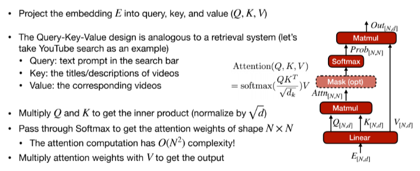
        - 查询键值的设计类似于一个检索系统(油管搜索为例)
            - Query: 搜索栏中的文本提示
            - Key: 视频的标题或描述
            - Value: 相应的视频
        - $Attentioin(Q,K,V)=softmax(\frac{QK^T}{\sqrt d_k})V$
    - MHA: Each head captures different semantics
        - 我们需要不同的注意力映射来捕捉不同的语义关系。
        - 模型有 $H>1$ 个 attention heads($QKV$ 的并行分支)，最终结果由不同的注意力结果拼接而成。
        - 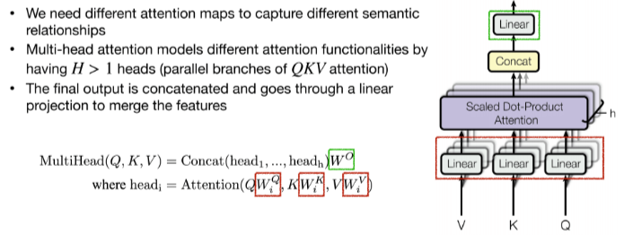
    - Attention Masking
        - 判别任务的 token 能够看见所有的 token, 生成任务只能看到前面的。
        - 对应两种 mask.
        - 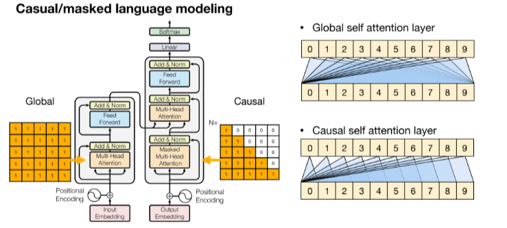
- Feed-Forward Network
    - Self-Attention 只建立了 token 之间的关系(进行的都是线性变化即矩阵乘法)，我们想要更强的表达能力，所以希望有个激活函数引入非线性性。
    - 朴素实现就是一个 2 层 MLP 并使用 ReLU
        - $FFN(x)=ReLU(xW_1+b_1)W_2+b_2$
- LayerNorm & Residual connectioni
    - LN 对每个 token 进行规范化，随后作用放射变化。(BatchNorm 是对整个 batch 进行规范化)
    - 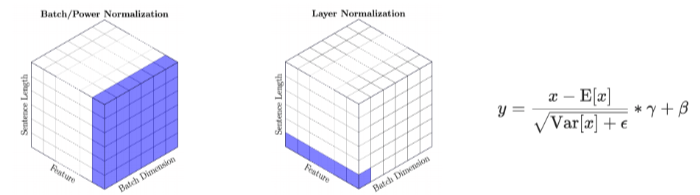
    - Transformer Block
        - 添加 LN 和 Residual Connectioin 来促进训练的稳定性。
        - 两种方法：Post-Norm 和 Pre-norm, 后者更多。
        - 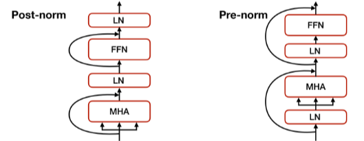
- Positional Encoding(PE)
    - attention 和 FFN 并没有区分输入 token 的顺序，即将输入 token 打乱后结果是一样的详单与我们只是对 set encoding 而非 sequence encoding.
    - 使用位置编码来解决。为每一个 token 添加一个位置信息。
        - 每个单词在句子中的位置有一个唯一的 encoding
        - 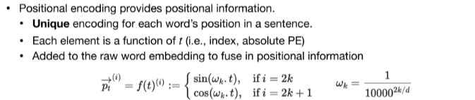

**Put it all together**

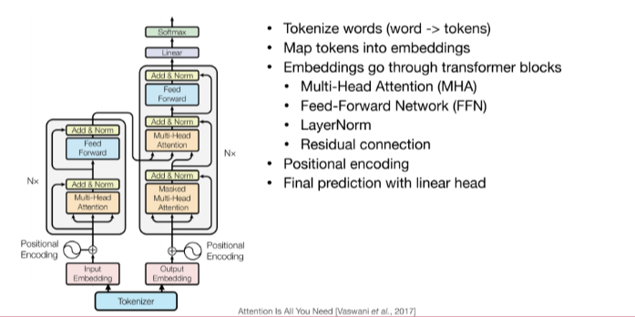

## Transformer Design Variants

### Encoder & Decoder

- Encoder-Decoder
    - The original Transformer is an Encoder-Decoder architecture
    - T5 offers a unified text-to-text model for transfer learning on various NLP tasks
    - The prompt is fed to the encoder, the decoder generates the answer
- Encoder-only
    - BERT(Bidrectional Enocder Representations from Transformers) 是一个 encoder-only 的预训练模型
    - Two pre-training objectives
        - Masked Language Model(MLM): Mask some percentage of the input tokens at random; train the model to predict masked tokens.(类似完型填空)
        - Next Sentence Prediction(NSP): Whether sentence B is the next sentence of Sentence A(less used)
        - 通过 fine-tune 预训练模型来适配对应的下游任务
        - 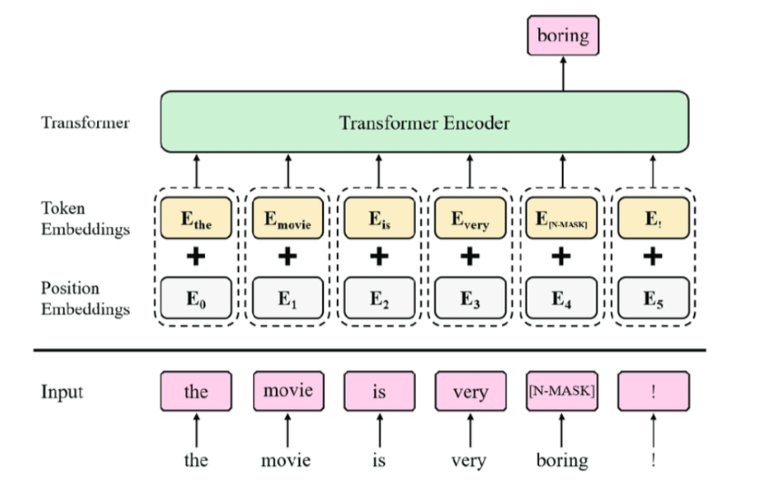
- Decoder-only(GPT)
    - 预训练的目标是 Next word prediction
    - 对于小模型(GPT-2) 预先训练好的模型将根据下游任务进行微调。Large model can run in zero-shot/few-shot.
    - 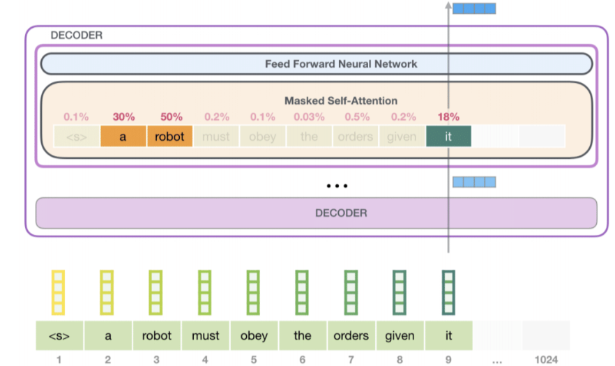

### Positional Encoding

- Absolute Positional Encoding
    - 把位置信息直接加到 embedding 上，因此会同时影响 $QKV$ 的值。The info is propagated through the entire Transformer.
- Relative Positional Encoding
    - 将位置信息加到 attention score 上，因此不会影响 $V$。可以泛化到训练中未见的训练长度 (train short, test long)
    - Attention with Linear Biases(ALiBi)
        - 使用相对距离来代替绝对的索引。将偏移量加到 attention matrix 上，再做 softmax 并与 $V$ 相乘。
        - 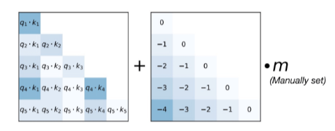
    - Rotary Positional Embedding(RoPE)
        - Rotate the embeddings in 2D space
            - Split an embedding of dimenstion $d$ into $frac{d}{2}$ pairs, each pair considered as a 2D coordinate
            - Apply rotation according to the positioin $m$.
            - 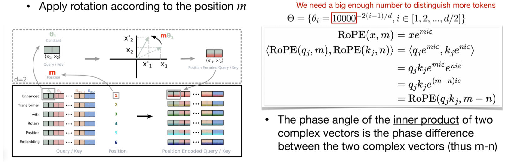
            - 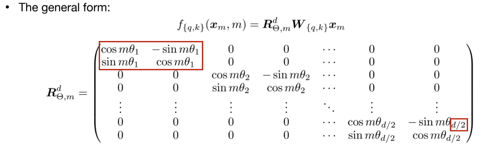
            - 优点：可以通过插值 RoPE (使用一个较小的 $\theta_i$) 来扩展上下文长度支持。

### KV Cache Opimizations

- The KV Cache could be large with long context
    - 在 transformer decoding 中，我们需要存储所有之前 Token 的 key 和 value 来计算 attention,这就是 KV Cache。
    - 随着上下文长度的增加， KV Cache 会变得非常大，因此需要一些优化来减少存储空间。减少 `#kv-heads`
    - Multi-head attentioin(MHA): $N$ heads for query, $N$ heads for key/value
    - Multi-query attention(MQA): $N$ heads for query, 1 heads for key/value
    - Grouped-query attention (GQA): $N$ heads for query, $G$ heads for key/value(typically $G=N/8$)
    - 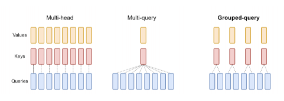

### Improving over FFN

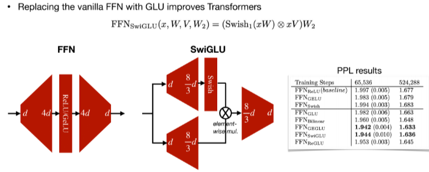

$Swish(x)=x\cdot sigmoid(x)$

## Large Language models

LLMs exhibit some "emergent" abilities that are only available with a lagre enough model size.

- GPT-3
    - Scaling up Transformers to be few-shot learners(in-context learning)
    - 传统 NLP 的 pipeline 是先预训练随后对下游任务微调，GPT-3 可以直接在下游任务上学习。
        - Zero-shot: answer questions given task descriptions
        - Few-shot: learn with demonstrations
        - 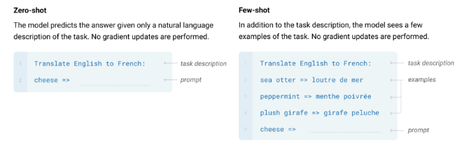
- OPT
    - Open Pre-trained Transformer Language Models 来自 Meta 2022
    - Decoder-only, Pre-norm, ReLU in FNN
    - 性能和GPT 很接近
- BLOOM
- LLaMA
    - Large Language Model Archive 来自 Meta 的开源预训练大模型
    - Decoder-decoder, Pre-norm, SwiGLU, RoPE
- LLaMA 2
    - 更大的上下文长度
    - 更多的训练 tokens
    - GQA for large models

## Efficient inference algorithms for LLMs

### Quantization

- Smooth Quantization(W8A8)
    - Weights are easy to quantize, but activation is hard due to oueliers
    - But outliers persist in fixed channels!
    - 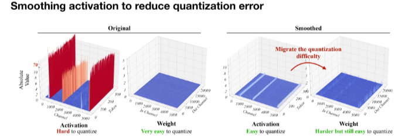
    - 我们将权重扩大 $N$ 倍，将激活缩小 $N$ 倍，数学上等价，因此将量化难度从 activation 迁移到 weights
    - 在 Transformer 中将所有密集型算子(线性层等)使用 INT8 计算，其它轻量级算子(LN,softmax)使用 FP16 运算，可以均衡精度和推理效率。
- AWQ for low-bit weight-only quantization
    - 权重对于 LLM 的性能并不同等重要
        - 只有 1% 的突出权重以 FP16 的格式存储，可以显著改善性能。
    - TBD

### Pruning

- Wanda:pruning by considering weights and activations
    - 思想类似 AWQ，我们剪枝权重时应该同时考虑激活值的分布
    - 使用 $|weight|\times \Vert activation\Vert$ 作为剪枝的 critieon.
    - 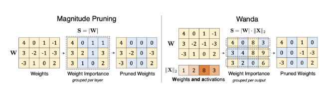
- Attentioin Sparsity
    - SpAtten: 对 token & head 剪枝，这是 cascade pruning, 在运行中逐渐去掉不重要的 tokens & heads.
    - 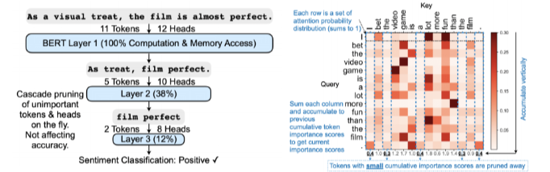
    - H2O: token pruning in KV cache
    - 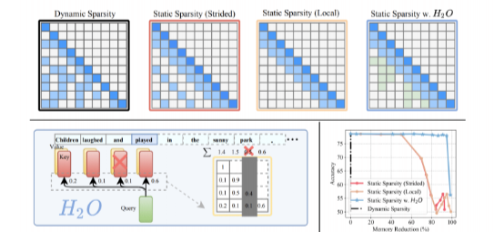
    - TBD

## Efficient inference systems for LLMs

### vLLM

- Analyzing the waste in KV Cache usage
    - Internal fragmentation: 不知道输出序列的长度因而 Over-allocated
    - Reservation: not used at the current step, but used in the future
    - External fragmentation: due to different sequence lengths (不同内存分配之间会有空隙)
- 从 OS 中借鉴 virtual memory 和分页的思想，允许 KV cache 不连续存储，而逻辑地址保持连续，通过页表来映射。
- 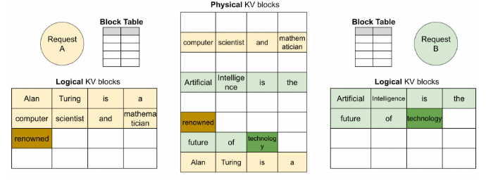
- 一个逻辑 KV 缓存块，一个块表，一个物理 KV cache 块。块表负责从 logical 到 Physical 的映射
    - 对一个 prompt, 它在逻辑地址上是连续的，而在物理地址上是可以不连续的
    - 动态块映射支持在并行采样中进行即时共享，即我们可以喂一个 prompt, 随后由多个进程共享，生成多个不同的输出。
