# Pruning and Sparsity

!!! note "Reference"

    - [MIT 6.5940](https://hanlab.mit.edu/courses/2023-fall-65940?schedule)
    - [HobbitQia 的笔记本](https://note.hobbitqia.cc/TinyML/pruning/) 

## Introduction

### Motivation

- Memory is Expensive: Data Movement->More Memory Reference->More Energy
- Idea: Make nerual network smaller by removing synapses(突触，在神经网络里相当于层与层之间的连接) and neurons.

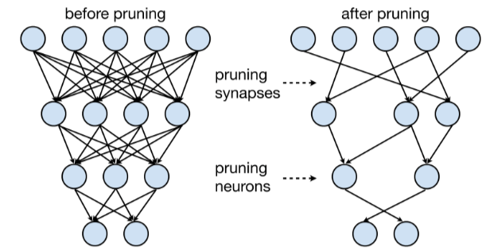

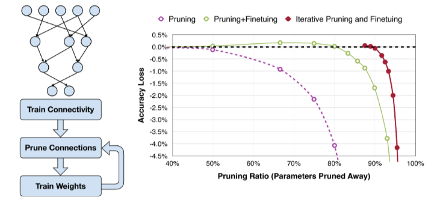

- 大致流程：
    - Train Connectivity: 首先训练至收敛
    - Prune Connections：剪枝
    - Train Weights: 重新训练权重

- Formulate Pruning
    - $\mathop{\arg\min}\limits_{\mathbf{W_p}}L(\mathbf{x};\mathbf{W_p})$, $s.t., \Vert\mathbf{W_p}\Vert_0<N$
        - $L$ 是网络的目标函数
        -  $\mathbf{x}$ 是输入，$\mathbf{W}$ 是原始权重， $\mathbf{W_p}$ 是剪枝后的权重。
        -  $\Vert\cdot\Vert_0$ 表示非零元素的个数， $N$ 表示我们希望有多少权重保持非零。

## Pruning Granularity

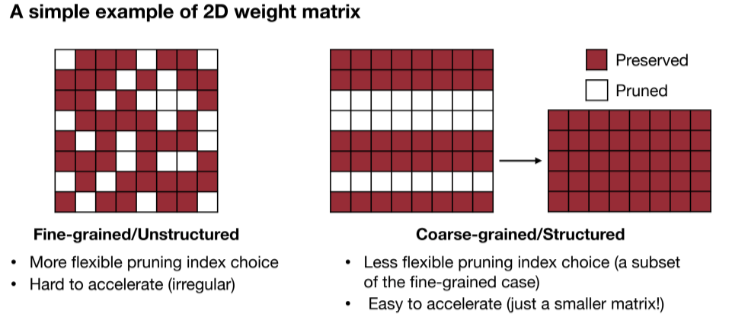

- 2D Matrix Case
    - Fine-grained/Unstructured
        - 优点: 更大的灵活性，可以有很多剪枝选择
        - 缺点：加速难度大，因为其高度不规则，对硬件并行计算不友好
    - Coarse-grained/Structured
        - 优点：经过剪枝后，权重矩阵依旧稠密，易于加速
        - 缺点：灵活性降低

- 卷积层(4 个维度 $[c_o,c_i,k_h,k_w]$)
    - $c_o$ 是 output channels, $c_i$ input channels, $k_h$ kernel size height, $k_w$ kernel size width.
    - have more choices to select pruning granularities.

    - 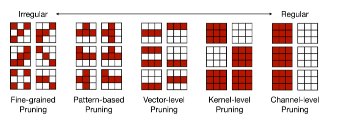

    - Fine-grained Pruning
        - 逐个元素选择是否剪枝，有更高的剪枝率。但不利于硬件加速。 GPU 上不行， EIE 上可以。
    - Pattern-based Pruning(N:M Sparsity)
        - 每连续 $M$ 个元素，剪掉 $N$ 个。常用 $2:4$ sparsity.
        - supported by NVIDIA'S Ampere GPU Architecture, which delievers up to 2x speed up. Usually maintains accuracy.
        - 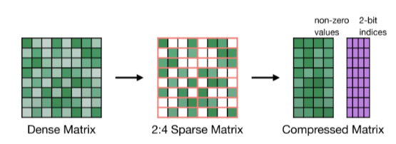
        - 如上图，存修建后的非零值，并且有一个额外的索引块存原始位置。
    - Channel Pruning
        - 直接去掉某些通道，可以直接获得加速(降低了 $c$ 的大小)
        - 压缩比较小
        - 对于不同层，可以采用不同的剪枝率，这样可以在相同精度下获得更低的延时。

## Pruning Criterion

**What synapses and neruons should we prune?**

### Selection of Synapses to Prune

- 希望移除不太重要的参数，这样剪纸后的 nn 可以获得更好的性能。
- Magnitude-based Pruning
    - 启发式(heuristic)的剪枝
        - Consider weights with **larger absolute values** more important than other weights 
        - 分为几种定义: element-wise, row-wise
        - 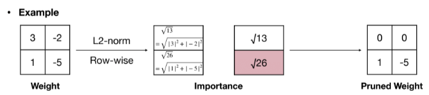
        - 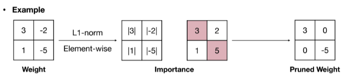
- Scaling-based Pruning
    - Pruning criterion for filter pruning 
    - 卷积层每个 filter 都有一个 scaling factor, 把这个 scaling factor 和输出通道的输出乘起来，缩放因子较小的通道将被修剪掉。
    - 缩放因子可以放在 BatchNorm 层里。
    - 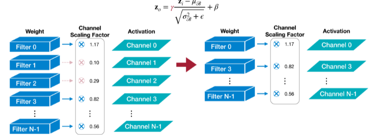
- Seconde-Order-based Pruning
    - 通过泰勒级数推导误差，随后通过 Hessian 矩阵的特征值来评估权重的重要性。
    - 目标函数 $L$ 是二阶的，最后一项忽略
    - 神经网络训练后是收敛的，一阶项忽略
    - 删除每个参数所引起的损失是独立的，交叉项忽略
    - 最终只剩下二阶项，因此只需要计算 Hessian 矩阵
    - 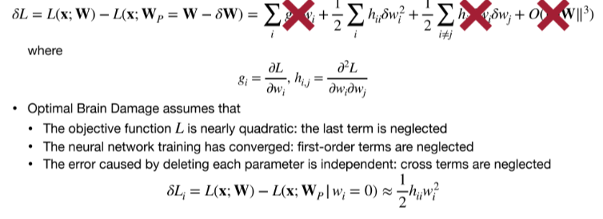
    - The synapses with smaller induced erro $|\delta L_i|$ will be removed.

### Selection of Neurons to Prune

也可以对神经元剪枝，一旦这个神经元被剪枝，与之相关联的所有权重也被剪掉了，所有神经元剪枝本质上是一种粗粒度的权重剪枝。

- Percentage-of-Zero-Based Pruning
    - ReLU 会在输出里产生 0，因此我们可以采用 Average Percentage of Zero activations(APoZ)来衡量权重的重要性。 APoZ 越小说明权重越重要。
    - 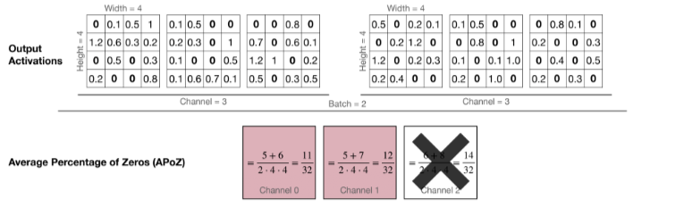
- Regression-based Pruning
    - Minimize the reconsturction error of the corresponding layer's outpts
    - 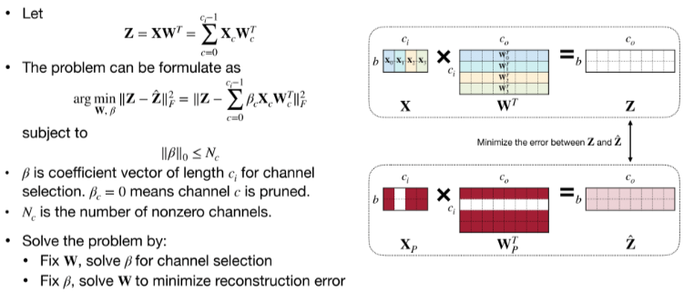

### Determine the Pruning Ratio

- Non-uniform pruning is better than uniform shrinking. (非规则的更好)
- How should we find ratios for each layer?
- We need different pruning ratios for each layer since different layers have different sensitivity.
    - Some layers are more senstive (first layer)
    - Some layers are more redundant
- Analyze the sensitivity of each layer
    - 选择模型中的 $L_i$ 层，以剪枝率 $r\in \{0,0.1,\cdots,0.9\}$ 剪枝 $L_i$ 层, 观察模型的精确度下降情况 $\nabla Acc_r^i$。重复这个步骤直到所有层都分析完。
    - 最后选择一个 threshold $T$ such that the overall pruning rate is desired.
    - 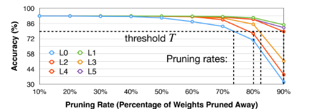
- Automatic Pruning
    - 之前剪枝的比例是人工选择，然后通过实验来确定最终比例。希望能够自动选择。
    - AMC (AutoML for Model Compression): Pruning as a reinforcement learning problem
        - FLOPS: floating point operations per second. 每秒浮点运算次数。
        - FLOPs: floating point operations 浮点运算数，可以用来衡量模型复杂度。
        - Reward: $r = -Error\cdot \log(FLOP)$ 希望保证浮点计算次数尽可能少。(平衡精读喝近似延时的关系)
        - Action: 输出每一层的  pruning ratio
        - State: 图层索引、通道号、Kernal size等等
        - 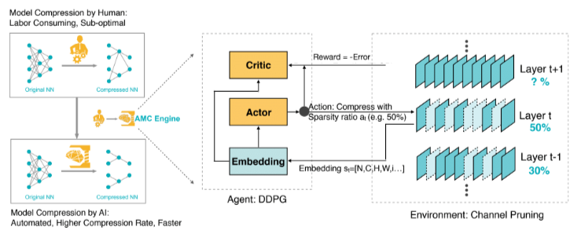
    - NetAdapt
        - A rule-based iterative/progressive method
        - find a per-layer pruning ratio to meet a global resource constraint. Done iteratively
        - 训练流程
            - 对于每次迭代，手动定义希望减少的 latency
            - For each layer $L_k$
                - 剪枝使得满足 latency 的减少 $\Delta R$
                - 短期微调模型，measure accuracy
            - Choose and prune the layer with the highest accuracy
            - Repeat until the total latency reduction satisfies the constraint
            - Long-term fine-tune to recover accuracy
            - 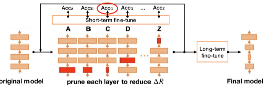

## Fine-tune/Train Pruned Neraul Network

- 剪枝后的模型精度会下降，我们需要微调剪枝后的模型来恢复精度，并可以尝试让剪枝率更高。
- Learning rate for fien-tuning is usually 1/100 of 1/10 of the original learning rate.因为剪枝前模型已经收敛，所以学习率不用太大
- Interative Pruning. 先训练到收敛，随后进行剪枝。剪纸后再次训练到收敛。随后可以进一步提高剪枝率，一直迭代。
- Regularization
    - 惩罚非零参数，目的是尽可能多修剪参数
    - 鼓励更小的权重，这样下一轮迭代就可能修剪掉这些权重。

