# Quantization

## Numeric Data Types

- Motivation: less bit-width means less energy.

- Integer
    - Unsigned integer: n-bit Range: $[0,2^n-1]$
    - Signed Integer
        - Sign-Magnitude Representation: n-bit range $[-2^{n-1}-1,2^{n-1}-1]$
        - Two's Complement Representation: n-bit range $[-2^{n-1},2^{n-1}-1]$
- Fixed-Point Number
- Floating-Point Number
    - IEEE FP32, FP64, FP16
    - Google's BFloat16: 8-bit exponent, 7-bit mantissa
        - 用精度换动态范围
    - Nvidia FP8(E4M3)
        - 没有 inf, $S.1111.111_2$ 表示 NaN
        - 最大的规格化值为 $S.1111.110_2 = 448$ 
    - Nvidia FP8(E5M2)
        - 有 inf ($S.11111.00_2$) 和 NaN($S.11111.XX_2$)
        - 最大的规格化值为 $S.11110.11_2=57344$
        - 有更大的动态范围(exp)，用于反向传播时的梯度计算(模型在训练过程中追求更高的动态范围，推理过程中追求更高的精度)
- INT4 & FP4

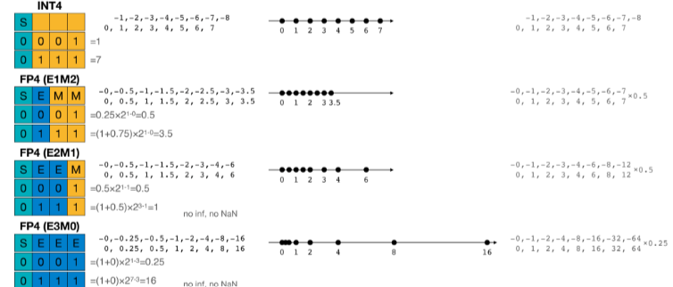

## Neural Network Quantization

**Quantization is the process of constraining an input from a continuous or otherwise large set of values to a discrete set.**

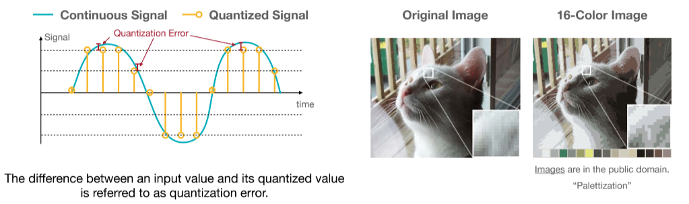

### K-Means-based Weight Quantization

- 使用 K-means 算法对权重进行分类，接近的权重着相同的颜色，将同类的数统一替换为与之相近的浮点数
- 有一个 lookup table(codebook)， 权重就是调色板里的索引。因此只需要存浮点调色板和整数索引，不用完整地将浮点权重存下来。

!!! Example

    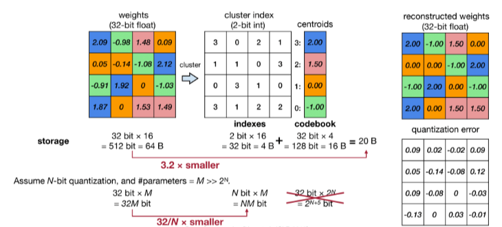

    我们使用 2-bit 量化，即得到 4 个不同的值，经过 K-Means 算法我们得到 4 个中心点，然后将权重量化为这 4 个中心点的索引。右侧是量化后的权重。

- 量化后的权重也可以进行微调。梯度也可以进行相应的量化。
    - 按权重分类结果对梯度进行分组，每一组求和或者average, 得到改组的梯度
    - 将 centroids 的值进行更新

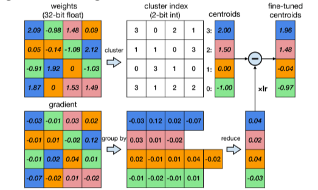

- 卷积层小于 4—bit 编码后准确率大幅度下降，全连接层小于 2-bit 编码后准确率大幅下降。
- 这种量化方法只节省了存储空间，没有减少计算量，因为所有的计算和内存访问依然是浮点数。

### Linear Quantization

- 用仿射变换将整数映射到实数。
    - 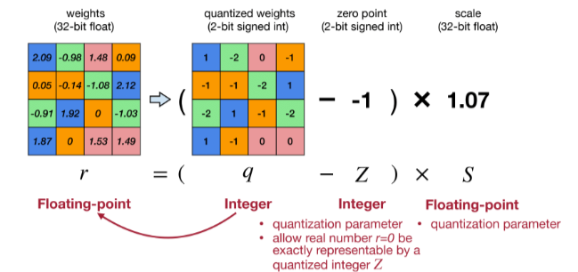
    - 使用 $r=S(q-Z)$ 将整数 $q$ 映射到实数 $r$。其中 $Z$ 是 zero-point(int),$S$ 是 scale(fp)
        - zero-point: 为了让 $r=0.0$ 这个数能被准确映射到一个整数 $Z$ 上。
        - 确定 $S,Z$: 当我们量化的位数确定后，使用二进制补码表示法，$q_{max}$ 和 $q_{min}$ 就是 $2^{N-1}-1$ 和 $-2^{N-1}$。这时候如果知道了 $r_{max},r_{min}$ 就可以求出 $S,Z$.
        - 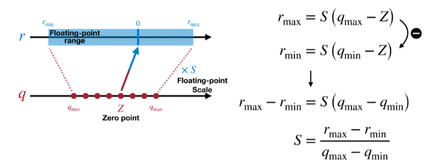
- 线性量化下的矩阵乘法 TODO

## Post-Training Quantization

How should we get the optimal linear quantization paremeters $(S,Z)$?

### Quantization Granularity

- Per-Tensor Quantization
    - $|r|_{max}=|\bf{W}|_{max}$,即取每个 tensor 的最大值
    - 使用单个缩放因子 $S$ (对于大模型效果好，对于小模型精度会下降)
    - 因为不同的输出通道权重范围较大不同。
- Per-Channel Quantization
    - 每个通道使用单独的缩放因子
    - 优点：更细粒度，量化误差更小，在视觉模型表现出色
    - 缺点：需要额外的内存存储每个通道的缩放因子

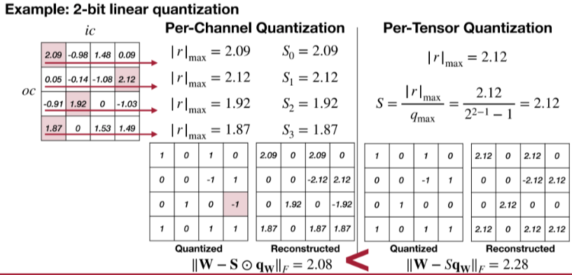

- Group Quantization
    - VS-Quant: Per-vector Scaled Quantization
        - 对同一个通道里每多少个元素分组做相同的量化
        - 原方程多了一个缩放因子 $\gamma$：$r=\gamma \cdot S_q(q-z)$, $\gamma$ 是一个浮点数粗粒度缩放因子，一个张量共享一个，$S_q$ 是整数缩放因子，每个向量有一个单独的。
        - 实现精度和硬件效率的平衡。

        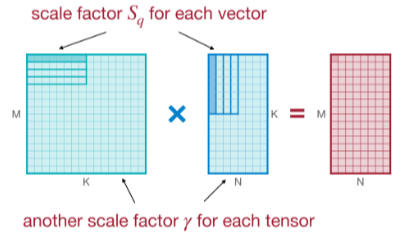

    - Multi-level scaling scheme
        - 使用更多层次的缩放因子。
        - 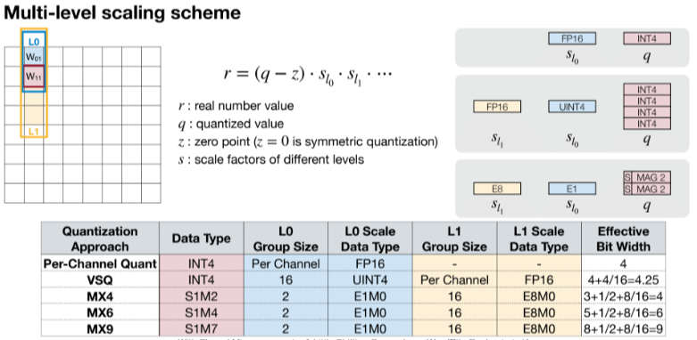
        - 还不是很懂

### Dynamic Range Clipping

- weight 是静态的，但是 activation 是动态的，我们需要确定 activation 的范围，在部署模型前收集 activatioin 的统计信息。
- Type1: during training
    - 在训练过程中跟踪指数移动平均值(EMA)
    - 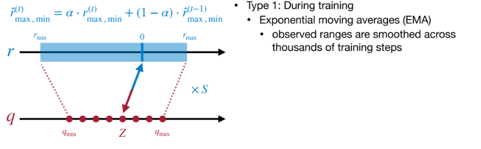
- Type2: 使用少量校准数据集来确定R的最大值最小值，这种方式不需要大量的训练.
    - 通过 KL 散度衡量信息的损失，用来找最适合 clip 的地方
    - 在训练后的模型上运行几个 calibration batches 来校准。
    - 不是很懂

### Rounding

- Rounding-to-nearest 不是最佳的，因为权重会相互影响。对于单个权重最好的 rounding 不一定是对整个矩阵最好的。
- optimal: rounding that reconstructs the original activation the best. 

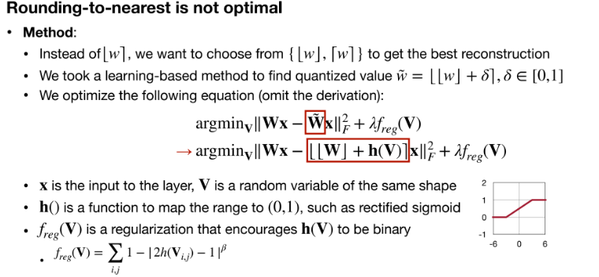

## Quantization-Aware Training

How should we improve preformance of quantized models?

当我们把模型量化后，可能需要微调来提供更好的精度。

考虑一个问题，我们在训练过程中使用 fp32, 在模型推理的时候使用 post-training quantization 直接量化为 int8 模型，可能会导致模型精度存在损失。量化感知训练在模型训练过程中引入了伪量化来模拟量化过程带来的误差。

- 为什么存在量化误差
    - 主要原因为量化-反量化
    - 模型经过量化后，在推理框架运行的时候会根据不同的 op 调用相应的算子
        - 某些算子可以支持低精度的输入输出，这时候就会直接调用 INT8 计算
        - 某些算子需要高精度输入输出，那么我们就会将 INT8 反量化为 FP32 计算。
        - 这个过程造成精度损失。
- QAT
    - 首先在数据集上以 FP32 精度进行模型训练，得到训练好的 baseline
    - 在 baseline 模型中插入伪量化节点，得到 QAT 模型，并进行 finetune
    - 伪量化节点模拟推理时的量化过程并且保存 finetune 过程中计算得到的量化参数。
    - finetune 完成后，使用 3 中得到的量化参数对 QAT 模型进行量化得到 INT8 模型。
- Fake-quantize
    - quantization + dequantization 的结合，实际上就是模拟量化 round 引起的误差。
    - 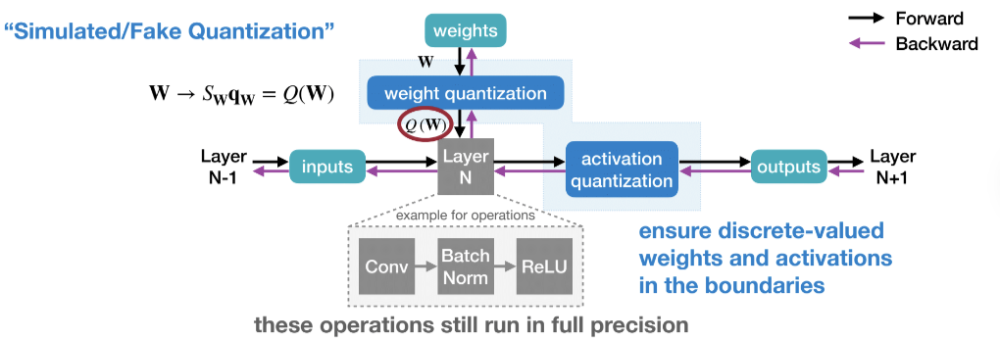

### Straight-Through Estimator

神经网络训练中，反向传播算法依赖于链式法则，但是量化函数通常不可微。因此我们 BP 的时候就应该用近似方法计算梯度。

STE 近似地将量化函数的梯度视为恒等函数的梯度。

## Binary/Ternary Quantization

Can we push the quantization precision to 1 bit?

## Mixed-Precision Quantization

不同层对量化的敏感程度不同，因此引入混合精度量化，为不同层设计不同的量化精度。