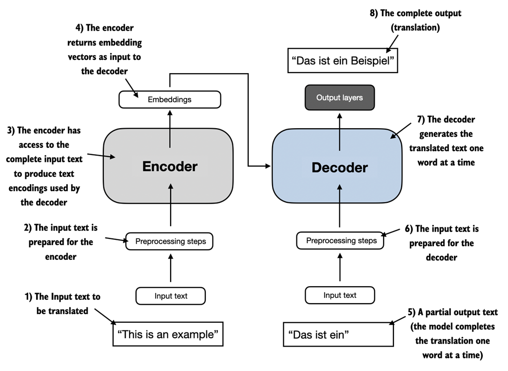
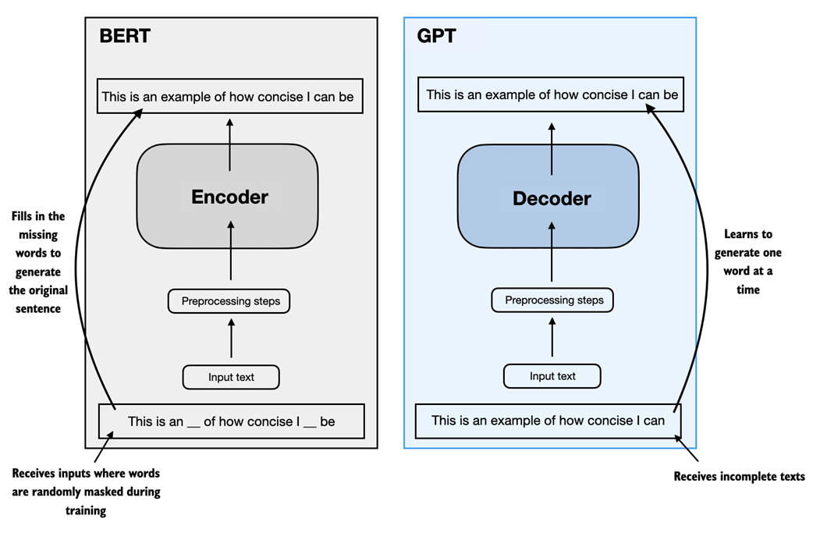
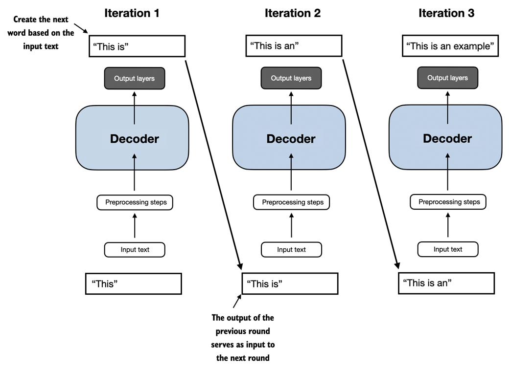

# Understanding Large Language Models

!!! note "Goal"

    understanding LLMs by implementing a ChatGPT-like LLM based on the transformer architecture.

## What is an LLM?

An LLM is a neural network designed to understand, generate, and respond to human-like text.

## Stages of building and using LLMs

- When it comes to modeling performance, custom-built LLMs (those tailored for specific tasks or domains) can outperform general-purpose LLMs.
- The general process of creating LLM includes pretraining and finetuning.
    - pretraining: the initial phase where a model like an LLM is trained on a large diverse dataset to develop a broad understanding of language.
    - finetuning: the pretrained model serve as a foundational resource that can be further refined. finetuning is a process where the model is specifically trained on a narrower dataset that is more specific to particular tasks.

## Transformer architecture

- The encoder module processes the input text and encodes it into a series of numerical representations or vectors that capture the contextual information of the input.
- The decoder module takes these encoded vectors and generates the output text from them.
- Both the encoder and decoder consist of many layers connected by a self-attention mechanism, which allows the model to weigh the importance of different words or tokens in a sequence relative to each other.**enable the model to capture long-range dependencies and contextual relationships within input data**

### Bert

BERT and its variants specialize in masked word prediction, where the model predicts masked or hidden words in a given sentence.

### GPT

GPT focus on the decoder portion of the original transformer architecture and is designed for tasks that require generating texts.

GPT models are adept at executing both zero-shot and few-shot learning tasks:

- Zero-shot learning: the ability to generalize to completely unseen tasks without any prior specific examples.
- few-shot learning:  learning from a minimal number of examples the user provides

## Utilizing large datasets

!!! note "token"

    - a unit of text that a model reads
    - the number of tokesn in a dataset is roughly equivalent to the number of words and punctuation characters in the text.