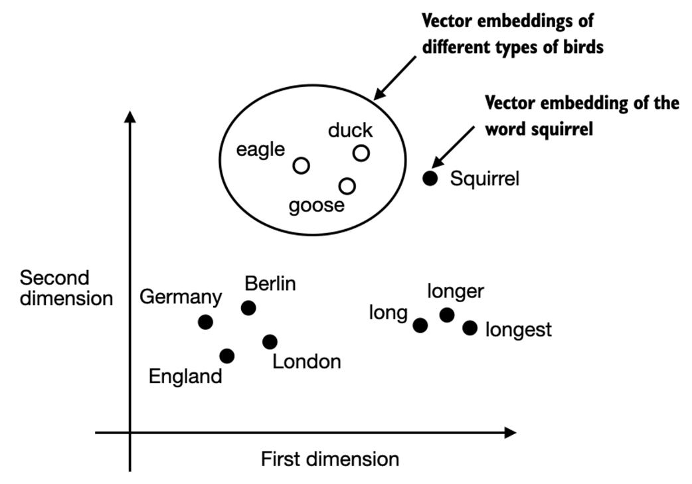

# Working with Text Data

## Word Embeddings

深度神经网络模型不能处理 raw text, 我们希望将 words 转化成向量，使得其可以用于训练网络。

The concept of converting data into a vector format is reffered to as **embedding**. (a mapping from discrete objects to points in a continuous vector space.)

Key idea: words that appear in similar contexts tend to have similar meanings.

## Tokenizing text

**How we spilt input text into individual tokens**.

!!! note "code implementation"

    - 利用正则表达式来分解

## Converting tokens into token IDs

