# Transformer

!!! note "Reference"

    https://jalammar.github.io/illustrated-transformer/

## A High-Level Look

首先我们从 High-Level 的角度理解 Transformer 模型。假设我们的应用场景是机器翻译，首先我们将 Transformer 看作一个简单的黑盒。
所以这个黑盒的输入是一个语句，输出是该语句翻译后的结果。

现在我们来探索这个黑盒里面的结构。首先，这个黑盒有两个部分组成： encoder 和 decoder, 并且二者之间存在连接。

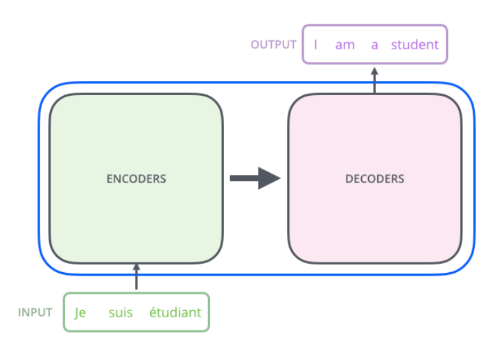

Encoders 由很多小的 encoder 组成， decoder 同理。

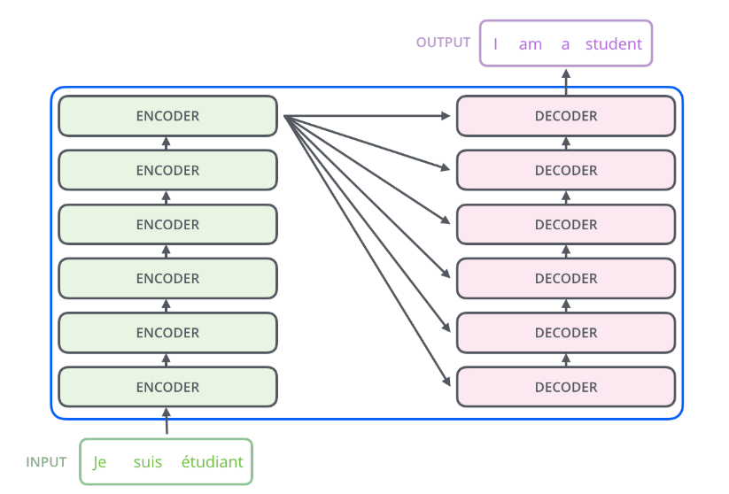

每个 Encoder 由两个 layer 组成，一个是 self-attention 模块，另一个是 FNN 模块。 每个 Decoder 除了 self-attention 和 FNN 之外，在这两层之间还有一个 attention 模块。

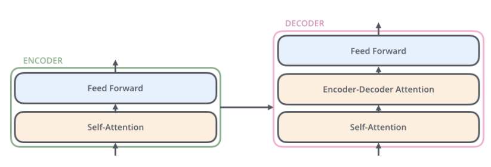

## Details!

现在我们从 vector 的视角来看看 input 经历了哪些步骤，最终产生 output。

首先自然是将输入的单词通过 embedding 变成 vector。word embedding 之后，他们经过 encoder 的两层网络后得到该个 encoder 的输出，输出喂给下一个 encoder。

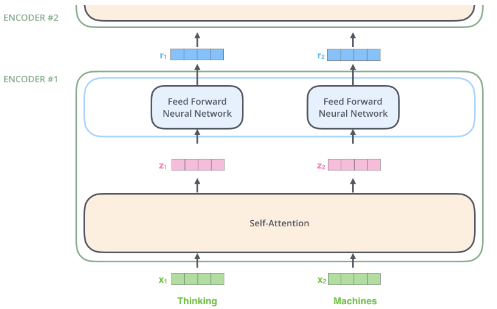

这里有一个比较重要的点：每个 vector 是有自己的 flow path 的。在 attention 层中这些 path 是互相依赖的，但是在 FNN 中是独立的，因此这允许了 FNN 中 vector 的并行。

### Self-Attention at a High Level

- Motivation
    - 我们看这个句子: The animal didn't cross the street because it was too tired. 我们要怎么知道句子中的 it 指代的是什么呢？是 street 还是 anmial? 这个问题对机器来说是比较困难的。
    - 所以 self-attention 要解决的问题就是如何让机器知道这里的 it 指代的是 animal。
- 怎么做呢？在处理每一个 word 的时候，self-attention 可以查看句子的其它位置来找到更好 encode 这个 word 的方法。(**bake the understanding of other relevant words into the one we are currently processing**)

### Self-Attention in Detail

首先我们看 self-attention 机制是怎么处理 vector 的。

首先，对于 encoder 的输入向量，我们需要为他们构建三个向量 (Query vector, Key vector, Value vector)。怎么构造这三个向量呢？我们用矩阵乘以输入的向量，这三个矩阵是训练得到的。 
需要注意的是，构建出的三个向量的维数是小于输入向量的。

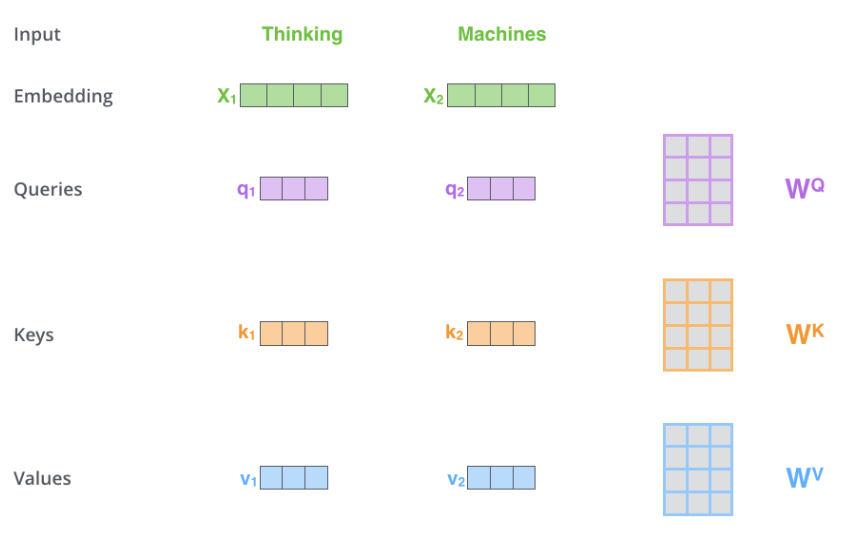

其次，我们需要计算出一个 score。我们1在某个位置对一个 word 进行 encode 时，这个 score 决定了我们需要多大程度关注输入句子的其它部分。我们计算 Query vector 和 Key vector 的点积。

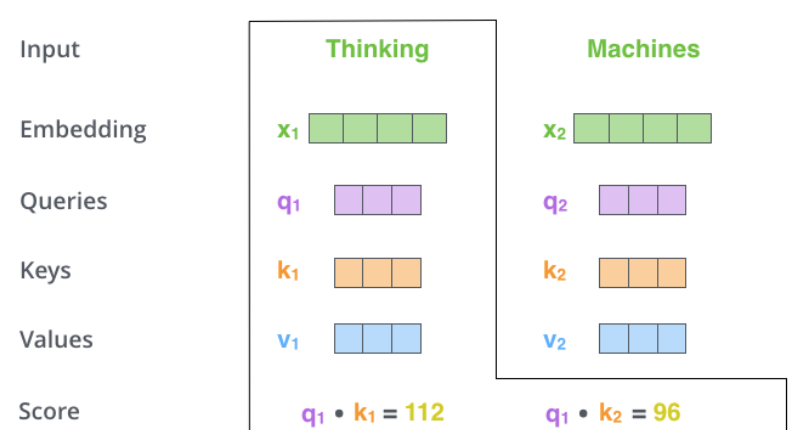

在计算完 score 后，我们需要除以一个 normal 项(这可以使得梯度更稳定)，然后将 result 过一个 softmax 层，将分数转化为概率。这个概率分数决定了在当前位置上，每个 word 的表达量。

然后我们将每个单词的分数与 Value vector 相乘。这一步比较直观，就是保留相关的 word 并且丢弃无关的 word。最后将所有结果相加得到该层的 output。

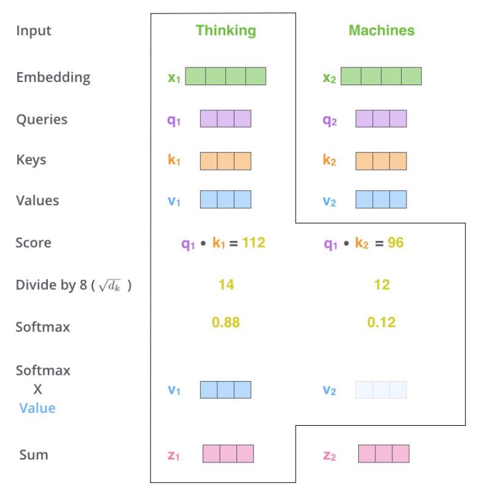

但实际上，我们采取的是矩阵乘法的实现方式，但思路其实是类似的，总结一下就是下面这个公式。

$$
softmax(\dfrac{QK^T}{\sqrt{d_k}})V
$$

### The Beast With Many Heads

我们采取 Multi-headed attention。相对于 self-attention, 它有如下几个好处：

- 尽管 self-attention 中，每个位置编码了其它位置的信息，但是每个位置产出的结果仍然会被该位置的单词 dominate(比较自己和自己的点积结果肯定是大的)。所以在多头 attention 中，模型可以看到更多不同的位置。
- 有很多个 representation subspaces? 目前不是很明白

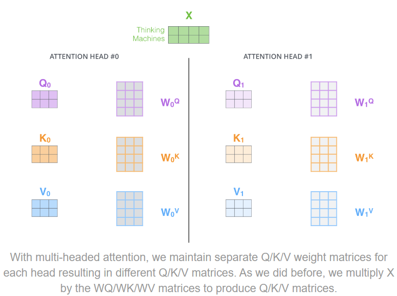
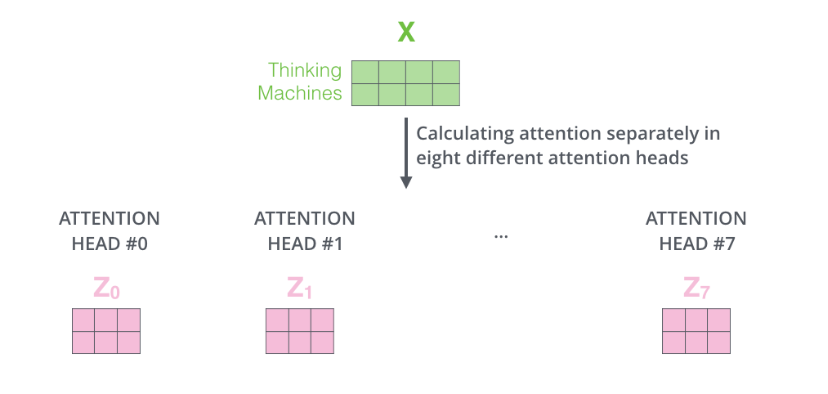

可以看到，我们对每个 head 分别做 self-attention, 我们得到很多个不同的 $Z$ 矩阵。但是问题来了，我们的 FNN 只想要一个矩阵，所以我们需要想个办法将这些矩阵聚合成一个。做法如下图所示，我们将这几个矩阵拼接起来，然后乘一个我们训练好的矩阵，得到最终的结果喂给 FNN。

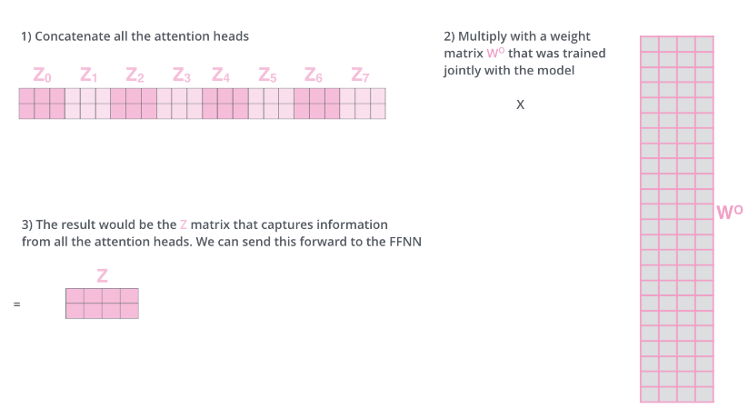

**Put it all together!**

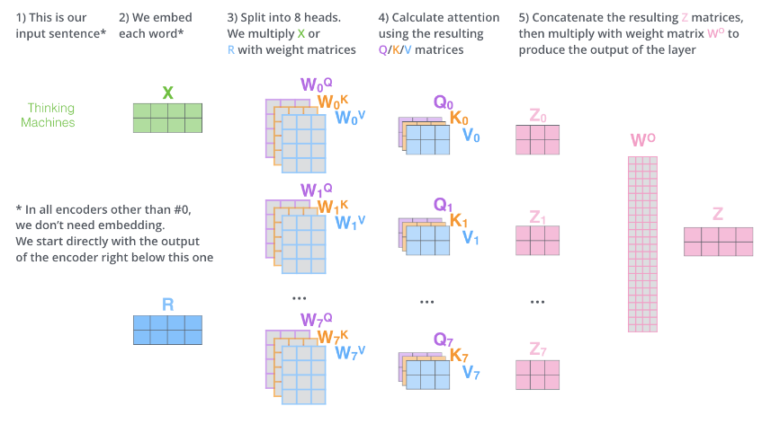

### Positional Encoding

目前为止的方法我们不能区分输入序列的顺序，i.e., 我们是对整个 set 进行处理，打乱顺序后结果是一样的，所以我们需要引入位置编码的概念。

一个很直观的想法就是在 word embedding 上加一个具有位置信息的 vector。

### The Residuals

在 encoder 和 decoder 的每一个 layer 中，我们都有一个残差连接和一个 layer-normalization.

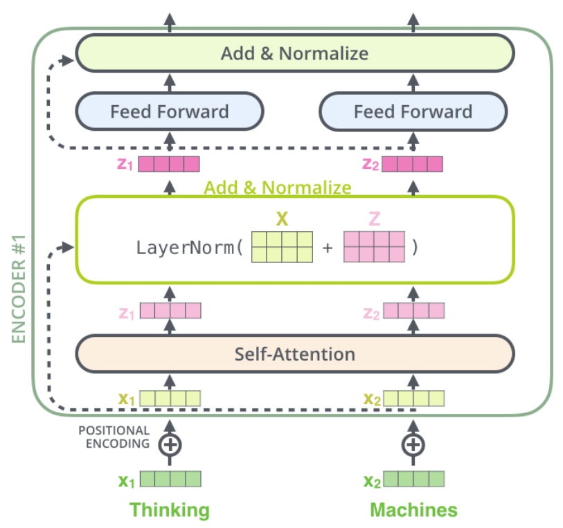

### The Decoder Side

我们已经知道了 encoder 的具体过程，将输入句子喂给 encoder 之后, encoder 会得到一系列 output, 这些 output 向量被转化成 attention vectors $K,V$. $K,V$ 向量会被喂给每个 decoder 的 encoder-decoder 层中来帮助 decoder 聚焦于输入序列的合适位置。

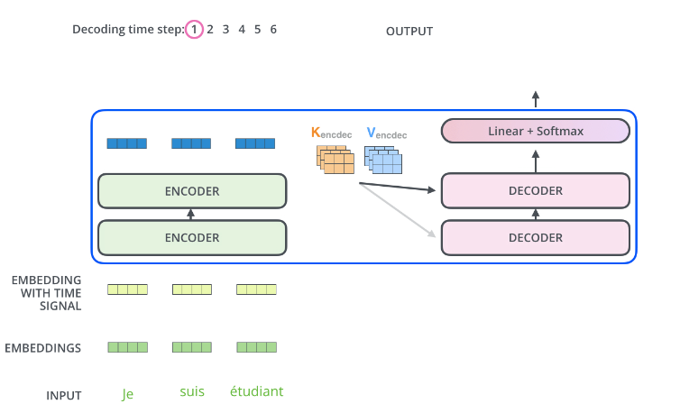

在 decoder 的 self-attention 中，与 encoder 中不同的是，它只能看到该位置之前的单词，该位置之后的词被 mask 掉(在 softmax 层前把它们设为 `-inf`)。

> The “Encoder-Decoder Attention” layer works just like multiheaded self-attention, except it creates its Queries matrix from the layer below it, and takes the Keys and Values matrix from the output of the encoder stack.

### The Final Linear and Softmax Layer

我们需要将 decoder 输出的 vector 转化成 word。

- Linear Layer
    - 实际上就是全连接网络，它把向量维数变大，得到 logits vector. (我们的模型词汇量多大，logits vector 就多大，其实就是每个词的分数)
- Softmax Layer
    - 将分数转化为概率，概率最高的单词作为输出。