# Lecture 2: Image Classification with Linear Classifiers

## Image Classification

> This is one of the core problems in Computer Vision that, despite its simplicity, has a large variety of practical applications. Moreover, many other seemingly distinct Computer Vision tasks (such as object detection, segmentation) can be reduced to image classification.

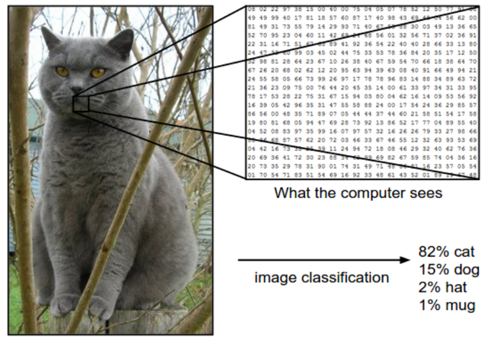

The task in Image Classification is to predict a single label(or a distribution over labels as shown here to indicate our confidence) for a given image. 

Images are 3-dimensional arrays of integers from 0 to 255, of size Width x Height x 3. The 3 represents the three color channels Red, Green, Blue.

### Challenges

- Viewpoint cariation. A single instance of an object can be oriented in many ways with respect to the camera.
- Scale variation. Visual classes often exhibit variation in their size (size in the real world, not only in terms of their extent in the image).
- Deformation. Many objects of interest are not rigid bodies and can be deformed in extreme ways.
- Occlusion. The objects of interest can be occluded. Sometimes only a small portion of an object (as little as few pixels) could be visible.
- Illumination conditions. 
- Background clutter. The objects of interest may *blend* into their environment, making them hard to identify
- Intra-class variation. The classes of interest can often be relatively broad, such as *chair*. There are many different types of these objects, each with their own appearance.

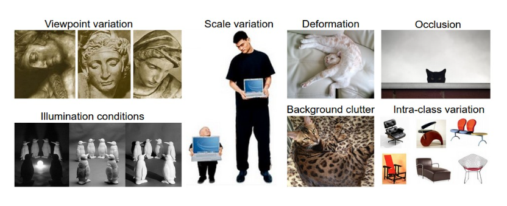

**A good image classification model must be invariant to the cross product of all these variations, while simultaneously retaining sensitivity to the inter-class variations.**

### Data-driven approach

Instead of trying to specify what every one of the categories of interest look like directly in code, we’re going to provide the computer with many examples of each class and then develop **learning algorithms** that look at these examples and learn about the visual appearance of each class.

### The image classification pipeline

- Input: consists of a set of $N$ images, each labeled with one of $K$ different classes.(training set)
- Learning: training a classifier
- Evaluation: by asking it to predict labels for a new set of images that it has never seen before.

## Nearest Neighbour Classifier

> example image dataset: CIFAR-10: consists of 60,000 tiny images that are 32 pixels high and wide. Each image is labeled with one of 10 classes (for example *“airplane, automobile, bird, etc”*). These 60,000 images are partitioned into a training set of 50,000 images and a test set of 10,000 images
>
> 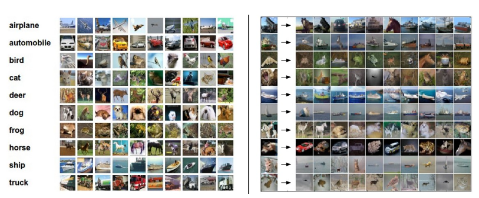

**The nearest neighbour classifier will take a test image, compare it to every single one of the training image,  and predict the label of the closest training image**.

### L1 distance

- compare the images pixel by pixel and add up all the differences.
- $d_1(I_1,I_2)=\sum_p \vert I_1^p-I_2^p\vert$

```python
import numpy as np

class NearestNeighbor(object):
  def __init__(self):
    pass

  def train(self, X, y):
    """ X is N x D where each row is an example. Y is 1-dimension of size N """
    # the nearest neighbor classifier simply remembers all the training data
    self.Xtr = X
    self.ytr = y

  def predict(self, X):
    """ X is N x D where each row is an example we wish to predict label for """
    num_test = X.shape[0]
    # lets make sure that the output type matches the input type
    Ypred = np.zeros(num_test, dtype = self.ytr.dtype)

    # loop over all test rows
    for i in range(num_test):
      # find the nearest training image to the i'th test image
      # using the L1 distance (sum of absolute value differences)
      distances = np.sum(np.abs(self.Xtr - X[i,:]), axis = 1)
      min_index = np.argmin(distances) # get the index with smallest distance
      Ypred[i] = self.ytr[min_index] # predict the label of the nearest example

    return Ypred
```

- However, this classifier only achieves 38.6% on CIFAR-10.

!!! note

    Train O(1),predict O(N)
    But we want classifiers that are fast at prediction; slow for training is ok.


### The choice of distance

- L2 distance: $d_2(I_1,I_2)=\sqrt {\sum_p{(I_1^p-I_2^p)}^2}$, 35.4% accuracy

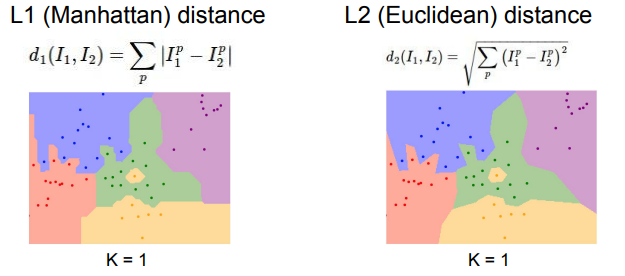

## K-Nearest Neighbor Classifier

Instead of finding the single closest image in the training set, we will find the top **k** closest images, and have them vote on the label of the test image.

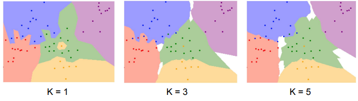

Intuitively, higher values of k have a smoothing effect that makes the classifier more resistant to outliers.

### Pros and Cons of Nearest Neighbour classifier

- 优点：训练不花费时间
- 缺点：不适用于高维数据，基于像素距离的比较造成维数灾难

## Setting Hyperparameters

*Which number of k works best?*

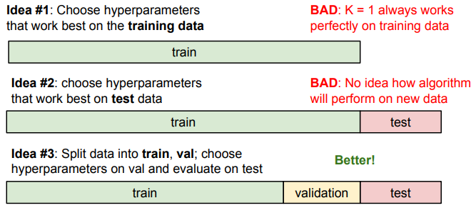

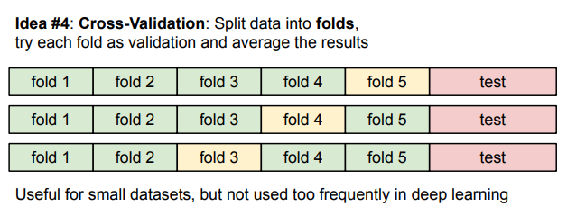

!!! note

    Evaluate on the test set only a single time, at the very end.


## Linear Classification

由于KNN存在不足，我们需要一种更强大的方法来解决图像分类问题，并且该方法可以自然延申到神经网络上。


该方法主要由两部分组成：一个是**score function**(评分函数)，它是原始图像数据到类别分值的映射。另一个是**loss function** （损失函数），它是用来量化预测得分与真实标签之间的一致性。该方法最终可转化为一个最优化问题。

### Parameterized mapping from images to label scores

score function 将图像的像素值映射为各个分类类别的得分，得分高代表图像属于该类别的概率大。

现在我们从一个例子出发： 假设有一个包含很多图像的训练集$x_i \in \mathbb{R}^D$, 每个图像都有一个对应的分类标签$y_i$, 即我们有$N$个图像，每个图像的维度是$D$（将图像拉长，可以把图像看作高维空间的一个点，整个数据集就是一个点的集合，每个点带有一个分类标签）, 共有$K$种不同的分类。定义$f:\mathbb{R}^D \rightarrow \mathbb{R}^K$

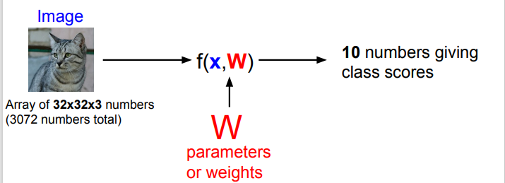

### Linear classifier

我们从最简单的函数开始，一个线性映射：
$$
f(x_i,W,b)=Wx_i +b
$$
其中$x_i$的大小是$D\times 1$, $W$的大小是$K\times D$ ,$b$是$K\times 1$

$W$ 被称为weights(权重)，$b$ 影响输出的数值但是并不和原始数据产生关联，可以理解为一个修正量，被称为bias vector（偏差向量）

而对于$W$矩阵，可以这样理解：每个类的分类器就是$W$的一个行向量。以船的分类为例，可以想象船被大量蓝色包围。那么船分类器在蓝色通道上就有较多的正权重，而在绿色红色通道上负权重较多。

举个简单的例子，如下图所示，假设input image只有四个像素（不考虑RGB通道），有三个分类（红绿蓝分别代码猫狗船，不是RGB的意思！）。首先将图像像素拉长为一个列向量，与$W$进行矩阵乘，然后得到各个分类的分值。

!!! warning

    该例仅供理解分类器的具体内容，它的矩阵W is bad.可以看出来该分类器猫的分值非常低，算法倒觉得这个图像是一只狗。

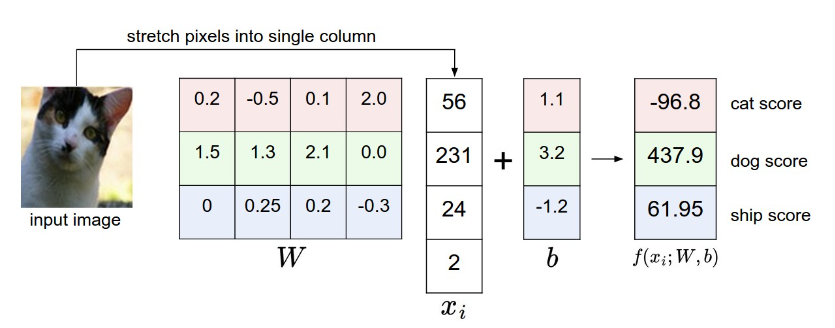

#### 几何解释

另一个对linear classifier直观的理解，我们假设每个图像拉长后都是二维的（因为我们无法可视化真实图像那么高维空间的线性函数），如下图所示：

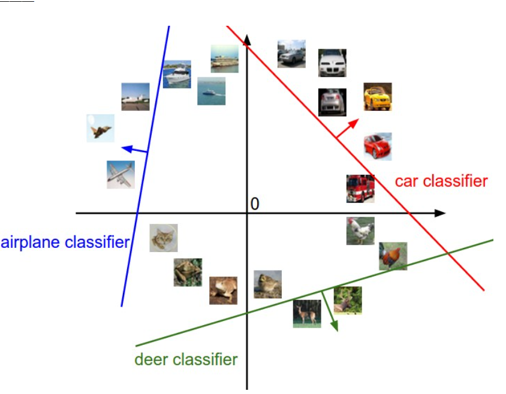

通过该图我们再次理解一下 $W$ 和 $b$ 的作用：$W$的每一行都是一个分类类别的分类器。如果改变其中一行的数字，分类器在空间中对应的直线就开始旋转，而$b$允许直线平移。需要注意的是，如果没有$b$, 那么无论权重如何，在$x_i=0$时分值始终为$0$,这样所有直线都要穿过原点。这是我们在$Wx$的基础上加上偏差向量的另一种解释。

#### 将线性分类器看作模板匹配

关于$W$ 的另一种解释是它的每一行对应一个分类的模板。每张图像的不同类别得分，是使用内积来比较图像和模板，最后得到的相似度。从这个角度来看，线性分类器就是在利用学习到的模板，针对图像做模板匹配。而联系到之前的kNN算法，我们也可以理解为linear classifier是在高效使用kNN。不同的是，我们没有使用所有训练集的图像来比较，而是使用模板图片来判断，而且没有使用$L_1.L_2$距离计算，而是使用内积来计算相关性。

!!! note

    内积经常在相关性的计算中被使用

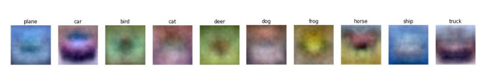

## Loss function

> *The loss function quantifies our unhappiness with predictions on the training set*

在上个unit举的例子中，$W$并不是我们想要的权重矩阵，所以我们现在需要做的就是调整权重矩阵的参数，使得评分函数的结果与训练集中图像的真实类别一致。所以引入损失函数的概念。

当评分函数输出结果与真实结果之间差异越大，损失函数输出越大，反之越小。

### Multiclass Support Vector Machine Loss

**Key idea**: SVM的loss function 想要SVM在正确分类上的得分始终比不正确分类的得分高出一个边界值 $\Delta$

首先将score简写为$s$, 即$s_j=f(x_i,W)_j$. 则针对第$i$个数据的svm损失函数定义如下：
$$
L_i = \sum_{j \neq y_i}max(0,s_j-s_{y_i}+\Delta)
$$
下图是一个具体的例子，这里的边界值设置为1

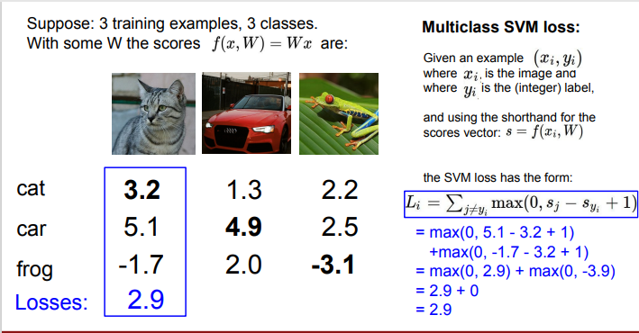

> 关于0的阈值：$max(0, )$函数被称作折叶损失函数（hinge loss)

### Softmax((Multinomial Logistic Regression)

与SVM不同，Softmax的输出为归一化的概率分布，更加直观。

$s=f(x_i,W), P(Y=k|X=x_i)=\frac{e^{s_k}}{\sum_j{e^{s_j}}}$

使用$f_j$表示评分向量$f$中的第$j$个元素，损失函数定义为：
$$
L_i=-log(\frac{e^{f_j}}{\sum_j{e^{f_j}}})
$$

#### 信息理论视角

真实分布 $p$ 和估计分布 $q$ 之间的**交叉熵**： 
$$
H(p,q)=-\sum_x p(x)log(q(x))
$$
因此，softmax分类器所作的就是最小化在估计分布 $\frac{e^{f_{y_i}}}{\sum_j e^{f_j}}$ 和真实分布之间的交叉熵。真实分布就是所有概率密度都分布在正确的类别上（比如$p=[0,…,1,…,0]$中$y_i$的概率是$1$, 代表真实类别，其他全为$0$)


#### Practical issues

代码实现softmax函数计算时，因为存在指数函数，除以大数值可能造成数值计算的不稳定，所以我们需要使用归一化技巧
$$
\frac{e^{f_{y_i}}}{\sum_j{e^{f_j}}}=\frac{Ce^{f_{y_i}}}{C\sum_j{e^{f_j}}}=\frac{e^{f_{y_i}+logC}}{\sum_j{e^{f_j}+logC}}
$$
其中$C$的值可以任意选择，通常将$C$设定为$logC=-max_jf_j$， 即将$f$中的数值平移使得最大值为$0$, 以下是一个例子

```python
f = np.array([123, 456, 789]) # example with 3 classes and each having large scores
p = np.exp(f) / np.sum(np.exp(f)) # Bad: Numeric problem, potential blowup

# instead: first shift the values of f so that the highest number is 0:
f -= np.max(f) # f becomes [-666, -333, 0]
p = np.exp(f) / np.sum(np.exp(f)) # safe to do, gives the correct answer
```

