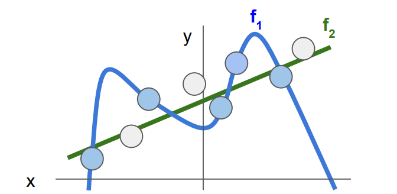
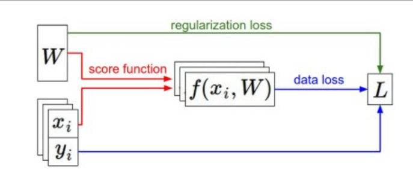

--- comments: true ---
# Lecture 3: Regularization and Optimization

## Regularization

考虑上一节损失函数得到的结果，有一个数据集和一个权重集$W$能够正确分类每个数据，但是这个$W$并不唯一。例如，$W$可以使得$L=0$, 那么$2W$同样也可以做到。那么我们究竟要怎么选择？

这时候就要引入正则化的方法。我们在损失函数后加一个正则化penalty部分：
$$
L(W)=\frac{1}{N}\sum_{i=1}^{N}L_i(f(x_i,W),y_i)+\lambda R(W)
$$

### Regularization intuition



一个直观的例子如上图，蓝色的点代码训练集的数据，我们想得到的不是一个能够非常好的拟合现有数据的$W$（如图中的$f_1$),而是可以对陌生数据具有同样好的效果（$f_2$)。所以正则化起到的作用是防止数据过拟合。

### Simple examples

- L2 regularization: $R(W)=\sum_k\sum_lW_{k,l}^2$, likes to spread out weights
- L1 regularization: $R(W)=\sum_k\sum_l \vert W_{k,l}\vert$ , prefer sparse weights
- Elastic net(L1+L2): $R(W)=\sum_k\sum_l \beta W_{k,l}^2+\vert W_{k,l}\vert$


## Optimization

损失函数可以量化某个权重矩阵的质量，而最优化的目标就是找到能够最小化损失函数值的$W$, 我们现在就朝着这个目标，引入优化的方法。

### 两个直观但不太好的想法

- 随机搜索：很容易想到的方法，但是是个very bad idea

- 随机本地搜索：从一个随机$W$开始，然后生成一个随机扰动 $\delta W$, 只有当 $W+\delta W$的损失值变低，我们才会更新。虽然比随机搜索好一些，但是依然很浪费计算资源

### 跟随梯度

在一维空间，函数的导数为：$\frac{df(x)}{dx}=lim_{h \rightarrow 0}\frac{f(x+h)-f(x)}{h}$

在输入空间中，梯度是各个维度的斜率组成的向量

#### 计算梯度：数值梯度法

利用公式$\frac{df(x)}{dx}=lim_{h \rightarrow 0}\frac{f(x+h)-f(x)}{h}$计算

#### 计算梯度：微分分析法

$\nabla_w L$

### 梯度下降

####  Vanilla Gradient Descent（普通梯度下降）

```python
# Vanilla Gradient Descent

while True:
  weights_grad = evaluate_gradient(loss_fun, data, weights)
  weights += - step_size * weights_grad # perform parameter update
```

其中`step_size`也叫学习率，是最重要的超参之一。若学习率过低，虽然梯度下降稳定但耗时长；如果学习率过高，有可能越过局部最优点导致更高的损失值。

#### Mini-batch gradient descent（小批量数据梯度下降）

在大规模的应用中，训练数据可以达到百万级量级。如果像这样计算整个训练集，来获得仅仅一个参数的更新就比较浪费。一个常用的方法是计算训练集中的*小批量数据。

```python
# Vanilla Minibatch Gradient Descent

while True:
  data_batch = sample_training_data(data, 256) # sample 256 examples
  weights_grad = evaluate_gradient(loss_fun, data_batch, weights)
  weights += - step_size * weights_grad # perform parameter update
```

这个方法之所以效果不错，是因为训练集中的数据都是相关的。要理解这一点，可以想象一个极端情况：在ILSVRC中的120万个图像是1000张不同图片的复制（每个类别1张图片，每张图片有1200张复制）。那么显然计算这1200张复制图像的梯度就应该是一样的。对比120万张图片的数据损失的均值与只计算1000张的子集的数据损失均值时，结果应该是一样的。实际情况中，数据集肯定不会包含重复图像，那么小批量数据的梯度就是对整个数据集梯度的一个近似。因此，在实践中通过计算小批量数据的梯度可以实现更快速地收敛，并以此来进行更频繁的参数更新。

## Summary

