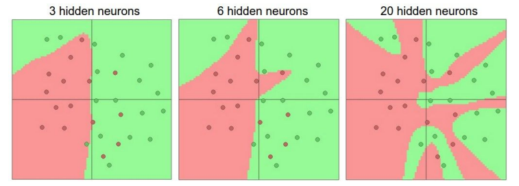
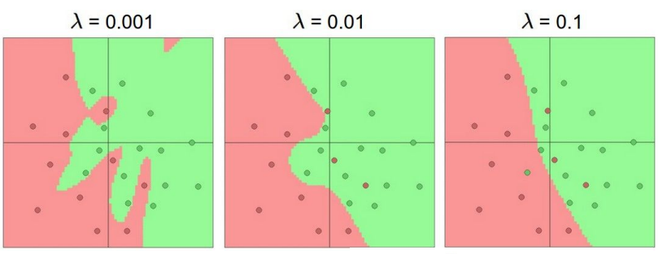
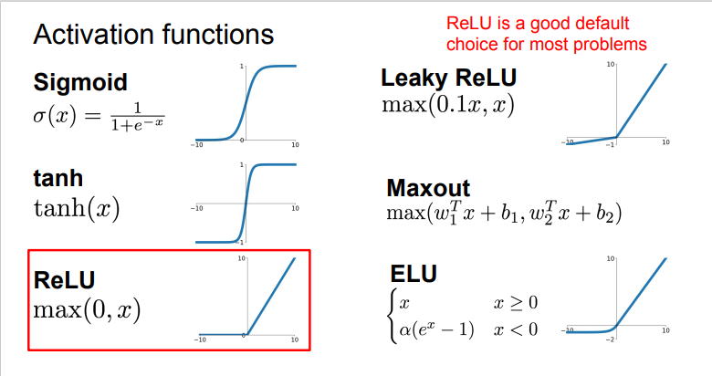
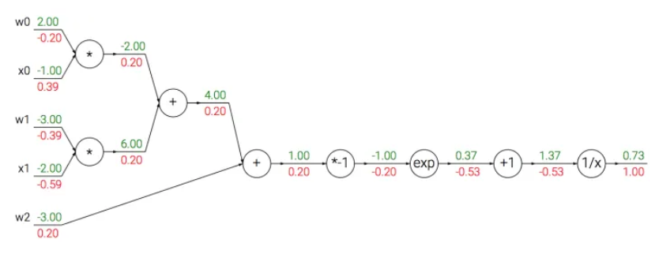

# Lec 4: Neural Networks and Backpropagation

## Neural Networks

### 由生物系统的神经元到神经网络

#### 基本结构

大脑的基本计算单位是神经元，人类神经系统中的大约$860$亿神经元被$10^{14}-10^{15}$个突触连接起来。每个神经元从树突获得信号，沿着轴突输出信号，轴突末端会形成分枝，通过突触和其它神经元的树突相连。

#### 具体过程

- 在神经元的计算模型中，沿着轴突传播的信号($x$)将基于突触强度($w$)，与其它神经元的树突进行乘法交互。
- 突触的强度($w$)可学习，并且控制一个神经元对另一个神经元的影响强度与方向。
- 树突将信号传递到细胞体，信号在细胞体中相加，如果结果高于阈值，那么神经元将会被激活，向轴突输出一个峰值信号。
- 在计算模型中，是激活信号的频率在交流信息，因此将神经元的激活率建模为activation function $f$，它表达轴突上激活信号的频率。


!!! note

    该生物神经元的建模是非常粗糙的，生物神经元的树突可以进行复杂的非线性计算。突触并不就是一个简单的权重，它们是复杂的非线性动态系统，etc.该模型只是为了引入对于我们来说更为重要的神经网络，而非介绍神经科学。

### 作为线性分类器的单个神经元

由神经元通过激活函数的压缩，可见它有能力like or dislike 输入空间的某些线性区域（激活函数值接近1or0）。我们可以通过选择合适的损失函数，使得单个神经元变成一个线性分类器。

!!! question

    在SVM/Softmax的例子中，正则化损失从生物学角度可以看做逐渐遗忘，因为它的效果是让所有突触权重w在参数更新过程中逐渐向着0变化。


### Neural Network

- (Before) Linear score function: $f=Wx,x\in \mathbb{R}^D,W\in \mathbb{R}^{C\times D}$
- (Now) 2-layer Neural Network: $f=W_2max(0,W_1x), x\in \mathbb{R}^D,W_1\in \mathbb{R}^{H\times D}, W_2\in \mathbb{R}^{C\times H}$

> “Neural Network” is a very broad term; these are more accurately called  “fully-connected networks” or sometimes “multi-layer perceptrons” (MLP)

我们可以看到，神经网络引入了非线性函数（在该例中是max函数），那么问题来了，Why do we want non-linearity?

下图的例子是个很好的解释：我们引入非线性函数对数据集进行非线性变换，使得满足其线性分类器的要求。


#### Architectures


- 命名规则：当我们说N层神经网络的时候，我们没有把输入层算入。

用来度量神经网络的尺寸的标准主要有两个：一个是神经元的个数，另一个是参数的个数。

- 第一个网络有$4+2=6$ 个神经元，$3\times 4+4\times 2=20$个权重，还有$4+2=6$个bias, 共26个可学习参数。
- 第二个网络有41个可学习参数（可自己计算验证）

#### 神经网络的表达能力

我们可以把神经网络理解为一个函数族，网络的权重就是每个函数的参数，我们现在想知道的是该函数族的表达能力。(不严谨的类比，可以理解为向量空间的基，我们希望它尽可能扩张成更大的空间)

可以证明，拥有至少一个隐藏层的神经网络是一个通用的近似器，即给定任意连续函数$f(x)$和任意$\epsilon>0$, 均存在一个至少含一个隐藏层的神经网络 $g(x)$ （网络中有合理选择的非线性激活函数）, 对于$\forall x$, 使得 $\vert f(x)-g(x)\vert < \epsilon$.

即**神经网络可以近似任何连续函数**，且深层网络效果比单层网络好。

#### Setting the number of layers and their sizes

当我们增加层的数量和尺寸时，网络的容量上升，即神经元们可以合作表达许多复杂函数，所以表达函数的空间增加。考虑一个分类问题，训练三个神经网络，每个网络都只有一个隐藏层，但每层神经元数目不同，结果如下图所示：



具有更多神经元的网络显然可以分类更复杂的数据，但是可能造成数据的过拟合（网络对数据中的噪声有很强的拟合能力，而没有重视数据间的潜在基本关系）。正则化强度控制可以较好解决该问题：




### Activation functions

下图是常见的激活函数。



#### Sigmoid

它输入实数值并将其“挤压”到0到1范围内，由于它对于神经元的激活频率有良好的解释，**从不完全激活到假定最大频率处的完全饱和激活**。在历史上非常常用。但是它有两个缺点：

- 函数饱和使梯度消失。当激活值接近0或1时，函数的梯度几乎为零，而反向传播时（下文会提到）局部梯度会与整个损失函数对于该门单元的梯度相乘，则导致结果接近0，那么就几乎没有信号通过神经元传到数据，导致网络不学习。
- 函数输出不是以零为中心。如果输入神经元的数据总是正数，那么$w$的梯度在反向传播的过程中要么全是正数，要么全是负数，导致权重更新出现Z字型下降。


#### ReLU(Rectified Linear Unit)

- 优点：对于随机梯度下降的收敛有巨大的加速作用
- 缺点： 对于小于零的数据，梯度为零，导致不可逆转的死亡，而Leaky ReLU是为解决该问题的尝试。

#### Maxout

Maxout是对ReLU和Leaky ReLU的一般化归纳，这里拥有ReLU的所有优点而且不具备缺点，但是整体参数数量激增。


## Backpropagation(反向传播)

**核心问题：给定函数$f(x)$, 需要计算$f$关于$x$的梯度，即$\nabla f(x)$**

- bad idea: derive $\nabla_wL$ on paper: very tedious
- better idea: **computational graphs + backpropagation**


### 简单的表达式

我们以$f(x,y,z)=(x+y)z$为例，直观理解一下反向传播的思想

!!! note

    对于该函数，显然可以进行直接微分。但直接微分在函数很复杂时需要极大的计算量，反向传播则极大简化计算过程。


首先将公式分为两部分：$q=x+y, f=qz$, 可以得到 $\frac{\partial f}{\partial q}=z, \frac{\partial q}{\partial x}=1$, 并且由链式法则：$\frac{\partial f}{\partial x}=\frac{\partial f}{\partial q}\frac{\partial q}{\partial x}$, 可以得到结果。而整个计算的过程，首先将输入值根据公式前向传播，得到最终$f$函数的值。然后由$\frac{\partial f}{\partial f}=1$开始逐步返回，分别计算本地的梯度值，直至得到结果。为了更好的理解，可以参考以下的示例代码和计算流图（前向传播从输入计算到输出（绿色），反向传播从输出计算到输入（红色））。

```python
# set some inputs
x = -2; y = 5; z = -4

# perform the forward pass
q = x + y # q becomes 3
f = q * z # f becomes -12

# perform the backward pass (backpropagation) in reverse order:
# first backprop through f = q * z
dfdz = q # df/dz = q, so gradient on z becomes 3
dfdq = z # df/dq = z, so gradient on q becomes -4
dqdx = 1.0
dqdy = 1.0
# now backprop through q = x + y
dfdx = dfdq * dqdx  # The multiplication here is the chain rule!
dfdy = dfdq * dqdy  
```


在整个计算线路图中，每个门单元都会得到输入并立即计算：

- 该单元的局部梯度
- 局部梯度乘以输入值，得到整个网络的输出对于该单元的梯度

这里将局部梯度与每个输入进行乘法运算是基于链式法则。该操作让一个相对独立的单元变成复杂计算线路中不可或缺的一部分。

反向传播可以看做是门单元之间在通过梯度信号相互通信，只要让它们的输入沿着梯度方向变化，无论它们自己的输出值在何种程度上升或降低，都是为了让整个网络的输出值更高。

### Sigmoid example

$f(w,x)=\frac{1}{1+e^{\neg(w_0x_0+w_1x_1+w2)}}$

这是使用sigmoid激活函数的二维神经元：输入是$[x_0,x_1]$, 可学习的权重是$[w_o,w_1,w_2]$。该神经元对输入数据进行内积，然后其数据被sigmoid函数压缩至$[0,1]$区间。

注意到sigmoid函数的微分是可以简化：
$$
\frac{d\sigma(x)}{dx}=(1-\sigma(x))\sigma(x)
$$
因此可以将中间的流程装进一个独立的门单元，大大简化计算：

```python
w = [2,-3,-3] # assume some random weights and data
x = [-1, -2]

# forward pass
dot = w[0]*x[0] + w[1]*x[1] + w[2]
f = 1.0 / (1 + math.exp(-dot)) # sigmoid function

# backward pass through the neuron (backpropagation)
ddot = (1 - f) * f # gradient on dot variable, using the sigmoid gradient derivation
dx = [w[0] * ddot, w[1] * ddot] # backprop into x
dw = [x[0] * ddot, x[1] * ddot, 1.0 * ddot] # backprop into w
# we're done! we have the gradients on the inputs to the circuit
```



### 矩阵乘法的梯度

```python
# forward pass
W = np.random.randn(5, 10)
X = np.random.randn(10, 3)
D = W.dot(X)

# now suppose we had the gradient on D from above in the circuit
dD = np.random.randn(*D.shape) # same shape as D
dW = dD.dot(X.T) #.T gives the transpose of the matrix
dX = W.T.dot(dD)
```

!!! note

    quite tricky,在操作时要注意转置操作。可以使用分析维度的方法。

