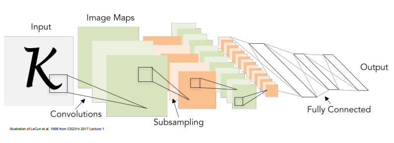
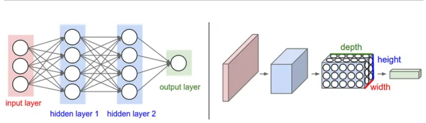
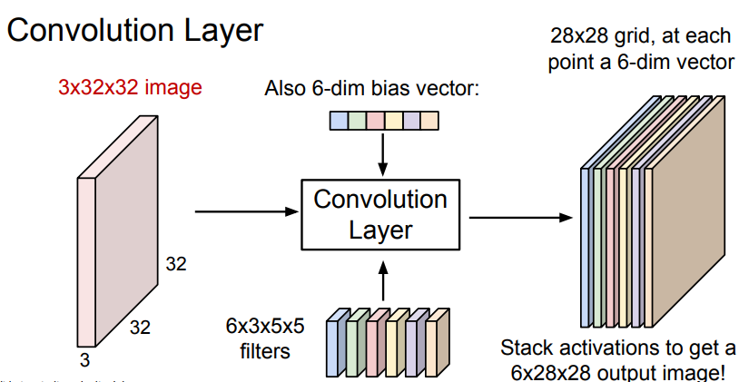
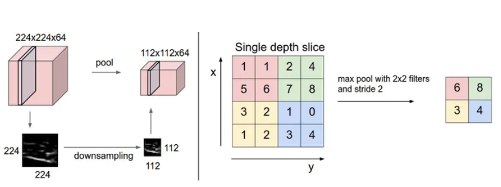

# Lec5: Image Classification with CNNs

## Overview

常规神经网络是全连接的，对于大尺寸图像效果不好。而卷积神经网络针对输入全部是图像的情况，将结构调整得更加合理。我们可以看到层中的神经元只与前一层中的一小块区域连接，最后的评分向量是在深度方向排列的。

## 具体结构

主要由**卷积层，池化层，全连接层**构成，通过将这些层叠加起来，就可以得到一个完整的卷积神经网络

### 卷积层

#### introduction

卷积层是构建卷积神经网络的核心层，它产生了网络中大部分的计算量

- 卷积层的参数是由一些可学习的滤波器（也称该神经元的感受野）集合构成的
- 每个滤波器在空间上都比较小，但是深度与输入一致。
- 在前向传播时，每个滤波器与输入数据进行卷积，生成一个二维的activation map。
- 在每个卷积层上，有一整个集合的滤波器，所有滤波器的激活映射在深度方向上堆叠起来就生成了该层的输出数据。

> **The brain view**. If you’re a fan of the brain/neuron analogies, every entry in the 3D output volume can also be interpreted as an output of a neuron that looks at only a small region in the input and shares parameters with all neurons to the left and right spatially (since these numbers all result from applying the same filter).

#### spaital arrangment

有3个超参控制着输出的大小：depth, stirde, zero-padding

- depth: 与使用的filter的数量一致
- stirde: 滑动滤波器时，必须指定步长（每次移动的像素个数）
- zero-padding：用来保持输入数据在空间上尺寸的trick

#### Summary

input: $W_1\times H_1\times C$

hyperparameters:

- Number of filters $K$
- The filter size $F$
- The stride $S$
- The zero-padding $P$

Output: $W_2\times H_2\times K$

- $W_2=(W_1-F+2P)/S+1$
- $H_2=(H_1-F+2P)/S+1$

Number of parameters: $F^2CK+K$ 

### 池化层

通常，在连续的卷积层之间会周期性插入池化层，它的作用是逐渐降低数据的空间尺寸以减少网络中参数的数量，同时有效控制过拟合现象。

池化层对输入数据的每一个深度切片独立进行max操作，最常见的是使用$2\times 2$的滤波器，以步长为2对每个深度切片降采样，丢弃75%的激活信息。

### 全连接层

与常规神经网络一样，神经元对于前一层的所有激活数据是全部连接的

