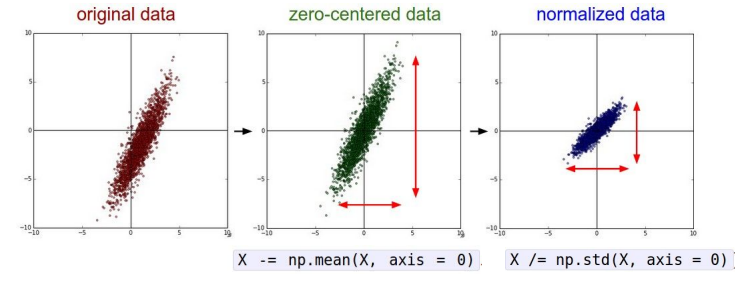
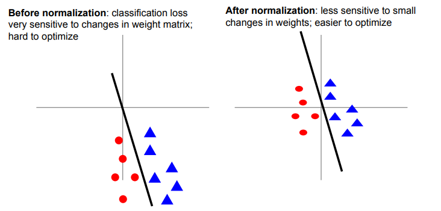
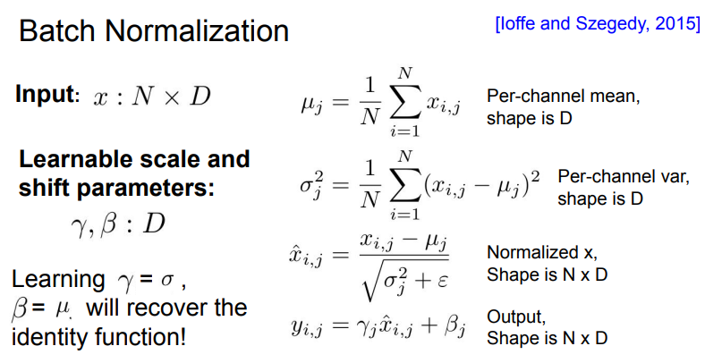

# Lec6: Training Neural Networks(I)

## Activation Functions

### Sigmoid

它输入实数值并将其“挤压”到0到1范围内，由于它对于神经元的激活频率有良好的解释，**从不完全激活到假定最大频率处的完全饱和激活**。在历史上非常常用。但是它有两个缺点：

- 函数饱和使梯度消失。当激活值接近0或1时，函数的梯度几乎为零，而反向传播时（下文会提到）局部梯度会与整个损失函数对于该门单元的梯度相乘，则导致结果接近0，那么就几乎没有信号通过神经元传到数据，导致网络不学习。
- 函数输出不是以零为中心。如果输入神经元的数据总是正数，那么$w$的梯度在反向传播的过程中要么全是正数，要么全是负数，导致权重更新出现Z字型下降。

### tanh

将实数值压缩到$[-1,1]$之间，与sigmoid一样，tanh也存在饱和问题，但是它的输出是零中心的。

### ReLU(Rectified Linear Unit)

$f(x)=max(0,x)$

- 优点：对于随机梯度下降的收敛有巨大的加速作用，比sigmoid和tanh快6倍之多
- 缺点： 对于小于零的数据，梯度为零，导致不可逆转的死亡，导致数据多样化的丢失。而Leaky ReLU是为解决该问题的尝试，但效果不是很稳定。通过合理设置学习率，这种情况发生的概率会降低。

### Maxout

Maxout是对ReLU和Leaky ReLU的一般化归纳，这里拥有ReLU的所有优点而且不具备缺点，但是整体参数数量激增。

**实际应用tips**:

- 使用ReLU函数。注意设置好学习率，并且可以监控网络中死亡的神经元比例.
- 如果不学习问题困扰，可以试试Leaky ReLU或者Maxout，不要用Sigmoid.

## Data Preprocessing

假设数据矩阵$X$, 大小为$[N\times D]$, ($N$ 是数据样本的数量，$D$ 是数据的维度)

### 减均值+归一化

首先回顾在激活函数的介绍中，我们提到sigmoid函数的缺点就是不以零为中心，假设神经元的输入全是正的，那么我们梯度下降的优化就会出现zigzag的现象，效率极低。

所以我们考虑对数据中的每个独立特征减去平均值，从几何上理解就是在每个维度上都将数据的中心移到原点。再这之后将数据的所有维度归一化，使其数值范围近似相等。而归一化有两种方法：

- 先对数据做zero-centered处理，然后每个维度除以标准差
- 每个维度都做归一化，使得每个维度最大值和最小值分别为-1和1

均值处理的另一个优点就在于，它可以使得线性分类器对于微小的权重变换不那么敏感，使得整个网络能够更好的优化。

### PCA and  Whitening

!!! question

    我对PCA过程的理解还不是很透彻，不太理解其中协方差矩阵的具体含义

!!! note

    需要注意的是，任何预处理操作都只能在训练集数据上进行计算，应该先将整个数据集分成训练/验证/测试集，从训练集中求出均值，再在各个集合的图像中减去平均值。

## Weight Initialization

在开始训练神经网络之前，我们还需要初始化神经网络的参数

### 一些错误的idea

- 全零初始化：使得所有神经元都一模一样
- 小随机数初始化：`W=0.01*np.random.randn(D,H)`, 这个方法对于小规模的网络是可取的，但是在大规模的深度网络上，随着层的深入，所有激活值都趋向于零，导致网络不学习。

### 可取的方法

#### Xavier Initalization

使用`1/sqrt(Din)`的方法校准方差。可以保证网络中的神经元有近似的输出分布，提高收敛的速度 (对于卷积层，din是卷积核的维度

!!! note

    该方法的证明将在我学完概率论之后补上

## Batch Normalization

我们希望每一层网络的输入输出都近似符合标准高斯分布。

一个很直观的想法：$\hat{x}^{(k)}=\frac{x^{k}-E[x^{(k)}]}{\sqrt{Var[x^{(k)}]}}$

