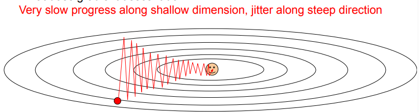
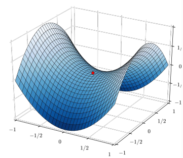
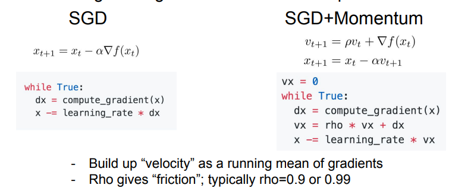
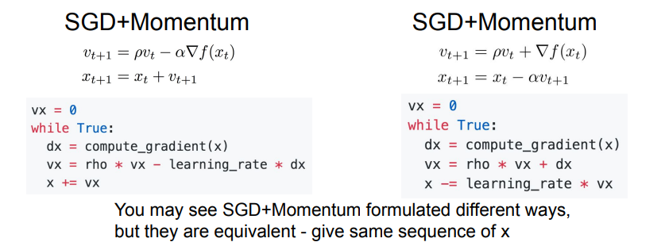
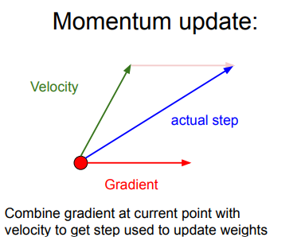
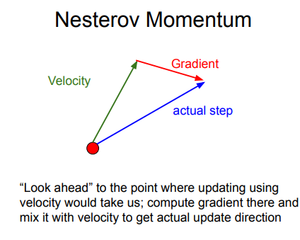

# Lec7: Training Neural Network(II)

## Better Optimization
### 批梯度下降(BGD)
在训练中每一步迭代都使用训练集的所有内容$\left\{x_1,\cdots,x_n\right\}$以及每个样本对应的输出$y_i$,用于计算损失和梯度然后使用梯度下降更新参数

缺点是随着数据集的增大，运行速度变慢

### 随机梯度下降(SGD)
每次迭代随机抽取一批样本以及$y_i$,以此来反向传播计算出梯度，然后向负梯度方向更新参数

缺点：
- 如果损失函数在一个参数方向下降的快，在另一个方向下降得慢，会导致zigzag,这在高维中非常普遍

- 如果损失函数有局部极小值或者鞍点，此时梯度为零，参数更新会get stuck.而鞍点在高维中非常常见

- 我们的梯度来自小批量数据，可能产生噪声，会导致下降的路线很曲折，收敛较慢

### 动量(Momentum)更新

损失值可以理解为山的高度(高度势能$U=mgh$),用随机数字初始化参数等同于在某个位置给质点设定初始速度为0，最优化过程可以看作是参数向量滚动的过程，而它滚动的力来源于势能$F=-\nabla U$

> 在 SGD 中，梯度直接影响质点的位置，在梯度为0的地方，位置就不会更新了；而在这里，梯度作为作用力影响的是速度，速度再改变位置，即使梯度为0 ，但之前梯度累积下来的速度还在，一般而言，一个物体的动量指的是这个物体在它运动方向上保持运动的趋势，所以此时质点还是有动量的，位置仍然会更新，这样就可以冲出局部最小值或鞍点，继续更新参数。但是必须要给质点的速度一个衰减系数或者是摩擦系数，不然因为能量守恒，质点在谷底会不停的运动.

**也就是说，参数更新的方向，不仅由当前点的梯度方向决定，而且还受此前累积的梯度方向影响!**

??? Example "直观理解"

    

### Nesterov Momentum

Nesterov动量更新是既然我们知道动量将会将质点带到一个新的位置（即向前看），我们就不要在原来的位置计算梯度了，在这个「向前看」的地方计算梯度，更新参数。
$$
v_{t+1}=\rho v_t-\alpha\nabla f(x_t+\rho v_t)\\ x_{t+1}=x_t+v_{t+1}
$$
Usually we want update in terms of $\nabla f(x_t)$

We do this by changing of variables $\tilde{x}_t=x_t+\rho v_t$

$$
v_{t+1}=\rho v_t-\alpha \nabla f(\tilde{x}_t)\\\tilde{x}_{t+1}=\tilde{x}_t-\rho v_t+(1+\rho)v_{t+1}=\tilde{x}_t+v_{t+1}+\rho(v_{t+1}-v_t)
$$

### Adagrad(自适应梯度算法)

上面提到的方法对于所有参数都使用了同一个更新速率，但是同一个更新速率不一定适合所有参数。如果可以针对每个参数设置各自的学习率可能会更好，根据情况进行调整。

## Transfer Learning

另一个导致过拟合的原因可能是训练样本过少，可以使用迁移学习来解决，它允许使用很少的数据来训练CNN

### 主要思想

- 在大量数据集上训练一个CNN，得到模型(比如ImageNet,1000个分类)
- 使用一个少量数据集，最后需要得到的分类是一个较小的值$C$,比如说10.这时最后一个全连接层的参数矩阵变为$4096\times C$，初始化这个矩阵，重新训练这个线性分类器，保持前面的所有层不变(前面的层已经训练好，具有泛化能力)
- 当得到较多的训练集后，训练的层数可以增多，比如可以训练最后三个全连接层，使用较低的学习率微调参数。

所以对一批数据集感兴趣但是数量不够时，可以在网上找一个数据很相似的有大量数据的训练模型，然后针对自己的问题微调或重新训练某些层。
