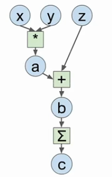

# 常见深度学习框架

## 深度学习硬件

### CPU/GPU/TPU

- CPU(Central Processing Unit)一般由多个核心，每个核心都很快，可以独立工作，可同时进行多个进程，内存与系统共享，完成序列任务时很有用。
- GPU(Graphics Processing Unit)有上千个内核数，但每个核心运行速度很慢，不能独立工作，适合大量并行完成类似的工作。GPU一般自带内存，也有自己的缓存系统。
- TPU(Tensor Processing Unit)是专门的深度学习硬件，运行速度非常快。

### GPU的优势和应用

GPU在大矩阵的乘法运算中有明显优势。在矩阵乘法中，结果的每一个矩阵都是第一个矩阵每一行和第二个矩阵每一列的点积，所以并行的同时进行运算速度很快。卷积神经网络中卷积核和感受野的点积也是并行运算。

CPU 虽然也有多个核心，但是在大矩阵运算时只能串行运算，速度很慢。

**Programming GPUs**

- CUDA: 英伟达(NVIDIA）并行运算框架，可以写出类似C语言的代码直接在GPU上运行。NVIDIA已经有很多高度优化的API，比如cuBLAS包含很多矩阵预算，cuDNN包含CNN前向传播，反向传播，批量归一化等操作。
- OpenCL：可以在CPU,AMD上通用，但是速度很慢
- HIP：可以将CUDA代码自动转换成可以在AMD上运行的语言

目前来说CUDA是最好的选择

实际应用 GPU 还有一个问题是训练的模型一般存放在 GPU，而用于训练的数据存放在硬盘里，由于 GPU 运行快，而机械硬盘读取慢，就会拖累整个模型的训练速度。

解决方法：

- 如果训练数据数量较小，可以把所有数据存放到GPU的RAM中
- 用固态硬盘代替机械硬盘
- 使用多个CPU线程预读取数据，放到缓存供GPU使用

## 深度学习软件

首先回顾计算图的概念，一个线性分类器可以用计算图表示，网络越复杂，计算图也越复杂，而使用深度学习框架的原因如下：

- 构建大的计算图很容易，可以快速开发和测试新想法
- 这些框架可以自动计算梯度，我们只需写出前向传播的代码
- 可以在GPU上高效运行

**Example**


对于以上的计算图，之前的想法可能是使用Numpy写出前向传播，然后计算梯度:

```python
import numpy as np
np.random.seed(0)  # 保证每次的随机数一致
N, D = 3, 4
x = np.random.randn(N, D)
y = np.random.randn(N, D)
z = np.random.randn(N, D)
a = x * y
b = a + z
c = np.sum(b)
grad_c = 1.0
grad_b = grad_c * np.ones((N, D))
grad_a = grad_b.copy()
grad_z = grad_b.copy()
grad_x = grad_a * y
grad_y = grad_a * x
```

这种做法 API 干净，易于编写代码，但问题是没办法在 GPU 上运行，并且需要自己计算梯度。所以现在大部分深度学习框架的主要目标是自己写好前向传播代码，类似 Numpy，但能在 GPU 上运行且可以自动计算梯度。

```python
import torch
device = 'cuda:0'  # 在GPU上运行，即构建GPU版本的矩阵
# 前向传播与Numpy类似
N, D = 3, 4
x = torch.randn(N, D, requires_grad=True, device=device)
# requires_grad要求自动计算梯度，默认为True
y = torch.randn(N, D, device=device)
z = torch.randn(N, D, device=device)
a = x * y
b = a + z
c = torch.sum(b)
c.backward()  # 反向传播可以自动计算梯度
print(x.grad)
print(y.grad)
print(z.grad)
```
