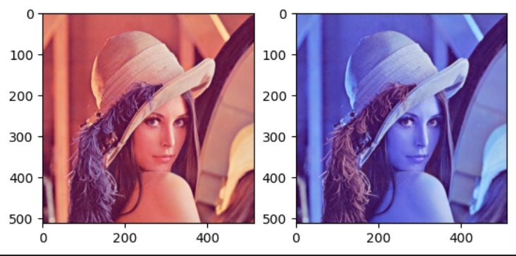
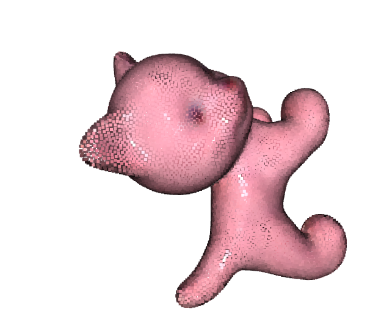

# Lab 1 Matplotlib, OpenCV and Open3d


Firstly, import packages

```python
import matplotlib.pyplot as plt
import open3d as o3d
import imageio
import numpy as np
import cv2
```

## Matplotlib

### Read an image using imageio and opencv

```python
def read_image_cv_io(img_path):
    '''
    Input:
    img_path: string
    
    Return:
    img_cv: array, (H, W, 3)
    img_io: array, (H, W, 3)
    '''
    img_io = imageio.imread(img_path)
    img_cv = cv2.imread(img_path)
    return img_cv,img_io
```

The difference of two methods:

- imageio.imread: RGB
- cv2.imread: BGR

### Show images using matplotlib

```python
def show_image(img)：
	plt.imshow(img)
```

### Show images in a $1\times 2$ subplot

```python
def show_image_subplot(images):
    '''
    Input: 
    images: tuple of 2 images
    '''
    plt.subplot(1,2,1)
    plt.imshow(images[0])
    plt.subplot(1,2,2)
    plt.imshow(inages[1])
```



The first graph is the result of img_io(RGB), the second is img_cv(BGR).


### Show concated images using matplotlib

```python
def concat_images(images):
    '''
    Input: 
    images: tuple of two images, ((H, W, 3), (H, W, 3))
    Output:
    image: (H, 2*W, 3)
    '''
    newimage = np.concatenate((images[0],images[1]),axis=1)
    return newimage
```


#### Plot the function of $y=2x^2-3$ during [-10,10]

```python
def func(x):
    return 2 * x**2 - 3

def plot(func):
    x = np.arange(-10,10,0.1)
    y = func(x)
    plt.plot(x,y)
```


## OpenCV

### Convert and show images

```python
def convert_rgb_to_bgr(img):
    '''
    Input:
    img: (H, W, 3), RGB channels.
    Return:
    img: (H, W, 3), BGR channels.
    '''
    newimage = cv2.cvtColor(img,cv2.COLOR_RGB2BGR)
    return newimage

def convert_rgb_to_gray(img):
    '''
    Input:
    img: (H, W, 3), RGB channels.
    Return:
    img: (H, W), Gray image.
    '''
    newimage = cv2.cvtColor(img,cv2.COLOR_RGB2GRAY)
    return newimage

def cv_imshow(img):
    '''
    Input:
    img: (H, W, 3), BGR channels
    '''
    cv2.imshow('image',img)
    cv2.waitKey(0)
    cv2.destroyAllWindows()# called to close any open windows.
```

`waitkey`控制着`imshow`的持续时间，当`imshow`之后不跟`waitkey`时，相当于没有给`imshow`提供时间展示图像，所以只有一个空窗口一闪而过。

设置 `waitKey(0`) , 则表示程序会无限制的等待用户的按键事件


### Read videos and show videos

```python
def read_and_show_video(video_path):
    '''
    Input: 
    video_path: string
    '''
    video = cv2.VideoCapture(video_path)
    while video.isOpened():
        ret,frame = video.read()# ret is a boolean value indicating whether a frame was successfully read; frame holds the actual frame that was read from the video source. It is a NumPy array representing an image.
        if ret:
            cv2.imshow('frame',frame)
        	if key==ord('q'):
                video.release()
                break
            else:
                video.release()
```


### Write student ID in the image and save it

```python
def write_student_id(img):
    text=" "
    newimage = cv2.putText(img,text,(100,50),cv2.FONT_HERSHEY_COMPLEX,2.0,(255,255,255),5)
    # 2.0:determines the size of the text.
    #5:the thickness of the text
    return newimage

def write_img(img_path,img):
    cv2.imwrite(img_path,img)
```


## Open3d

### Read and visualize 3D models(in point cloud)

```python
def read_vis_model(model_path):
    pcd = o3d.io.read_point_cloud(model_path)
    o3d.visualization.draw_geometries([pcd],width=800,height=600)
```

