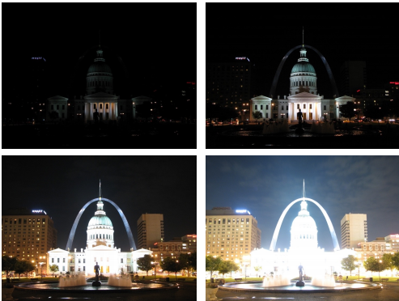
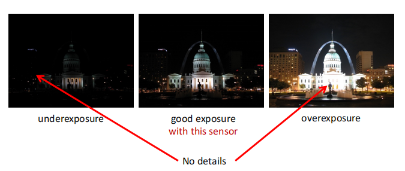
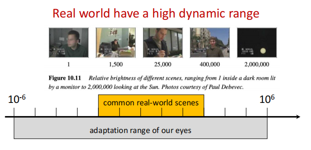
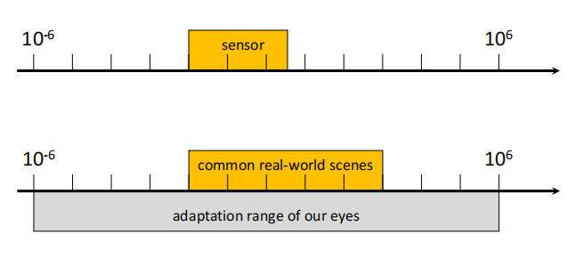
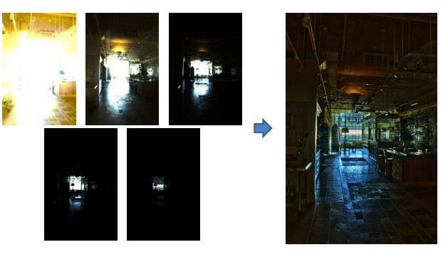

# Lec12 Computational Photography

计算摄影学的任务就是通过算法使得拍出来的图像质量更高。

## High Dynamic Range Imaging(HDR)

HDR, 即高动态范围成像。回想我们生活中，在晚上拍照时，照片会出现要么一片黑，要么一片亮的情况。原因是晚上的场景对比度太大，而这种明暗的对比度就被称作动态范围。HDR可以做到既捕捉亮处的细节，也捕捉到暗处的细节。

对于相机，它每个像素的曝光(exposure)取决于如下三个因素：

- 增益(Gain): controlled by the ISO. 可以理解为光电信号转化的效率。ISO是底片的感光度。
- 辐射度(Irradiance): 可以理解为打到底片上的光的数量(光强)，取决于光圈的大小。
- 曝光时间(Time)：由快门速度控制。

**Dynamic range**

The ratio between the largest and smallest values of a certain quantity.

即一个场景中最亮地方和最暗地方的比值。在夜晚拍照时，由于场景动态范围太大，暗处和亮处的细节不能兼得，就会造成上图的两种情况。

真实世界具有很大的动态范围。但是相机的传感器只能覆盖很小的动态范围。传感器的动态范围不能覆盖真实场景的动态范围，这就是我们拍照不能兼顾明暗细节的原因。

### HDR

一个很直观的想法就是我们拍多张图像，部分图像用较小的曝光时间，记录亮出的细节，另一部分图像用较长的曝光时间，记录暗处的细节，最后将所有图像合成得到最终的图像。

- Exposure bracketing: Capture multiple LDR images at different exposures.
- Merging: Combine them into a single HDR image.

对于图像合成，有以下几个步骤：

For each pixel:

- Find valid pixels in each image. 这个像素值既不会太亮也不会太暗(0.05<pixel<0.95)，我们即认为它处于合理的区间。
- Weight valid pixel values appropriately.(pixel value/t).
- Form a new pixel value as the weighted average of valid pixel values.

## Deblurring

