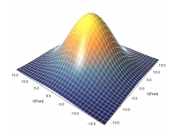
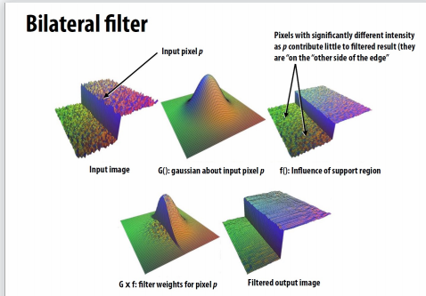
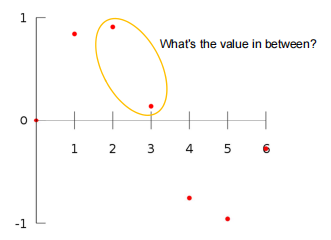
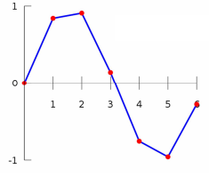
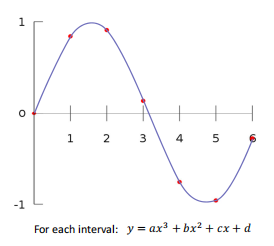

# Lec 3 : Image Processing

## Image processing basics

### 一些基本的处理

- 增加对比度（使用"S curve")
- 模糊，锐化，边缘提取

### convolution

$$
(f*g)(x)=\int_{-\infty}^{\infty}f(y)g(x-y)dy
$$

#### Discrete 2D convolution

$$
(f*g)(x,y)=\sum_{i,j=-\infty}^{\infty}f(i,j)I(x-i,y-j)
$$

#### Padding

如果没有padding的话，那么我们经过卷积操作之后得到的图像size会变小，为了得到大小相同的图像，我们选择在图像周围进行padding。

### Guassian blur

- Obtain filter coefficients by sampling 2D Gaussian function $f(i,j)=\frac{1}{2\pi\sigma^2}e^{-\frac{i^2+j^2}{2\sigma^2}}$

### Sharpening

锐化操作就是往图像里添加高频信息

- Let $I$ be the original image
- High frequencies in image $I=I-blur(I)$
- Sharpened image = $I+(I-blur(I))$

### Bilateral filter

**removing noise while preserving image edges**

## Image sampling

### Image resizing

## Image magnification

### Interpolation

#### Nearest-neighbor interpolation

- Not continuous
- Not smooth(光滑函数：几阶导连续就称该函数几阶光滑)

#### Linear interpolation

#### Cubic interpolation

**For each interval**: 并不是对整体进行拟合，而是每两点首先拟合线性函数，非线性项的引入是为了使曲线光滑

#### Bilinear Interpolation

