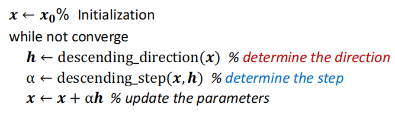

# Lec4: Model fitting and Optimization

## Optimization

这里首先介绍了优化的基本范式，详见优化基本理论与方法，这里不详细展开

一个有趣的example：Image deblurring

我们已知模糊图像Y和卷积核F，需要通过优化的方法得到去噪后的图像X

我们的想法是找到清晰的图像X，使得它做模糊处理后与已知的图像Y差别尽可能小，于是得到目标函数：
$$
\mathop{min}_X \Vert Y-FX\Vert_2^2
$$

### Model fitting

一个模型描述问题中输入和输出的关系：例如线性模型$b=a^Tx$ 描述输入$a$ 和输出 $b$ 关于模型参数 $x$ 的关系。

但实际结果很难完全满足数学模型，因此我们做的是进行模型拟合，即我们有一个先验的假设（数据符合哪种模型），然后从从数据集中预测出模型的参数（该方法通常被称为学习）

一个经典的方法：最小二乘法(Minimize the **Mean Square Error(MSE)**)
$$
\hat{x}=\mathop{argmin}_x\sum_i(b_i-a_i^Tx)^2
$$

如果我们假设数据中的噪声是服从高斯分布，那么可以与**极大似然估计**联系起来

#### Maximum Likelihood Estimation

首先假设数据服从高斯分布
$$
b_i=a_i^T+n,\ n\sim G(0,\sigma)
$$
对于给定的 $x$, 观察到 $(a_i,b_i)$ 的似然（可能性）：
$$
P[(a_i,b_i)|x]=P[b_i-a_i^Tx]\propto exp-\frac{(b_i-a_i^Tx)^2}{2\sigma^2}
$$
如果数据点是相互独立的，那么：
$$
P[(a_1,b_1)(a_2,b_2)\cdots|x]=\Pi_iP[b_i-a_i^Tx]\propto exp\frac{(b_i-a_i^Tx)^2}{2\sigma^2}=exp-\frac{\Vert Ax-b\Vert_2}{2\sigma^2}
$$

因此我们可以看到，极大似然估计即为找到$x$能够最大化似然函数，而这即为最小化$\Vert Ax-b\Vert_2$

因此**MSE=MLE with Gaussian noise assumption**

## Numerical methods

### Recap: Taylor expansion

- First-order approximation

- Second-order approximation

### 梯度下降法

#### Steepest descent method

#### Newton method(考虑了二阶导)

- Do second-order expansion

$$
F(x_k+\Delta x)\approx F(x_k)+J_F\Delta x+\frac{1}{2}\Delta x^{T}H_F\Delta x
$$

- Find $\Delta x$ to minmize $F(x_k+\Delta x)$

$$
H_F\Delta x+J_F^{T}=0 \\ \Delta x=-H_F^{-1}J_F^{T}\ (Newton Step)
$$

#### Gauss-Newton method

