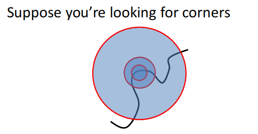
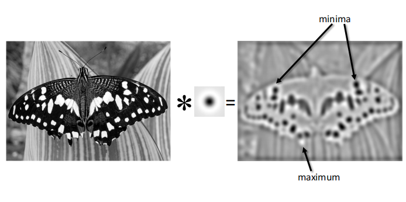

# Image Matching and Motion Estimation

## Image matching

**Finding point-to-point correspondences between two images**

**Main Components of Feature matching**

- Detection: identify the interest points
- Description: extract vector feature descriptor surrounding each interest point
- Matching: determine correspondence between descriptors in two views

### Detection

#### Feature points

特征点需要满足独特性（至少要在局部唯一）

那么我们首先的问题就是如何衡量一个点的独特性.

考虑一个小的像素窗口,如下图所示，当我们向任意一个方向移动该窗口，都会造成较大变化时，我们认为该点是uniqueness

在数学上，我们可以用梯度分布来衡量该变化

根据上图我们可以大致观察到图像的特征，即存在多少个edge及其变化的方向（即梯度方向），更进一步，我们使用**主成分分析（PCA）**的方法进行计算

- The 1st principal component is the direction with highest variance
- The 2nd principal component is the direction with highest variance which is *orthogonal* to the previous components.

图中绿色箭头所指的方向即协方差矩阵两个特征向量的方向，长度即特征值的大小。可以看到，我们想要的是两个主成分大小都很大的区域。具体计算过程如下：

- Compute the covariance matrix at each point

$$
H=\sum_{(u,v)}w(u,v)\begin{bmatrix}I_x^2&I_xI_y\\I_xI_y&I_y^2\end{bmatrix}\\I_x=\frac{\partial f}{\partial x},I_y=\frac{\partial f}{\partial y}
$$

- Compute eigenvalues

$$
H=\begin{bmatrix}a&b\\c&d\end{bmatrix}
$$

$$
\lambda_{\pm}=\frac{1}{2}((a+d))\pm \sqrt{4bc+(a-d)^2}
$$

- Classify points using eigenvalues of $H$:

为了更方便计算，我们引入哈里斯算子(Harris operator):
$$
f=\frac{\lambda_1\lambda_2}{\lambda_1+\lambda_2}=\frac{determinant(H)}{tr(H)}
$$
注意到只有满足$\lambda_1,\lambda_2$都很大时函数值才不为零，$f$ 被称作corner response.

#### Summary: Harris detector

- Compute derivatives at each pixel
- Computer matrix $H$ in a Gaussian window around each pixel
- Compute corner response $f$
- Threshold $f$（阈值过滤）
- Find local maxima of response function 

除了独特性之外，我们还希望特征点在图像变换（下图是常见的变换，包括光学变换和几何变换）中保持不变。比如说对于上图，我们希望左右两张图片检测到的特征点相同。

**Harris detector: Invariance properties**

首先对于光学变换，对于常数项 $b$, 我们在求导时会将其消掉，但是intensity scaling $a$ 无法消掉，所以Harris detector is partially invariant to affine intensity change.

比较显然的是几何变换中的平移与旋转变换，由于几何结构保持不变，我们计算的协方差矩阵也不会变化，因此Corner response is invariant w.r.t image translation and rotation.

但是对于图像放缩来说，角点响应函数的值是会变的，下图是一个直观的例子，在左侧图的区域识别为角点，但是在右侧图识别为边缘

这就是我们需要解决的问题：如何在经过一定变换后的图像中找到合适的scale（或者窗口大小）呢？

注意到我们的目标是特征点匹配，那么理想的结果就是两张图相同的feature point对应的corner response应该相同。

所以我们考虑不同大小的window size, 取得对应的corner response值，将其绘制成图像，曲线的峰值（即特征最明显的区域）即为当前图片应该取的scale。

但是在实际应用中，instead of 改变window size，我们一般固定住窗口大小，而去改变图像的大小，形成一个图像金字塔(**image pyramid**), 二者效果上是等价的。

#### Blob detector

Blobs are good fearues, but how to find them?

由于斑点的局部性质(即在一个小区域内，且一般是闭合的)，所以斑点区域在像素上具有比较大的二阶导。所以我们的步骤是计算图像的拉普拉斯，然后找到局部最大与最小值。

而对于计算经拉普拉斯变换后得到的图像，我们使用滤波器来实现。

- Laplacian operator:

$$
\nabla^2=\frac{\partial^2}{\partial x^2}+\frac{\partial^2}{\partial y^2}
$$

- Compute image derivatives by filtering:

**Laplacian of Gaussian Filter**

由于Laplacian对噪声比较敏感(实际上求导这种运算对噪声都很敏感，它计算的是区域像素的变化率，更何况二阶导)， 所以我们通常使用**Laplacian of Gaussian(LoG) filter** 进行处理，即首先对图片作高斯模糊，再计算拉普拉斯算子：

$$
\nabla^2(f*g)=f*\nabla^2g
$$

需要注意的是，The scale of LoG 是由高斯分布的方差$\sigma$控制的，可以想象一下当 $\sigma$ 比较大时，高斯核整体分布就比较宽，对应的scale也变大，反之亦然。

而在这里我们可以产生对滤波器更直观的认识。原图像与滤波器进行卷积之后，得到结果中比较清晰的是和卷积核长得比较像的像素区域，而差别比较大的则被模糊处理。LoG的visualization与斑点极其相似，因此它可以用来进行blob detection.

对于scale的选择，我们可以采用类似Harris detector的方法，只不过这里我们放缩的是LoG的$\sigma$ 

**Difference of Gaussian(DoG)**

- Filter the image with two Gaussians
- Compute the difference of two filtered images

LoG可以由两个相邻$\sigma$的Guassian进行近似

之所以引入DoG, 是因为我们在使用LoG处理图像时也是要进行Guassian滤波的，直接将滤波后的相邻两个图像相减效率会更高。

#### Summary of detection

- What is a good feature point?
    - unique
    - invariant to transformations
- Popular detecors
    - Harris corner detector
    - Blob detector(LoG,DoG)

### Description

We know how to detect good points.

Next question: *How to match them?*

Answer:  **Extract a descriptor for each point, find similar descriptors between the two images**(构建一个描述子)

**Patches with similar content should have similar descriptors**

首先很容易想到的就是将像素值拉长，作为一个特征向量。But this is very sensitive(i.e.,not invariant) to even small shifts, rotations.

#### SIFT(Scale Invariant Feature Transform)

SIFT 使用patch的**梯度分布**(梯度向量的方向分布)作为描述子。该方向必然是位于$[0,2\pi]$之间，因此SIFT构建一个直方图，来统计在每个区间（例如十等分）有多少个像素。$[0,2\pi]$等分个数即为描述子的维度。

此时对于图像的平移显然不会有影响，但我们考虑旋转和scale。

旋转会改变梯度向量的方向，导致直方图循环平移。但这个情况很好处理：我们可以选中最大的分量放在第一个，使整个直方图平移对齐，称作直方图的归一化(朝向归一化)

对于scaling来说，SIFT的名字scaling invariant 可能会有些误导。但很显然地，SIFT本身描述子是not invariant to scaling的(缩放后区域内的向量个数都发生变化了呀)，但其实SIFT是经过DoG处理过的，即在检测阶段已经确定了scale的大小(最佳的$\sigma$)，所以我们在提取描述子时就不用考虑scale的影响了。

**Properties of SIFT**

Extraodinarily robust matching technique

- Can handle changes in viewpoint
- Can handle significant changes in illumination
- Fast and efficient-can run in real time

**Summary: SIFT algorithm**

- Run DoG detector: find maxima in location/scale space
- Find dominate orientation
- For each (x,y,orientation), create descriptor

