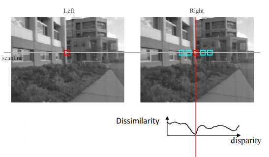
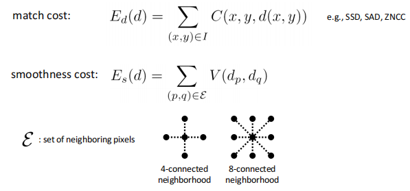

# Lec8 Depth estimation and 3D reconstruction

上一节我们讨论的structure from motion重建的是稀疏的点云，这节我们讨论稠密的重建，即对每个像素点进行重建，而需要的一个重要概念就是深度的估计。

## Depth estimation

深度估计即对于给定的图像，估计每一个像素在实际场景中的深度。这里的深度有时候指空间点到相机中心或者像平面的距离，也有时候表示沿光线的距离。

深度图就是将深度信息可视化

### Stereo matching

#### Stereo Vision

- An object point will project to some point in our image
- That image point corresponds to a ray in the world.
- Two rays intersect at a single point, so if we want to localize points in 3D we need 2 eyes.(双目视觉)

**Recap: Epipolar geometry**

即如果已知$X_L$,那么$X_R$的轨迹就是对极线。这极大简化了我们搜索的区域。

考虑最简单的情况：两个平行的像平面：

这样子我们只需要搜索另一张图中同一高度的水平线即可，更加缩小了搜索的空间，提高效率！

那么对于并不平行的像平面，很直观的想法，就是通过几何变换使得它们平行。称作立体影像矫正。

这样我们就将所有的情况都简化为了平行像平面。

!!! Example "Result"

    
     

**视差(disparity)**
两张图同一个点水平坐标的差别：
$x_2-x_1=$ the disparity of pixel($x_1,y_1$)

我们可以从视察来估计出深度信息：

通过相似三角形得到。

#### Stereo matching algorithms

我们假设亮度一致。
立体匹配就是在另一张图的对极线上当前点搜索最佳匹配的点。很直观的想法就是取一个小窗口，在另一张图的对极线上滑动，寻找最相似的小区域。

!!! Example "Popular matching scores"

    

对于窗口匹配，窗口大小的选择对结果造成比较大的影响。窗口太小可以增加细节，但是会增加噪声。窗口太大虽然噪声小了，但是我们提取不到细节，后续重建的效果就不好

可以看到即使是最佳的window size,得到的深度图与实际还是有一定差距。

**Stereo as energy minmization**

我们可以将立体匹配转化为一个优化问题

$$
E(d)=E_d(d)+\lambda E_s(d)
$$

优化变量是每个点的视差，目标函数分为两个部分：

- 匹配本身的损失：目的是在另一张图中找到最佳匹配(match cost)
- 光滑性的损失： 相邻的两个像素，视察应该尽可能接近(smoothness cost)

对于$V$的选择：

可以看到该方法的结果，效果好了很多

