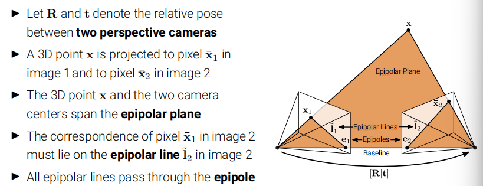

# Structure from Motion

## Preliminaries

### Camera Calibration

- Camera calibration is the process of finding the **intrinsic/extrinsic** parameters
	- First, the known calibration target is *captured in different poses*
	- Second, features on the target are detected in the images
	- Finally,the camera intrinsics and extrinsics are jointly optimized.

### Feature Detection and Description

- Point features describe the appearance of **local,salient regions** in an image
- They can be used to describe and match images taken from different viewpoints.
- They form the basis of sparse 3D reconstruction methods covered in the lecture

***Features should be invariant to perspective effects and illumination,and the same point should have similar vectors independent of pose/viewpoint***

#### SIFT(Scale Invariant Feature Transform)

!!! question

    For now I could not fully undestand the essence of this algorithem, so the contente here are lost.

## Two-frame SFM

### Epipolar Geometry

*Goal:Recovery of camera pose from image correspondences*



#### Derivation of essential matrix

Let $K_i \in \mathbb{R}^{3 \times 3}$ denote the camera matrix of camera $i$

Let $\tilde{x_i} = {K_i}^{-1} \overline{x_i}$ denote the local ray direction of pixel $\overline{x_i}$ in camera $i$

We have: $\tilde{x}_2 \propto x_2 = Rx_1 + t \propto R \tilde{x}_1 + st$

Taking the cross product of both sides with $t$ we obtain: $[t]_{\times}\tilde{x}_2 \propto [t]_{\times}R\tilde{x}_1$

Taking the dot product of both sides with $\tilde{x}_2^{T}$ yields: $\tilde{x}_2^{T}[t]_{\times}R\tilde{x}_1 =0$, which is the **epipolar constraint**, with **essential matrix** $\tilde{E} = [t]_{\times}R$

$\tilde{E}$ maps a point $\tilde{x}_1$ in image 1 to the corresponding epipolar line in image 2:

$\tilde{l}_2=\tilde{E}\tilde{x}_1$ as $\tilde{x}_2^{T}\tilde{l}_2=0$, the epipolar line in image 1 is similar, $\tilde{l}_1=\tilde{E}^{T}\tilde{x}_2$

For any point $\tilde{x}_1$ in the first image ,the corresponding epipolar line in the second image passes through the epipole $\tilde{e}_2$ which therefore satisfied: 
$$
\tilde{e}_2^{T}\tilde{l}_2 = \tilde{e}_2^{T}\tilde{E}\tilde{x}_1=0
$$
for all $\tilde{x}_1$, It follows that : $\tilde{e}_2^{T}\tilde{E} = 0$

Thus,$\tilde{e}_2^{T}$ is the **left null-space** of $\tilde{E}$$. Similarly,$$\tilde{e}_1^{T}$ is the **right null-space** of $E$

#### Estimating the Epipolar Geometry

> using 8-point algorithm

```python
def compute_fundamental_matrix(keypoints1, keypoints2):
    ''' 
    Computes the fundamental matrix from image coordinates using the 8-point 
    algorithm by constructing and solving the corresponding linear system.

    Args:
        keypoints1 (np.ndarray): Nx3 array of correspondence points in first 
            view in homogenous image coordinates.
        keypoints2 (np.ndarray): Nx3 array of correspondence points in second 
            view in homogenous image coordinates.

    Returns:
        F (np.ndarray): 3x3 fundamental matrix.
    '''
    num_points = keypoints1.shape[0]
    assert(num_points >= 8)

    # Assemble homogenous linear system
    # each correspondence yields one equation in the nine elements of F
    A = np.zeros([num_points, 9])
    for i in range(num_points):
        A[i] = [keypoints1[i, 0]*keypoints2[i, 0],
                keypoints1[i, 1]*keypoints2[i, 0],
                keypoints2[i, 0],
                keypoints1[i, 0]*keypoints2[i, 1],
                keypoints1[i, 1]*keypoints2[i, 1],
                keypoints2[i, 1],
                keypoints1[i, 0],
                keypoints1[i, 1],
                1,]

    # Solve the homogeneous linear system via SVD
    u, s, vh = np.linalg.svd(A)
    F = vh[-1].reshape(3, 3)

    # Force rank 2 by zeroing smallest singular value
    # see "In defense of the 8-point algorithm", Hartley, TPAMI 1997
    u, s, vh = np.linalg.svd(F)
    s[2] = 0
    F =  u @ (np.diag(s) @ vh)

    # return standardized fundamental matrix
    return F/F[2, 2]
```

#### case with unknwon intrinsics

If the camera calibration $K_i$ is unknown, we cannot use the local ray diretion.

The essential matrix becomes $\overline{x}_2^{T}K_2^{-T}\tilde{E}K_1^{-1}\overline{x}_1 = 0$,where we get the **fundamental matrix**:
$$
\tilde{F}=K_2^{-T}\tilde{E}K_1^{-1}
$$

### Triangulation

Given noisy 2D image observations, the two rays might not intersect in one point. We like to recover the 3D point $x$ that is closest to the two rays.

Let $\tilde{x}_i^s=\tilde P_i\tilde{x}_w$ denote the projection of  a 3D world point $\tilde{x}_w$ onto the image of the i'th camera $\tilde{x}_i^s$. We consider the cross product $\tilde{x}_i^s \times \tilde {P}_i\tilde{x}_w=0$ and using $\tilde{p}_{ik}^{T}$ to denote the k/th row of the matrix $\tilde{P}_i$,we obtain:

$\begin{bmatrix}x_i^s \tilde{p}_{i3}^{T}-\tilde{p}_{i1}^{T}\\y_i^s \tilde{p}_{i3}^{T}-\tilde{p}_{i2}^{T}\end{bmatrix}\tilde{x}_w=0$

Then using DLT.

```python
def triangulate_point(keypoint1, keypoint2, K1, K2, R, t):
    ''' 
    Triangulates world coordinates given correspondences from two views with
    relative extrinsics R and t.

    Args:
        keypoints1 (np.ndarray): Nx3 array of correspondence points in first 
            view in homogenous image coordinates.
        keypoints2 (np.ndarray): Nx3 array of correspondence points in second 
            view in homogenous image coordinates.
        K1 (np.ndarray): The 3x3 calibration matrix K for the first 
            view/camera.
        K2 (np.ndarray): The 3x3 calibration matrix K for the second
            view/camera.
        R (np.ndarray): 3x3 rotation matrix from first to second view.
        t (np.ndarray): 3-d translation vector from first to second view.

    Returns:
        x_w (np.ndarray): Nx4 array of 3-d points in homogenous world 
            coordinates.
    '''
    # Initialize extrinsics for reference view as identity transform
    R0 = np.eye(3)
    t0 = np.zeros([3, 1])
    
    # assemble projection matrix P0 for reference view
    P0 = assemble_projection_matrix(K1, R0, t0)

    # assemble camera matrix P0 for other view
    P1 = assemble_projection_matrix(K2, R, t)

    A = np.array(
        # A0
        [keypoint1[0] * P0[2].transpose() - P0[0].transpose(),
        keypoint1[1] * P0[2].transpose() - P0[1].transpose(),
        # A1
        keypoint2[0] * P1[2].transpose() - P1[0].transpose(),
        keypoint2[1] * P1[2].transpose() - P1[1].transpose()]
    )
    
    # solve linear system
    u, s, vh = np.linalg.svd(A)
    x_w = vh[-1]

    # standardize and return
    return x_w/x_w[3]
```


##  Factorization

