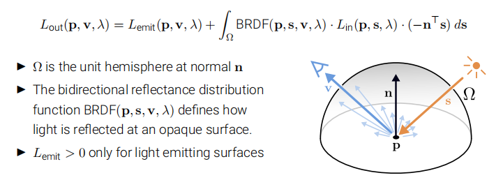
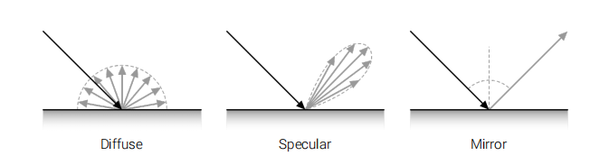
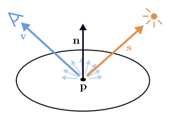
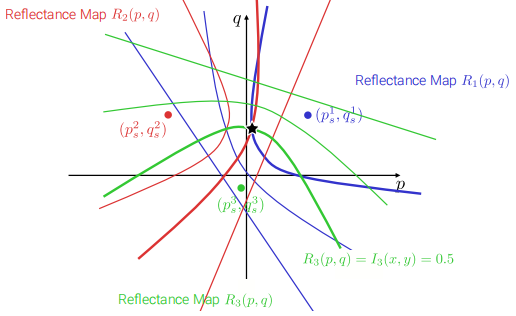
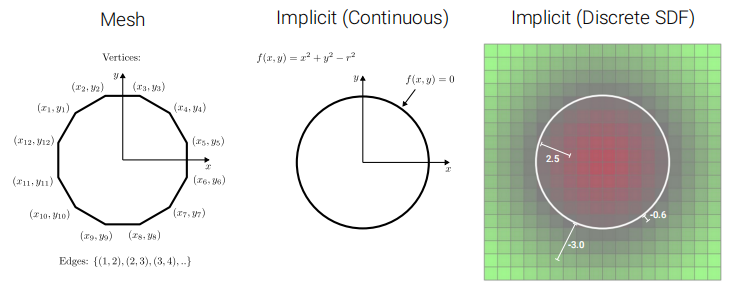

# Shape-from-X

## Shape-from-Shading

### Rendering Equation

- Typical BRDFs have a diffuse and a specular component
  - 

### Simplifying the Rendering Equation

> Dropping the deoendency on $\lambda$ and $p$ for notational simplicity, and considering a single point light source located in direction $s$, and assuming a purely diffuse material with albedo BRDF$(s,v)$ = $\rho$

$$
L_{out}(v)=\rho\cdot L_{in}\cdot n^{T}s
$$

- For a fixed material and light source, the reflected light is a function of $n$
- $L_{out}=R(n)$ is called **reflectance map**
- If we know $n$ at each surface point, we can integrate the geometry

SfS makes the following assumptions:

- Diffuse material with spatially constant albedo $\rho$	

  - - Reduces number of material parameters to 1

- Known point light source at infinity

  - - Keeps light direction $s$ constant across all pixels

    - Makes $s$ independent of geometry

- Known camera at infinity

  - -  Keeps view direction $v$ constant across all pixels

    - Makes $v$ independent of geometry

### Gradient Space Representation

## Photometric Stereo

- Instead of smoothness constraints, add more observations per pixel.
- Take K images of the object from same viewpoint but with different point light source each.
- Capture K images, construct reflectance maps per pixel, find intersection

#### Formulation

Assuming **Lambertian reflectance** and $L_{in}=1$, the iimage intensity light is:
$$
I=L_{out}=\rho\cdot n^{T}s=\rho\cdot s^{T}n
$$
Given 3 observations, we can express this in matrix form:$\begin{pmatrix}I_1\\I_2\\I_3\end{pmatrix}=\begin{pmatrix}s_1^{T}\\s_2^{T}\\s_3^{T}\end{pmatrix}\rho n$

$\rho n$ denoted by $\tilde{n}$, solution is given by $\tilde{n}=S^{-1}I, \rho = \Vert \tilde{n}\Vert_2, n= \frac{\tilde{n}}{\rho}$

However, when the linear system becomes rand-deficient, there exists no unique solution $\tilde{n}=S^{-1}I$, The least squares solution is given by:$\tilde{n}=(S^{T}S)^{-1}S^{T}I$

## Volumetric Fusion

#### SDF Representations

- SDF models store the signed distance to the closest surface at each voxel
- The surface is hence represented implicitly as the **zero level set**
- Crucial advantage:
  - Implicit modles allow for representing arbitrary topology

#### Depth-to SDF Conversion

- As the distance to surface is unknown, approximate it with distance along ray
- This approximation is good only in the vincinity of the surface(often suffices)

#### Volumetric Fusion

- After conversion, caluculate average of te discrete SDF fields
- The implicit surface will be an average of the two original ones

