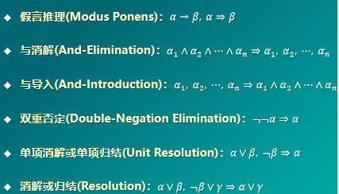
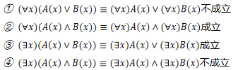
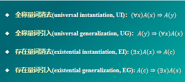
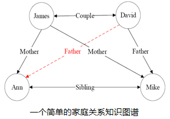
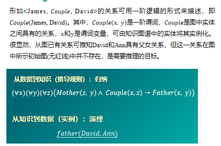

# 知识表达与推理

## 命题逻辑

- 命题：确定为真或为假的陈述句。
- 原子命题：不包含其他命题作为其组成部分的命题，又称简单命题。
- 复合命题：包含其他命题作为其组成部分的命题。
- 命题联结词：与，或，非，条件，双向条件(bi-conditional)
- 条件命题联结词中前件为假时，无论后件取值如何，复合命题均为真。
- 逻辑等价：具有相同的真假结果，用$\equiv$来表示。

命题逻辑推理的手段和方法：

## 谓词逻辑

在命题逻辑中，原子命题是最基本的单位。由原子命题出发，通过使用命题联结词，构成复合命题。命题逻辑只能把复合命题分解为简单命题（即原子命题），无法对原子命题所包含的丰富语义（如个体、部分或全体等）进行刻画。因此，命题逻辑无法表达局部与整体、一般与个别的关系。

谓词逻辑是刻画主体(个体和群体)之间逻辑关系的方法。

- 个体：研究领域中可以独立存在的具体或抽象的概念。
- 谓词：用来刻画个体属性或者描述个体之间关系存在性的元素，其值为真或为假。

包含一个参数的谓词称为一元谓词，表示一元关系，通常用于刻画个体是否包含特定的属性，如$P(x)$ ：x是质数，表示某个数是否是质数;

包含多个参数的谓词称为多元谓词，用于表示个体之间的多元关系，通常用于描述个体之间是否存在特定的关联，如Father(x,  y)表示 x是y的父亲。

函数是从定义域到值域的映射；谓词是从定义域到{True,  False}的映射。

- 全称量词：表示一切的，所有的，凡是，每一个等，用$\forall$表示。
- 存在量词：表示存在，有一个，某些等，用$\exist$表示

**谓词逻辑推理的手段和方法**

## 知识图谱推理

- 知识图谱(knowledge graph)由有向图构成，被用来描述现实世界中实体及实体之间的关系，是人工智能中进行知识表达的重要方式。在知识图谱中，每个节点表示客观世界中的一个实体，两个节点之间的连线表示节点具有某一关系。知识图谱中存在连线的两个实体可表达为形如$<leftnode,relation,rightnode>$的三元组形式。也可以表达为一阶逻辑(first order logic, FOL)的形式。

- 关系推理是统计关系学习研究的基本问题,也是当前知识图谱领域研究的热点问题。

- 归纳逻辑程序设计(inductive logic programming, ILP)是机器学习和逻辑程序设计交叉领域的研究内容。ILP使用一阶谓词逻辑进行知识表示，通过修改和扩充逻辑表达式对现有知识归纳，完成推理任务。
- 作为ILP的代表性方法，FOIL(First Order Inductive Learner)通过序贯覆盖学习推理。

### FOIL算法

- 输入：目标谓词$P$,目标谓词的训练样例(正例集合$E^{+}$和反例集合$E^{-}$)以及其他背景知识样例。
- 输出：可得到目标谓词$P$这一结论的推理规则。

- 过程：

    - 将目标谓词作为所学习推理规则的结论。
    - 将其他谓词逐一作为前提约束谓词加入推理规则，计算所得到推理规则的FOIL信息增益值，选取可带来最大信息增益值的前提约束谓词加入原来的推理规则，得到新的推理规则，并将训练样例集合中与该推理规则不符合的样例去掉。
    - 重复2，直到所得到的推理规则不覆盖任何反例。

FOIL算法从一般到特殊，逐步添加目标谓词的前提约束谓词，直到所构成的推理规则不覆盖任何反例。从一般到特殊指的是对目标谓词或前提约束谓词中的变量赋予具体值。

在推理过程中，添加前提约束谓词后所得推理规则的质量好坏由信息增益值来判断。

$$
FOIL_Gain=\hat{m}_{+}\cdot (\log _2\frac{\hat{m}_{+}}{\hat{m}_{+}+\hat{m}_{-}}-\log _2\frac{{m}_{+}}{{m}_{+}+{m}_{-}})
$$

其中$\hat{m}_{+},\hat{m}_{+}$是增加前提约束谓词后所得新推理规则能够覆盖的正例和反例数目，${m}_{+},{m}_{-}$是原推理规则所覆盖的正例和反例数目。

!!! Example "上面的知识图谱"

    假设目标谓词是Father(x,y)，x和y在分别取值为David和Mike时，Father(x,y)为真。

    目标谓词是需要推断规则的结论，称作规则头。在给定推理结论后，FOIL算法学习得到使得结论满足的前提条件，即目标谓词作为结论的推理规则。

    该知识图谱中Father(x,y)只有一个正例集合Father(David,Mike)。需要注意的是，只有在已知两个实体之间存在关系且确定这一关系与目标谓词相悖时，才能将这两个实体用于构建目标谓词的反例。

    背景知识来自于目标谓词之外的其他谓词的实例化结果。如Sibling(Ann,Mike)。

### 路径排序推理(PRA)

- 基本思想：将实体之间的关联路径作为特征，来学习目标关系的分类器。
- 步骤：
    - 特征抽取：生成并选择路径特征集合。生成路径的方法有随机游走，BFS,DFS等
    - 特征计算：计算每个训练样例的特征值$P(s\rightarrow t;\pi_j)$。表示从实体结点$s$出发，通过关系路径$\pi _j$到达实体结点$t$的概率。也可以表示布尔值，或频率。
    - 分类器训练：根据训练样例的特征值，为目标关系训练分类器。

## 概率图推理

在图数据中，如果两个节点之间存在连边，则可视为这两个节点之间具有概率依赖关系而相互影响。我们可以用概率描述两个相连节点之间的关联。

概率推理反映了推理过程中存在的不确定性特点。

### 贝叶斯网络

贝叶斯网络用一个有向无环图来表示，其用有向边来表示节点和节点之间的单向概率依赖。

贝叶斯网络满足局部马尔可夫性：给定一个节点的父节点的情况下，该父亲节点有条件地独立于它的非后代节点。

贝叶斯网络中所有因素的联合分布等于所有节点的$P(节点|父节点)$的乘积。

### 马尔可夫网络

表示成一个无向图的网络结构，用无向边表示节点和节点之间的相互概率依赖。

从概率统计角度来看，马尔可夫逻辑网络不仅简洁明了描述了马尔可夫网(Markov networks，简称MNs)中所存在信息之间关联，还因在马尔可夫网络中引入谓词逻辑融入了结构化知识；从一阶谓词逻辑角度来看，马尔可夫逻辑网在一阶谓词逻辑中添加了不确定性而对严格推理进行了松绑，更好反映了客观世界的复杂性。

## 因果推理

