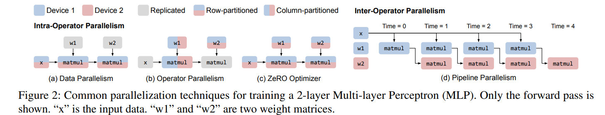

# Alpa: Automating Inter- and Intra-Operator Parallelism for Distributed Deep Learning

## Background: Distributed Deep Learning

### Conventional View of ML Parallelism

- **Data parallelism**
    - 训练数据被分割到多个工作节点(workers)上，但模型在每个 worker 上都有复制一份。
    - 每个工作节点计算自己的那份数据的参数更新，然后与其它节点同步，以确保所有节点在训练过程中观察到的模型参数保持一致。
- **Operator parallelism**
    - 当模型太大以至于不能放到一个设备上时，就不能用数据并行。
    - 将特定操作符的计算沿非批次轴分割，并在多个设备上并行计算每个部分。
    - 当一个设备计算其操作符一部分时，所需的输入张量部分可能不在本地内存，需要通信。
- **Pipeline parallelism**
    - 将 graph 中不同的操作符组(stage)放到不同的工作节点上，同时将训练批次分割成小批次。
    - 点对点通信: 一个 stage 的输出直接传给下一个 stage, 而不用像 operator parallelism 那样传到很多节点。
- **Manual Combination of Parallelism**
    - 需要结合上述方法以扩展当今的 DL 模型。
    - 无法推广到不同的模型或不同的集群配置。
- **Automatic Combination of Parallelism**
    - 整个 configutaion space 很复杂，难解。

### Intra- and Inter-Operator Parallelisms

作者将现有的并行方法分割成两种**正交的**类别：intra-operator 和 inter-operator parallelisms。

- **Intra-operator parallelism**
    - 涉及沿某些维度对多维张量进行分割，并将分割后的计算分配个多个设备同时执行。
    - 由于分割，在操作符的分割和合并出需要集体通信。
- **Inter-operator parallelism**
    - 不执行操作符分割，而是将不同操作符分配到分布式设备上执行。
    - 点对点通信，所以所需通信量远小于 intra-operator 。
    - 通信效率: 有可能造成设备空闲。

## Overview
