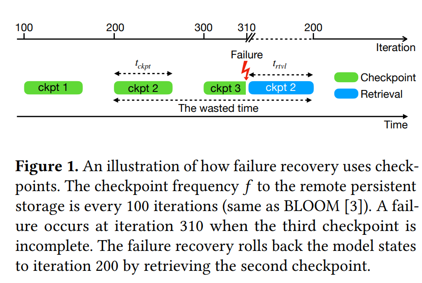
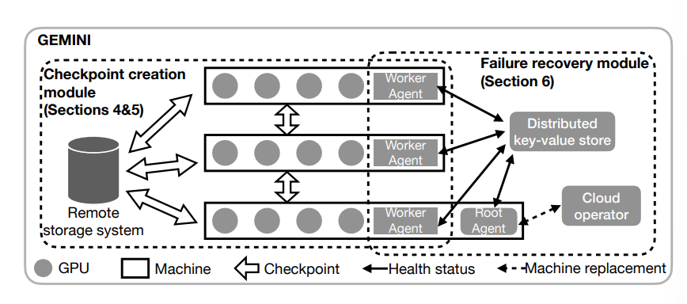
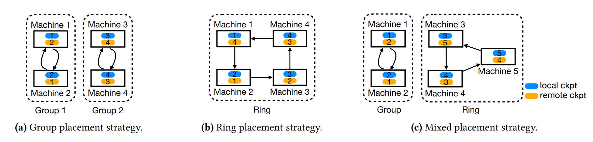
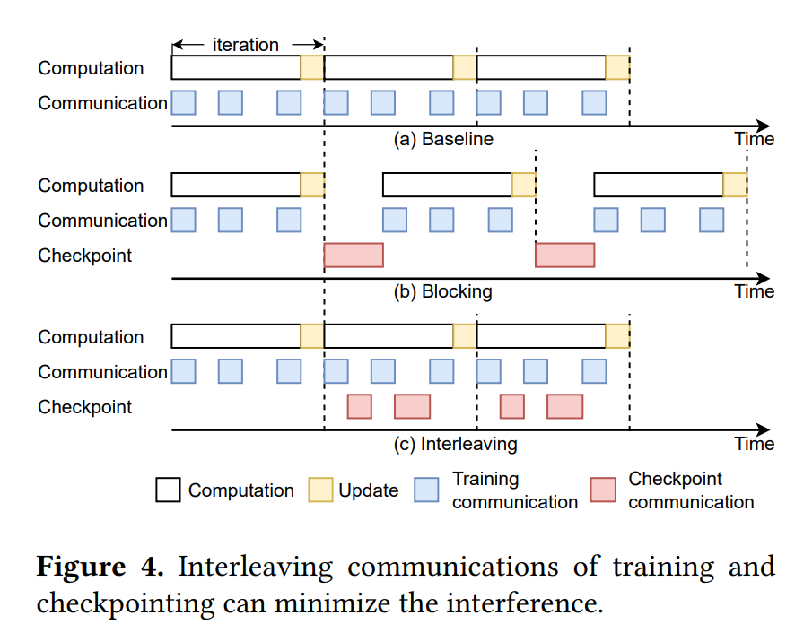

# Gemini: Fast Failure Recovery in Distributed Training with In-Memory Checkpoints

## Abstract

大模型训练期间会有故障问题，现有的解决方案由于远程存储带宽的限制，在存储 checkpoints 时存在显著的故障恢复成本。

因此作者提出 Gemini, 一个分布式训练系统。它通过在主机的 CPU 内存中进行 checkpoint 来实现大模型训练的快速故障恢复，利用 CPU 内存的更大聚合带宽。但是这存在两个挑战：

- 发生故障时不能保证 CPU 内存中的检查点始终可用。
- 训练和 checkpoint 的通信流量共用一个网络，检查点流量可能干扰训练流量，从而影响训练吞吐量。

本文提出两个解决方案：

- 近乎最优的检查点放置策略：最大化从 CPU 内存中的 checkpoin 恢复故障的概率。
- 检查点流量调度算法：最小化甚至消除 checkpoint 流量对模型训练的干扰。

## Motivation

### Failure Recovery in Model Training

- Frequent failures in model training
    - many failues during large model training due to the large number of GPUs and the long training time.
- Wasted time for failure recovery
    - 模型的状态(学习的参数和优化器的状态)存储在 GPU 中。
    - 发生故障时，模型状态必须通过检索最新的检查点来回滚到先前的状态。这个过程中产生两部分 wasted time:
        - 发生故障时从最新检查点到故障发生时刻之间所有的训练进度都会损失。
        - 恢复过程中，需要额外的时间来检索和加载检查点。
        - 
    - 定义 wasted time: 由于故障而导致训练过程暂停的总时间跨度。如下三个因素影响这个时间：
        - checkpoint time: 完成模型状态检查点所需要的时间, 记作 $t_{ckpt}$.(写断点的延迟)
        - checkpoint frequency: 训练系统将模型状态保存 (checkpoint) 到存储系统的频率，记为 $f$.(写断点的频率)
        - retrieval time: the time to retrieve the latest complete checkpoint， 记为 $t_{rtvl}$.(不知道翻译成检索还是恢复比较好) (读断点的延迟)
    - 文章中用平均 wasted time 来衡量 checkpointing solution 的表现。
    - 假设故障平均分布在两个连续的 checkpoints 之间，那么平均 $T_{wasted}= t_{ckpt}+\dfrac{1}{2f}+t_{rtvl}$.
    - 除此之外，我们还有一个约束条件: $\dfrac{1}{f}\ge \max (t_{ckpt},T_{iter}). 即检查点之间的时间间隔必须大于创建一个检查点的时间，以及模型训练一个 iteration 所需的时间。
        - 一个 checkpoint 不能在前一个还没完成时开始
        - 一个 iteration 中没必要有多个 checkpoint, 因为模型的状态每个 iteration 就更新一次。

### Limitations of Existing Solutions

1. 现有解决方法由于依赖远程持久化存储系统，无法实现高频率的检查点。
2. 故障发生时，低频率的检查点机制会导致数小时的计算资源浪费。
3. 导致训练时间延长
4. 检查点频率受到远程持久化存储带宽的限制。

### The Opportunity and Challenges

- Checkpointing to CPU memory
    - 作者观察到 GPU 机器中的 CPU 内存足够大，可以存储一些 checkpoint
    - Gemini 利用连接 GPU 实例的网络来进行 checkpoint, 它的带宽更大，因此可以得到一个更高的 checkpoint frequency.
    - 但是 CPU 内存大小不足以存储故障恢复以外目的的 checkpoint(迁移学习、model debugging), 因此 Gemini 将不同目的的检查点解耦，只在 CPU 中存储用于故障恢复的检查点。
- Challenges
    - How to maximize the probability of failure recovery from checkpoints stored in CPU memory?
        - 不能保证故障发生时 CPU memory 可用。
    - How to minimize the interference of checkpoint traffic with model training?
        - communication traffic for training and checkpointing have to share the same network.
        - thus harm training throughput

## System Architecture of GEMINI(Overview)

### Checkpoint Creation Module

GEMINI 使用一种解耦和分层的存储设计来进行检查点操作。

- 检查点被存储在不同的目的地(本地 CPU 内存，其它机器上的远程 CPU 内存和远程持久化存储)
    - failure recovery checkpoint: 本地和远程 CPU 内存
    - 其它目的的 checkpoint: 存在 remote persistent storage
- 故障恢复时，检索检查点的顺序：本地->远程 CPU 内存->远程持久化存储

### Failure Recovey System

- 四个组成部分
    - Gemini worker agents: 监控各自机器的健康状态，并更新到分布式键值存储中。
    - Gemini root agent: 在一个常规的训练机器上运行，这台机器被称为根机器。定期检查分布式键值存储中每个训练机器的健康状态。
    - distributed key-value store: 用于存储和更新机器的健康状态信息。
    - cloud operator: 负责管理训练计算资源，并在需要时替换故障机器。
- root agent 定期检查分布式键值存储中每个训练机器的健康状态。检测到故障时，根据故障类型采取相应的措施，与云操作员交互，完成机器替换并指导被替换的机器从何处检索其检查点。
- worker agent 监控自己的机器健康状态并定期检查 root 的健康状态。

## Checkpoint Placement to CPU Memory

现有的问题:

- 一些 GPU 机器与训练任务断开连接，存储在 CPU 内存中的检查点无法用于恢复，这样就需要从远程持久化存储中找 checkpoint
- 我们可以增加更多的副本，但增加了 CPU 内存的使用量。

在给定副本数量的情况下，作者旨在找到最佳的放置策略，使得最大化 CPU 内存中恢复故障的概率。

下面给出形式化的定义：G给定 $N$ 台机器和 $m$ 个检查点副本，寻找最佳的防治策略，以最大化从 CPU 内存中恢复故障的概率。

算法步骤：

- 如果 $N$ 可以被 $m$ 整除，采用分组放置策略；
    - 分层 $N/m$ 组，每组包含 $m$ 台机器。
    - 每台机器将其检查点广播到同一组的 $m-1$ 台机器，并将一个检查点写入自己的 CPU 中作为本地副本。
- 如果 $N$ 不能被 $m$ 整除，采用混合放置策略：
    - 将 $N$ 台机器分为 $\lfloor N/m\rfloor$ 组，前 $\lfloor N/m\rfloor -1$组每组 $m$ 台机器，用分组放置的方法。
    - 对于剩下的机器，采用环状放置策略，每台机器将检查点写入本地 CPU 内存，并将其检查点发送到环中左侧的连续 $m-1$ 台机器。

## Minimizing Training Interference

### Traffic Interleaving

- 现代分布式训练中，需要依靠集体通信操作来进行同步。
- training traffic: 模型计算的通信流量，包括梯度同步和参数获取。
- checkpointing traffic: 当执行远程 CPU 内存中的检查点获取时，其通信流量与训练流量共用一个网络。
- 可以观察到网络在计算过程中有空闲时段，因此可以在这些时段插入 checkpointing traffic，最小化两者之间的干扰，不会影响训练的进度。

### Difficulties and Approaches

从 local GPU 写 checkpoint 到 remote CPU 需要两个过程：一是使用 GPU-to-GPU 的通信，二是使用内部 GPU-to-CPU 的通信。但是这种设计存在几个问题：

- 额外的 GPU 内存消耗：直接从一个本地 GPU 发送完整的检查点到远程 GPU 会消耗大量 GPU 内存，可能触发 GPU 内存溢出，导致训练过程崩溃。
- 解决方法：检查点分割
    - 每个 GPU 在训练期间通常有几百 MB 的可用内存。
    - Gemini 首先为检查点通信预留一个小的内存缓冲区，然后将整个 checkpoint 分割成小块并分别传输。远程 GPU 在完成一次通信后将接收到的块移动到 CPU 内存中，使缓冲区可用于下一次通信。
- 本地 GPU 到 CPU 复制的开销：在 GPU 到 CPU 复制完成之前，发送方不能传输新的 checkpoint 块，这回在 GPU 到 GPU 通信时间线上造成 bubble。由于 GPU 到 CPU 的内存复制带宽与机器间GPU到GPU的网络带宽相当，气泡时间可能接近机器间GPU到GPU检查点通信时间，这可能加剧对模型训练的干扰。
- 解决方法：流水线化检查点传输
    - 将保留的 GPU 内存缓冲区分割成多个子缓冲区，并将检查点分割成适合这些子缓冲区的块。
    - 当一个块从 GPU 复制到 CPU 内存时，Gemini 可以同时使用 GPU 到 GPU 通信，在另一个缓冲区接收新的检查点块。

### Checkpoint Partition Algorithm

算法输入：网络空闲时段集合 $T={t_1,\cdots,t_d}$
算法输出：检查点分区的调度

假设 Gemini 有 $p$ 个 GPU 缓冲区，每个缓冲区大小为 $\frac{R}{p}$, 其中 $R$ 是保留的总 GPU 内存大小。假设有 $m$ 个检查点副本，发送大小 $s$ 的分区所需的时间为 $f(s)=\alpha +\frac{s}{B}$, 其中 $\alpha$ 是传输的启动时间，$B$ 是网络带宽。

### Online Profilling

- Gemini 在训练的前几次迭代中，不进行检查点操作
- 为了在线捕获模型训练间的网络空闲时段，通过时间戳记录每次迭代中所有通信操作开始和结束时间，计算每个空闲时段的平均时间间隔，用于后续的检查点流量调度。
- 作者观察到在不同迭代中，分析出的时间线几乎保持恒定。
- Gemini 根据网络的实际使用情况动态调整检查点的传输。

## Resuming Training from Failures

### Failuer Types

- **Software failures**: caused by bugs in software or errors in data. can be fixed by restrating the training process without requiring hardware replacements.
- **Hardware failures**: 硬件问题(GPU malfunctions and network failures). 故障可能发生在单台或多台机器上，检测到问题机器时，训练集群通常会在恢复训练之前用健康的机器替换它们。

### Failure Recovery Mechanisms

- **Software failures recovery**
    - 从软件故障中恢复不需要从其它机器检索 checkpoint, 由于硬件仍然完好，所有存储在 CPU 内存中的检查点都可以访问。
    - 由于每台机器都存储了它自己的检查点副本，因此所有机器都可以直接从它们的本地检查点恢复训练。
- **Hardware failures recovery**
    - 训练系统需要替换发生故障的机器。有以下两种情况
    - 每个检查点放置组中仍有健康的机器维护检查点副本
        - 直接从健康的机器中获取 checkpoint, 用于新加入的机器。
    - 机器必须从远程持久化存储中检索检查点，以确保所有机器一致地恢复训练。
        - 尽管存活的GPU机器中仍然可以访问部分模型检查点，但它们与远程持久化存储中的检查点不一致，因为它们是在不同的迭代次数中存储的
- **Standby Machines**
    - 为了最小化由于机器替换而导致的等待时间，训练集群可以预先分配一些备用机器。