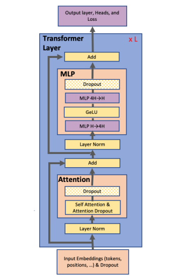
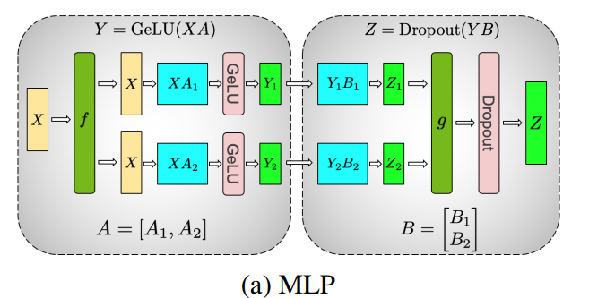
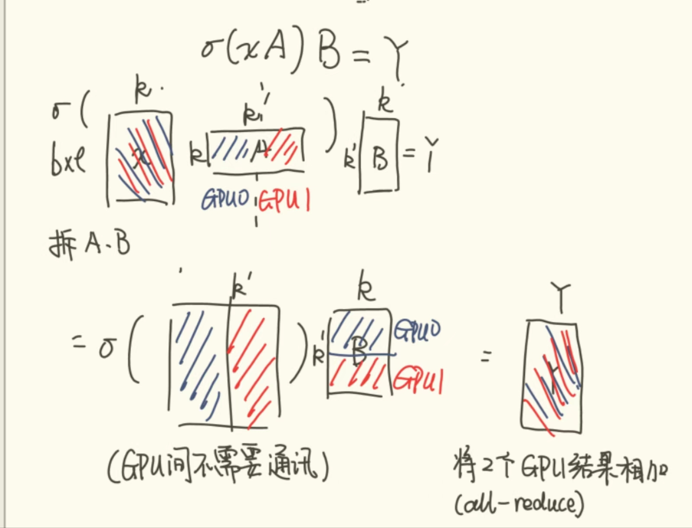
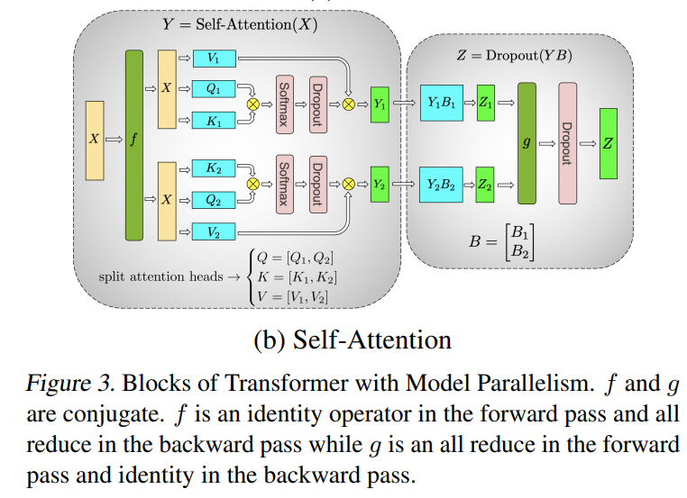
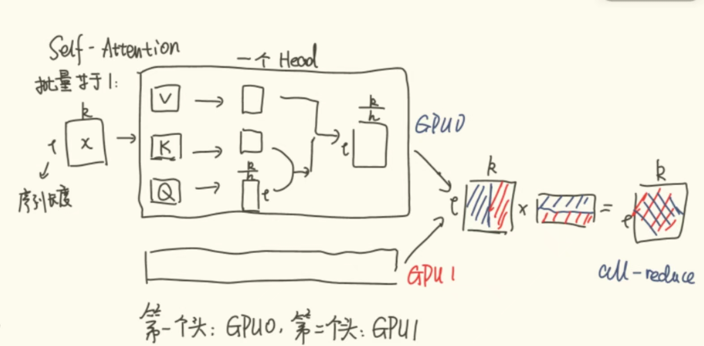
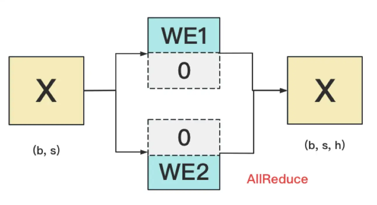

# Megatron-LM

!!! note "Reference"
    
    [Paper](https://arxiv.org/abs/1909.08053)
    [图解大模型训练之：张量模型并行(TP)，Megatron-LM](https://zhuanlan.zhihu.com/p/622212228)
    [李沐论文精度](https://www.bilibili.com/video/BV1nB4y1R7Yz/?spm_id_from=333.337.search-card.all.click&vd_source=49519b2e89bff31aec426f55ae7d4afa)
    
## Background

### Neural Language Model Pretraining

- 预训练模型在 NLP 领域有重要作用(预训练模型迁移学习+下游任务端到端微调)。
- 对硬件、系统和框架提出要求。

### Transformer Language Models and Multi-Head Attention

这里就放张本篇文章用的架构。

### Data and Model Parallelism in Deep Learning

- 将网络训练 scale 到多个硬件加速器的两个核心范式：
    - 数据并行：训练的 minibatches 分割成多个小部分，并将每个部分分配给不同的工作器进行处理。
    - 模型并行：将模型的不同部分分布到多个工作器上进行训练。
- Weak Scaling
    - 增加可用工作器数量的同时，按比例增加每个工作器上 minibatch 的大小。
    - 可能给优化过程带来复杂性(精度下降，收敛时间过长)，抵消了吞吐量增加带来的优势。
- data parallelism + activation checkpointing
    - 在前向过程中不保存所有中间激活值，而是在反向传播的时候重新计算。
    - 降低内存占用。
    - 尽管可用多个处理器来训练模型，但是模型的所有参数和激活值都必须存在单个处理器的内存中。
    - 一种解决方法：参数共享。但是限制了模型的整体容量(可学习的参数总数变少了)
- 作者使用模型并行
    - 两种范式
        - Layer-wise Pipeline Parallelism: 一组操作在一个设备上进行，然后将输出传递到流水线中的下一个设备，在那执行另一组操作。
        - Distributed Tensor Computation: 跨多个设备分布计算张量操作。
    - Pipeline 可能存在问题：有 bubble(TBD)

## Model Parallel Transformers

### MLP

MLP 的第一部分是一个 GEMM(通用矩阵乘法) + GeLU 的激活:

$$
Y = GeLU(XA)
$$

一个很直观的想法是把输入 $X$ 按列切分，将权重矩阵 $A$ 按行切分：

$$
X=\begin{bmatrix}X_1,X_2\end{bmatrix} A=\begin{bmatrix}A_1 \\ A_2 \end{bmatrix}
$$

因此我们可以得到: $Y=GeLU(X_1A_1+X_2A_2)$。由于 GeLU 是一个非线性函数，我们需要在应用 GeLU 之前完成所有的计算。因此需要一个同步点(synchronization point)(在并行计算过程中，所有参与计算的设备必须等待其他设备完成它们的计算任务，以便进行下一步的计算。)

我们想能够直接并行计算 GeLU 的结果，所以可以将 $A$ 按列分割 $A=[A_1,A_2]$。可以得到：

$$
[Y_1,Y_2]=[GeLU(XA_1),GeLU(XA_2)]
$$

如图所示：

手写图解:

### Self-Attention

每个 Head 分到一个 GPU 上，其余的思想类似 MLP。

手写图解：

### 输入嵌入层和输出层

这两块的切法要一样，因为二者是共用的。

- 输入层
    - word embedding 就是用 Token 的序号去词表中查找对应的词向量。
    - 如果查找到就返回，没有就返回 $0$ 向量，最后 all-reduce。
    - 
- 输出层
    - 输入和输出层共用一个 word embedding。
- 计算交叉熵损失
    - 正常做法是对输出层的结果 $[Y_1,Y_2]$ 做 all-gather，将它们 concat 成 $Y$, 然后对 $Y$ 的每一行做 softmax，就得到当前位置每个词出现的概率，然后用该概率和真值做交叉熵。
    - 通讯量为 $b\times s\times v$。$v$ 可能很大。
    - 优化：
        - 每块 GPU 上先按行求和
        - 将每块 GPU 的结果做 all reduce, 得到每行最终的 sum, 也就是 softmax 的分母。
        - 在每块 GPU 上计算各自维护部分的 $\dfrac{e}{\sum e}$, 将其与真值做交叉熵，得到每行的 loss，按行加起来得到 GPU 上的 loss
        - 将所有 GPU 的 Loss 做 all reduce, 得到总 loss。
        - 通讯量为 $b\times s+N$.
        - 