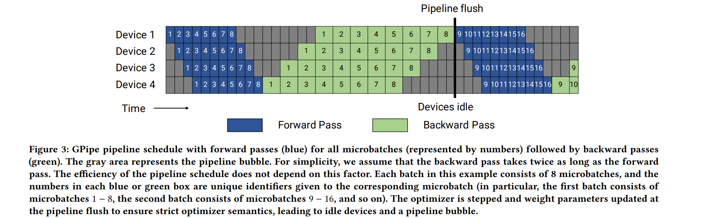

# Efficient Large-Scale Language Model Training on GPU Clusters Using Megatron-LM

## Introduction

现有模型的参数量不断变大，导致两个问题：

- 一个 GPU 里放不下模型的参数
- 即使放下了，训练会非常消耗时间。

因此需要引入并行训练。

- 数据并行
    - 整个模型的输入数据被分割成多个小批量，每个 GPU 上的模型副本处理其中一部分。
    - 随着 GPU 数量的增加，每个 GPU 上的 batch size 会减小。导致两个问题：
        - GPU 利用率降低
        - 通信成本增加( GPU 需要相互通信来使所有模型副本得到最新的权重。)
    - the maximum number of devices that can be used is the batch size, 这样就不能增加 GPU 个数了。
- 模型并行之张量并行
    - 为了克服数据并行的限制，提出了模型并行技术
    - 首先是张量并行
        - 矩阵乘法进行分割，分布到多个 GPU 上
    - 张量并行在更大的模型上有问题：
        - 跨服务器通信：大模型分布在多台多 GPU 服务器上。all-reduce 需要通过服务器间的链路进行，这些链路比单个多 GPU 服务器内部的高带宽 NVLink 要慢。
        - 小矩阵乘法：每个 GPU 上可能剩下很小的 GEMM 任务，导致利用率下降。
    - 总结一下张量并行：单个多 GPU 服务器内部很有用，但是要跨服务器时成本和利用率问题会暴露出来。
- 流水线并行
    - 模型的不同层被分配到多个 GPU 上。
    - 整个训练数据集的一个大批次被分割成更小的批次(microbatches)，每个微批次相当于 CPU 流水线中的一个 stage。
    - 不同的层可以以不同的方式分配给不同的 GPU，并且可以采用不同的调度策略来安排数据通过模型的前向和反向过程。
    - 每个大批次处理结束之后要进行一次流水线刷新 (pipeline flush) 以同步更新模型权重。flush 时允许当前流水线中的所有微批次完成执行，但是不会有新的批次被引入。
    - 所以批次越大，流水线刷新的时间越越短。(会有更多的微批处理)

在这篇文章中，作者提出可以将上述三种并行策略结合起来：

> How should parallelism techniques be combined to maximize the training throughput of large models given a batch size while retaining strict optimizer semantics?

## Modes of Parallelism

### Pipeline Model Parallelism

- Default Schedule
    - 
    - 一个批次中的所有微批处理的前向过程首先被执行，然后是所有微批处理的反向传播。
    - 设一个批次有 $m$ 个微批次，有 $p$ 个流水线并行设备。假设理想情况下美伦迭代的时间是 $t_{id}$，执行一个微批次前向反向过程的时间分别是 $t_f$ 和 $t_b$。
    - 调度过程中，bubble 存在于批次开始时的 $p-1$ 个前向过程和批次结束时 $p-1$ 个反向过程中。
    - 因此 bubble 的总时间 $(p-1)\cdot (t_f+t_b)$
    - 理想处理时间 $m\cdot (t_f+t_b)$
    - Bubble time fraction: $\dfrac{p-1}{m}$
    - 为了减少 bubble 的比例，需要 $m$ 远大于 $p$，但是对于大的 $m$ 有很高的内存占用(需要保存中间激活值，或者 re-materialized 的方法。要保存输入值)
- PipeDream-Flush schedule
    - Warm-up Phase: 不同的 worker 执行不同数量的前向传播，以逐渐填充流水线，确保每个阶段都开始工作但是没有太多未完成的工作积压。
    - In-flight Microbatches: 已经开始执行但是尚未完成所有前向和后向传播的微批处理。该策略将这一数量限制为流水线的深度 $p$。
    - Steady State: Warm-up 阶段后每个工作器进入稳态，在此状态下每个工作器执行一个前向传播，紧接着执行一个反向传播，称为 1F1B。
    - 批次的最后，完成所有剩余在 in-flight 处理的反向传播