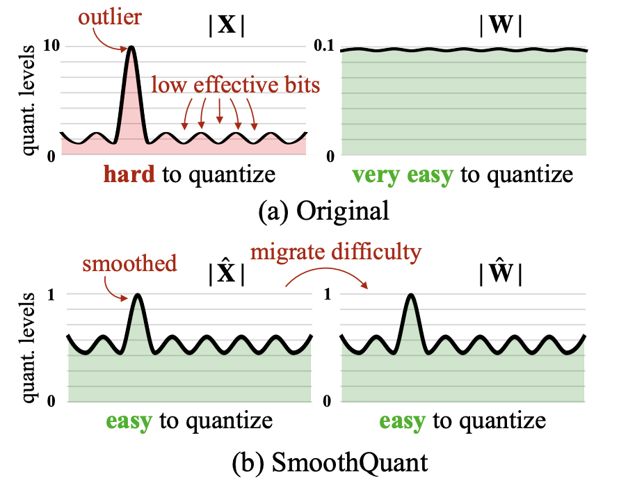
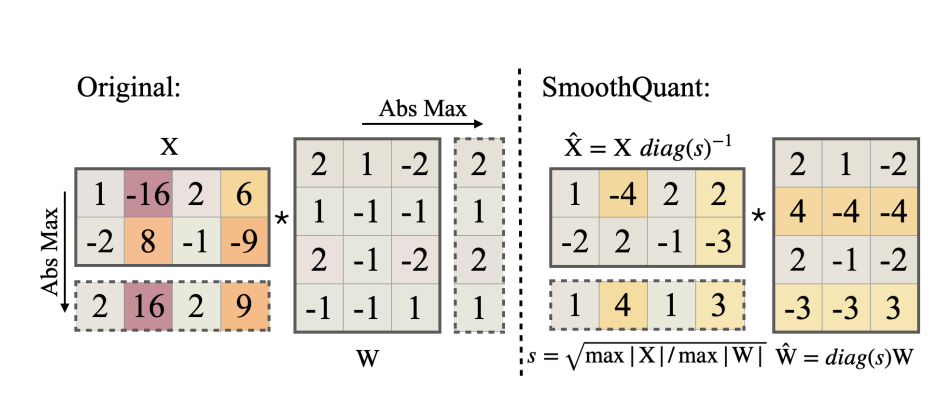

# SmoothQuant: Accurate and Efficient Post-Training Quantization for Large Language Model

## Abstract

SmoothQuant 是一种用于 LLM 后训练量化的解决方案，旨在通过 8-bit 权重和 8-bit 激活(W8A8) 量化来减少内存使用并加速推理过程，同时保存模型的准确性。

核心思想是将量化的难点从 activation 迁移到 weights, 通过数学等价变换平滑 activation 的 outliers.

## Introduction

- 现有量化方法存在局限性：LLM 的参数超过 6.7B 时，激活中会出现异常值，导致量化误差以及准确性下降。
    - weights 分布比较均匀，意味着它们的值在大多数情况下比较接近，更容易被量化。
    - activation 分散一点，包含一些很大的值，这就是 outlier
- SmoothQuant
    - rely on a key observation: even if activations are mnuch harder to quantize than weights due to the presence of outliers, different tokens exhibit similar variations across their channels.
    - SmoothQaunt offline migarates the quantization difficulty from activations to weights.

## Quantization Difficulty

- Activations are harder to quantize than weights.
    - the weight distribution is quite uniform and flat
- Outliers make actibation quantization difficult
    - The scale of outliers in activations is ~100 $\times$ larger than most of the activation values.
    - the large outliers dominate the maximum magnitude measuremet, leading to low effective quantization bit for non-outlier channels.
- Outliers persist in fixed channels.
    - if one channel has an outlier, it persistently appears in all tokens.
    - The variance between the magnitudes of a given channel across tokens is small.
    - So if we could perform per-channel quantization of the activation, the quantization error would be much smaller.
    - infeasible though.

## SmoothQuant

总的 idea: 对于 $Y=XW$ 将激活值缩小一个比例系数，同时将权重放大一个比例系数：

$$
\bf{Y}=(\bf{X}diag(\bf{s}^{-1}))\cdot (diag(\bf{s})\bf{W})=\hat{\bf{X}}\hat{\bf{W}}
$$

- Migrate the quantization difficulty from activations to weights
    - choose a per-channel smoothing factor $\bf{s}$ such that $\hat{\bf{X}}$ is easy to quantize.
    - 为了减少量化误差，需要增加所有通道的有效量化位数。 The total effective quantization bits would be largest when all the channels have the same maximum magnitude.
    - 一个简单的方法就是让 $s_j=\max{|X_j|}$. 这样除以 $s$ 后每个 channel 就有相同的最大值。
    - 但是如果按照上述方法直接选择，所有的量化难度都会被推向权重。？
    - 另一种方式 $s_j=\frac{1}{\max{|W_j|}}$.这会将所有量化难度推向 activation.
    - 因此我们需要寻找平衡，引入一个超参 $\alpha$.
    - $s_j=\max(|X_j|)^{\alpha}/\max(|W_j|)^{1-\alpha}$.

- Applying SmoothQuant to Transformer blocks.
    - self-attention，FNN，Batched Matrix Multiply 被量化为 INT8，因为它们是计算密集型的。
    - 其它轻量级逐元素操作，如 ReLU, Softmax, LayerNorm, 保持激活为 FP16 