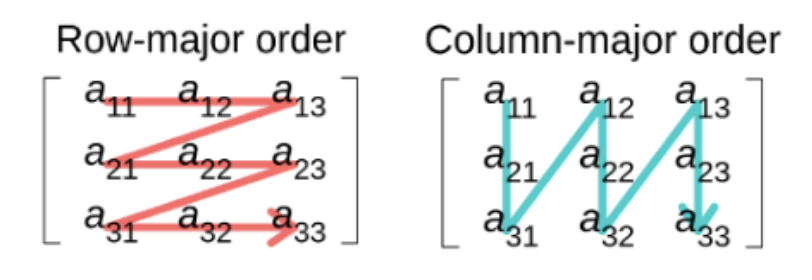
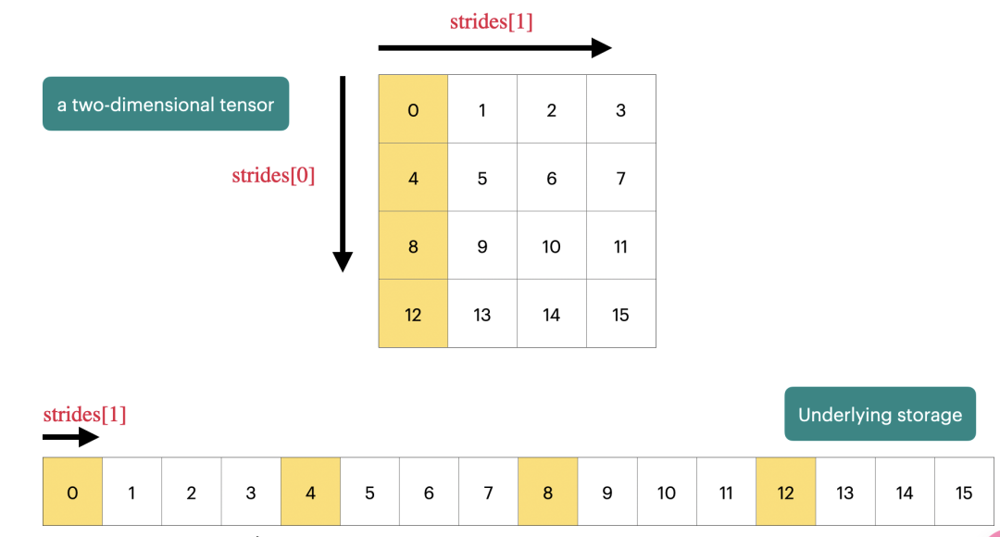

# Hardware Acceleration

!!! note "Reference"

    [CSE234@UCSD](https://hao-ai-lab.github.io/cse234-w25/)

## Arithmetic Intensity

首先我们定义 arithmetic intensity. 它代表总操作数与总的数据移动次数的比例。算术强度越高，说明算法越高效。

!!! Example "Arithmetic Intensity"

    ```c
    void add(int n, float* A, float* B, float* C){
        for (int i = 0; i < n; i++){
            C[i] = A[i] + B[i]
        }
    }
    ```
    对于上述的代码，我们需要读出 `a[i],b[i]`, 然后进行加法操作，最后将结果存储到 `c[i]`. 因此我们的 arithmetic intensity 就是 $\frac{1}{3}$. (3次 read/write 操作 + 1次计算)

我们想做的是优化 arithmetic intensity, 主要围绕以下几个技术展开:

- Vectorization: 向量化。我们使用硬件指令一次性可以处理多个数据。
- Data Layout Optimization: 数据在内存中的存储方式会对我们访问的速度产生影响。
- Parallelization: 并行。

## Operator Acceleration

首先我们先介绍矩阵在内存中的存储方式:

- Row-major order: 矩阵的行在内存中是连续的。
- Column-major order: 矩阵的列在内存中是连续的。



但实际上，不论是 row-major 还是 column-major, 他们本质上都是存储在内存中的一个一维数组。我们考虑能不能有一种通用的表示方式，能够将这种一维的存储映射到我们实际运用到多维张量。

因此我们就引入 `strides` 的概念。

**`strides[i]` indicate how many elements need to be skipped in memory in order to move one-unit in the ith dimension of the tensor.**

!!! Example

    `A[i][j] = A.data[offset + i*A.strides[0]] + j * A.strides[1]`.



接下来我们就可以使用 `strides` 来对一些算子进行加速。

### Slicing a Tensor


### Transposing a Tensor

### Broadcasting a Tensor

## Matrix Multiplication

朴素的矩阵乘法时间复杂度是 $O(n^3)$. 回顾之前提到的 Arithmetic Intensity(AI), 我们希望最大化 AI, 而通过 AI 的定义，显然有两种方法：

- 增加 #ops: **fuse operations to combine multiple computations into fewer memory-bound steps**.
- 减少 #bytes: **optimize data layout for better cache usage, use blocking and tiling techniques to keep active data in fast memory**.

### Memory Hierarchy

回顾 Registers, L1/L2 Cache, DRAM.

有三种针对 memory hierarchy 的优化方法：

- temporal locality: reuse the same data multiple times while it is in the cache.
- spatial locality: load data in contiguous blocks to minimize cache miss.
- blocking / tililng: divide computations into smaller blocks that fit into faster memory.

### Register Tiled Matrix Multiplication

**Dividing the matrices into smaller sub-blocks(tiles) that fit within the avaliable registers.**

```c++
dram float A[n/v1][n/v3][v1][v3];
dram float B[n/v2][n/v3][v2][v3];
dram float C[n/v1][n/v2][v1][v2];

for(int i = 0; i < n/v1; i++) {
    for(int j = 0; j < n/v2; j++) {
        register float c[v1][v2] = 0;
        for(int k = 0; k < n/v3; k++) {
            register float a[0:v1, 0:v3] = A[i][k];
            register float b[0:v2, 0:v3] = B[j][k];
            c += dot(a, b.T);
        }
    }
    C[i][j] = c;
}
```

观察上述代码，与传统的矩阵乘主要有以下几个不同：

- tiling factor: $v1, v2, v3$. 所以 $n/v1,n/v2,n/v3$ 就代表我们将原始的矩阵行/列分成了多少块。
- 在内层循环中，我们每次将一个块的元素从 DRAM 加载到 register 中，以加速我们的运算。

接下来我们对上述矩阵乘的技巧进行性能的分析。
对于矩阵 $\bf{A}$, 我们每次循环会 load $v1\times v3$ 个元素，总共有 $\frac{n}{v_1}\times \frac{n}{v_2}\times \frac{n}{v_3}$ 次循环，因此对于 $\bf{A}$, 总共的读内存操作有 $\frac{n^3}{v_2}$ 次。矩阵 $\bf{B}$ 也同理，有 $\frac{n^3}{v_1}$ 次。对于矩阵 $\bf{C}$,每个元素只在内层循环的末尾写入内存一次，因此总共内存访问次数为 $n^2$.

从上述的分析可以看出，$v_3$ 是不影响算法的性能的。

接下来我们考虑需要寄存器的数量。由于我们每块的矩阵乘是要在寄存器里进行的，每个寄存器可以放入一个元素，因此总的寄存器量为: $v_1\times v_3 + v_2\times v_3 + v_1\times v_3$. 因此块的大小($v_1,v_2,v_3$)是被机器寄存器数量所约束的。


### Cache-aware Tiled Matrix Multiplication

首先我们介绍 workflow for matrix multiplication:

1. DRAM to L1 Cache: Data is loaded in tiles from DRAM to the L1 Cache using cache-aware tiling.
2. L1 Cache to Registers: After data is in the L1 cache, it is further divided and transferred to the processor register for computation. (register-aware tiling)
3. Dot Product Computation.

```c++
dram float A[n/b1][b1][n];
dram float B[n/b2][b2][n];
dram float C[n/b1][n/b2][b1][b2];

for(int i = 0; i < n / b1; i++) {
    l1cache float a[0:b1, 0:n] = A[i];
    for(int j = 0; j < n / b2; j++) {
        l1cache = float b[0:b2, 0:n] = B[j];
        C[i][j] = dot(a, b.T);
        //Register-aware tiling can be applied.
    }
}
```

性能分析：

- Reads between DRAM and L1 Cache for Martrix A: $\frac{n}{b_1}\times n\times b_1 = n^2$.
- Reads between DRAM and L1 Cache for Matrix B: $\frac{n}{b_1}\times \frac{n}{b_2}\times b_2\times n = \frac{n^3}{b_1}$.

同时，类似地，我们也会被 L1 cache 的大小所限制：$b_1n+b_2n\le \text{L1 Cache Size}$.

### Putting it all together.

TBD.

## The Overall Trend of Hardware Accelerator

### SIMD

**SIMD is a computational paradigm where one instruction is issued, but it operates on multiple element of data in parallel.**

我们可以在 chip 上增加 ALU 运算单元来提高并行度。

**Limitations and the Road Ahead**

- Power wall: even if we add more ALUs, we risk overheating and surpassing feasible power budgets.
- Diminishing returns: doubling the vector width does not always translate to a 2$\times$ speedup.(due to memory bandwidth, cache effciency, etc.).

**Industry Direction**

- Quantum Computing
- Specialized Hardware: domain-specific accelerators.