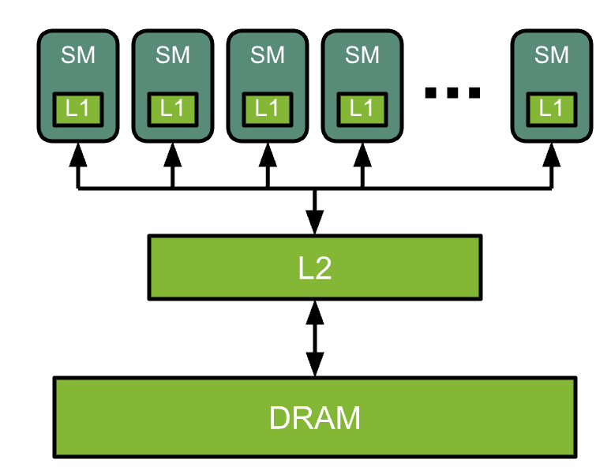
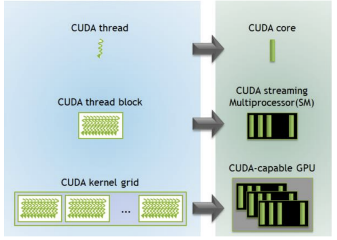
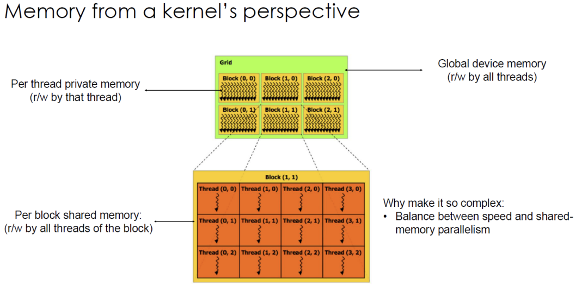

# GPU and CUDA

!!! note "Reference"

    https://docs.nvidia.com/deeplearning/performance/dl-performance-gpu-background/index.html


## GPU

### GPU Architecture Fundamentals

The GPU is a highly parallel processor architecture, composed of processing elements and a memory hierarchy.

At a high leel, NVIDIA GPUs consist of a number of Streaming Multiprocessors(SMs), on-chip L2 cache, and high-bandwidth DRAM. Arithmetic and othe instructions are executed by the SMs; data and code are accesed from DRAM via L2 cache.



**Some terminologies**

- Threads: **smallest** units of execution to process a chunk of data. Threads are the lowest-level workers in GPU computing and execute instructions **concurrently** within a warp.
- Warps: a group of 32 threads that execute instructsions simultaneously in a single instruction,multiple thread modle(SIMT). Warps are the standard **scheduling unit** in a streaming multiprocessor.
- Blocks: a collection of threads that **share memory**. Each block is assigned to a single streaming multiprocessor(SM). The SM schedules and executes the threads in warps.
- Grid: a collection of blocks that execute the same kernel. The grid defines the total structure of threads in the computation.
- Kernel: a function written in CUDA that is executed by many threads on the GPU in parallel. 
    - Each thread executes the kernel with a unique thread ID so that they can operate on different portions of data.



## CUDA

CUDA is a C-like language to program GPUs.

CUDA code could be devided into two parts:

- Host Code: the portion of the program that runs on the computer's CPU.
    - managing the overall program flow.
    - allocating and deallocating memory on both the host(CPU) and device(GPU)
    - transferring data between the host and device.
    - Launching kernel functions to be executed on the GPU.
    - Synchronizing CPU and GPU operations.
- Device Code: part of the program that runs on the GPU.
    - kernel functions: special functions that are executed in parallel on the GPU.
    - device functions: helper functions that can only be called from within kernel functions or other device functions.

### Examples

1. Host code, executed serially on the CPU

```c++
const int Nx = 12;
const int Ny = 6;

dim3 threadsPerBlock(4,3,1); // 12
dim3 numBlocks(Nx/threadsPerBlock.x, Ny/threadsPerBlock.y, 1); //(3,2,1) = 6

// the following call triggers execution of 72 CUDA threads
matrixAddDoubleB<<<numBlocks, threadsPerBlock>>>(A,B,C);
```

上述代码中，待处理矩阵的维度为 $N_x\times N_y$. `dim3 threadsPerBlock(4, 3, 1)` 定义了每个线程块的线程布局, `dim3 numBlocks(Nx/threadsPerBlock.x, Ny/threadsPerBlock.y, 1)` 计算 grid 中的 block 数量。需要注意的是，线程块可以是三维的，因此代码中的 1 表示 z 方向未被使用。

2. Device Code

- GridDim: dimensions of the grid.
- blockIdx: the block index within the grid.
- blockDim: the dimensions of a block.
- threadIdx: the thread index within a block.

```c++
__device__ float doubleValue(float x) {
    return 2 * x;
}

//kernel definition
__global__ void matrixAddDoubleB(float A[Ny][Nx], float B[Ny][Nx], float C[Ny][Nx]) {
    int i = blockIdx.x * blockDim.x + threadId.x;
    int j = blockIdx.y * blockDim.y + threadId.y;
    C[j][i] = A[j][i] + doubleValue(B[j][i]);
}


```


- The CPU program will continue execution immediately after launching the kernel. This is because CUDA kernel launches are asynchronous by default. When you call a CUDA kernel, the CPU doesn’t wait for the GPU to finish - it continues executing the next line of code right away.
- In cuda, the kernel functions must have a void return type because they are executed by muliple threads in parallel. Kernels typically write their results to pre-allocated GPU memory which can then be copied back to the CPU using `cudaMemcpy` when needed.
- To know when the GPU has finished its work, call `cudaDeviceSynchronize()` to make the CPU wait for the GPU.


### CUDA Memory Model

**CUDA operates on GPUs using High Bandwidth Memory(HBM)**.



我们使用 cuda 的内存架构来优化下面的 code:

```python
for i in range(len(input) - 2):
    output[i] = (input[i] + input[i-1] + input[i+1]) / 3.0
```

Host code:

```c++
int N = 1024*1024;
cudaMalloc(&devInput, sizeof(float) * (N+2));
cudaMalloc(&devOutput, sizeof(float) * N);

convolve<<<N/THREADS_PER_BLK, THREADS_PER_BLK>>>(N, devInput, devOutput);
```

Device code:

```c++
#define THREADS_PER_BLK 128

__global__ void convolve(int N, float* input, float* output) {
    int index = blockIdx.x * blockDim.x + threadIdx.x;
    float result = 0.0f; //thread-local variable.
    result = input[index] + input[index+1] +input[index + 2];
    output[index] = result / 3.f;
}

```

上述的代码中，每个元素都被读进了三次。


优化后的代码：

```c++
__global__ void convolve(int N, float* input, float* output) {
    int index = blockIdx.x * blockDim.x + threadIdx.x;

    __shared__ float support[THREADS_PER_BLK]; //每个线程块分配共享内存，缓存输入数据
    support[threadIdx.x] = input[index];
    if(threadIdx.x < 2) {
        support[THREADS_PER_BLK + threadIdx.x] = input[index + THREADS_PER_BLK];
    }
    __syncthreads();//确保所有线程完成共享内存数据加载后，再开始计算

    float result = 0.0f;
    for(int i = 0; i < 3; i++) {
        result += support[threadIdx.x + i];
    }
    output[index] = result / 3.f;
}
```
优化后的代码，我们只需要 128+2 次 memory operation. 对比优化前的代码，需要 128 $\times$ 3 次。


