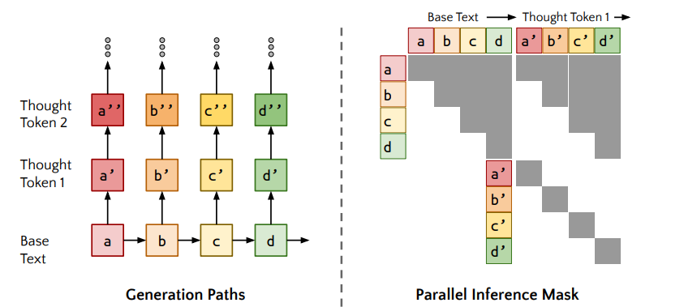

# Quiet-STaR: Language Models Can Teach Themselves to Think Before Speaking

## Introduction

通过推理文本的隐含意义来预测后续文本，可以提高语言模型在多种任务上的性能。但现有的方法通常集中在解决特定任务或者预定义的任务集上，非常依赖于数据集(提供特定的推理任务或直接提供推理过程)。作者提出通过语言模型的预训练来教授和学习推理。

Quiet-STaR 的方法：在每个 token 之后生成 rationale (理由) 来解释未来的文本(think), 将有无理由的未来文本预测混合在一起(talk), 然后使用 RL-based 的奖励来学习生成更好的理由(learning)

## Related Work

### Training Language Models to Reason

目前有两种训练语言模型推理能力的方向：

- 在推理痕迹或类似推理的数据上训练语言模型。缺点是需要手动标注，并且推理的分布不是语言模型会生成的文本。难以扩展
- 依赖语言模型自身生成的推理。

### Meta-tokens

a growing body of work has demonstrated the usefulness of custom tokens optimized to perform specific functions in the context of a neural network – for this reason, they have also been referred to as “function vectors.”

## Problem Statement

作者在序列的每一对 token 之间引入一个辅助的 "rationale" 变量。模型训练的目标是找到模型参数，能够最大化给定前文和理由的情况下，剩余序列的对数似然：

$$
\theta^{*}=\argmax_{\theta}\mathbb{E}_x[\log p_{\theta}(x_{i:n}|x_{0:i},rationale _{\theta}(x_{0:i}))]
$$

作者还有以下几点 observation:

- 推理允许模型将复杂的计算分解为更小的步骤。
- 目标是准确预测剩余的序列，而不是下一个 token(但对于最优的模型来说二者应该是等价的)。
- 非短视的公式对于学习理由更有效，所应该考虑多个未来的 token.

## Method

### Overview

### Parallel Generation(think)

目前不是很懂

一个挑战就是如何在输入序列的每个 token 位置高效地生成 rationales。为了解决这个问题，作者使用了一种高度并行的生成方法：

- 观察到语言模型的一次推理过程会为所有输入 token 产生下一个 token 的概率分布。
- 作者缓存每次前向传播，并将对角线注意力掩码连接到之前的注意力掩码上：每个生成的 token 现在关注所有用于生成它的 token 以及它自己。

### Mixing Heads

如果我们直接引入推理思考的步骤，这些思考可能不符合模型的预期分布，从而损害语言模型的性能。

因此作者引入混合头，在有无思考的情况下，对语言模型的预测进行加权混合，允许模型在保持原有语言模型性能的同时，逐渐引入和利用“思考”步骤来改善预测。

混合头基于“思考”结束时的 token 的隐藏状态（hidden state）和原始文本 token 的隐藏状态，输出一个权重。
这个权重决定了在最终预测中，使用“思考”后的预测 logits（即模型预测下一个 token 的概率分布）的程度。

### Optimizing Rtionale Generation

- **Optimizing Start-of-Thought and End-of-Thought Tokens**
    - meta-token: `<|startofthought|>` `<|endofthought|>`
    - challenge: rationale token 是离散的，不好优化。
    - 作者将这些 meta-token 的 embedding 初始化为 em dash(一个在文本数据中用来表示暂停的符号)，这样可以利用语言模型已有的知识。
    - 作者在更新步骤中对这些嵌入的梯度应用了一个超参数权重，意味着在训练时这些 meta-token 会得到更多的关注。
    - 遇到 `<|startofthought|>` 时，模型进入思考模式，在这个模式下模型生成一个理由来帮助预测接下来的文本。
    - 遇到 `<|endofthought|>` 时，表示模型完成了理由的生成，可以继续生成后续的文本。
- **Non-myopic Scoring and Teacher-forcing**
    - 并不是每个 token 的预测都需要一个理由，因此希望模型的 reward 不仅仅依赖于下一个词，而是更多依赖于随后的语义内容。
    - 不是很懂
- **Objective**
    - 根据理由的有用性进行优化：在给定先前观察到的 token 和理由的情况下，接下来 $n_{true}$ 个真实 token 的对数似然。
    - 定义奖励: $r_j=\log p_{j:j+n_{true}}^{talk}(X_{j+1:j+{n_{true}}+1})-\log p_{j:j+n_{true}}^{-talk}(X_{j+1:j+n_{true}+1})$
    - 损失函数: $\nabla_{\theta}L_j^{REINFORCMENT}=-r_j\cdot \nabla _{\theta}\log p_{\theta}(T_j|[X_{:j};<|startofthought|>])$
        - $r_j$ 是第 $j$ 个理由的奖励，衡量理由的有用性。
        - $[X_{:j};<|startofthought|>]$ 生成理由 $T_j$ 时考虑的上下文信息。

