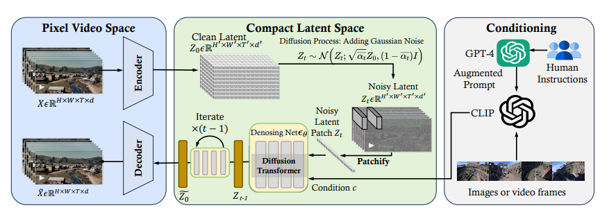
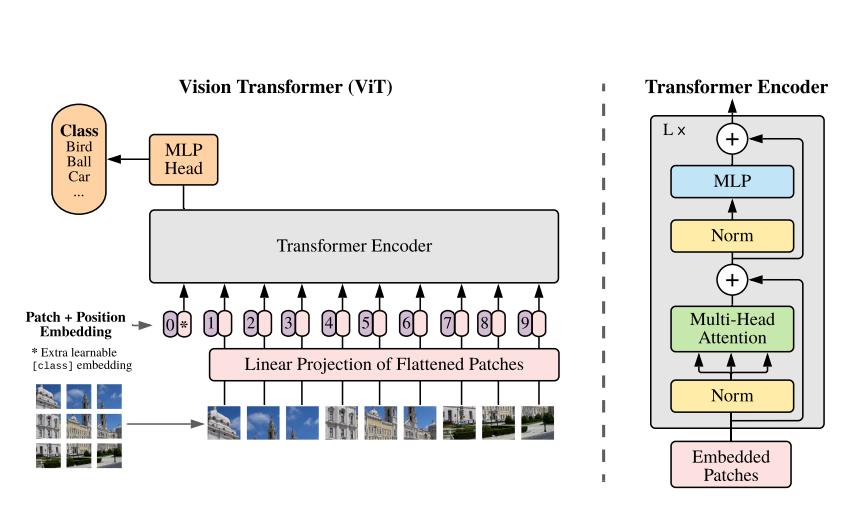
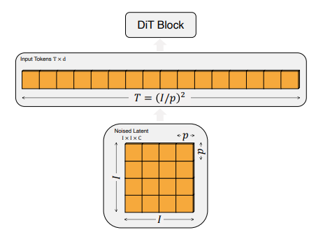
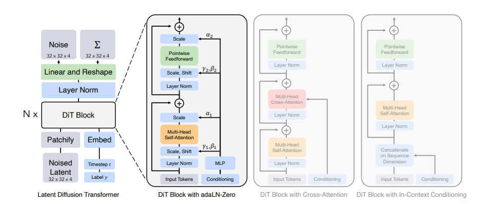
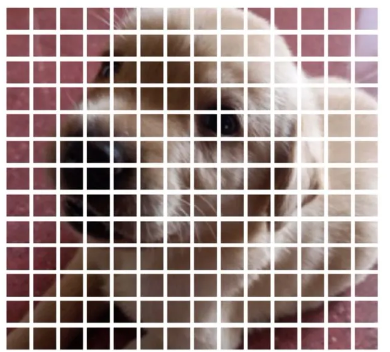
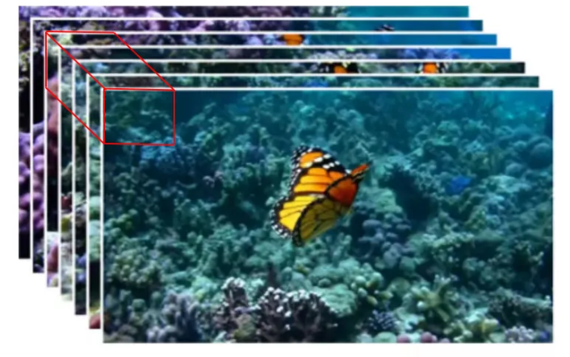

# Open-Sora: Democratizing Efficient Video Production for All

## Overview

- SORA 是在大规模的视频和图像数据上进行联合训练得到的生成模型。
    - 模型联合训练了不同持续时间、分辨率和纵横比的视频和图像上的文本条件扩散模型。
    - 利用了在视频和图像 latent space 上操作的 transformer 架构。
    - 生成一分钟的高清视频。
- 建立的一种通用的视觉模型方法(之前图像和视频模型使用不同的方法)

## Background

### Vision Transformer

直接将 Transformer 运用到视觉领域的挑战：输入序列太长，self-attention 是 $O(N^2)$ 的，在像素层面做自注意力是不现实的。

思路就是把图片分成 patches, patches 可以类比 LLM 中的 token，但是 Vision Transformer 是有监督的。

和 CNN 相比的劣势：CNN 有两个归纳偏置(先验知识)，即 CNN 模型是知道局部性和平移等价性的($f(g(x))=g(f(x))$)，因此相比 Transformer，CNN 可以通过较少的数据进行学习。

除了图像本身的 token, 我们还要额外加一个 cls token, 根据它的输出决定最后的分类类别。

其它的部分就和 Transformer 类似了。因此 ViT 将 NLP 和 CV 任务统一了起来，就用个 Transformer 骨干网络就行了。

### DiT Preliminaries

- DDPM 存在前向和反向两个马尔可夫过程。
    - 前向扩散过程中不断加噪，使得原始图像最终趋于正态分布。
    - 反向过程就是从噪声中根据 prompt 恢复出真实图片的过程。
- IDDPM: 主要思想是改进扩散模型的对数似然，既学习噪声分布的均值同时学习方差。
- LDM: 为了提高效率降低成本，采用在 latent space 中进行训练和采样，分为两个阶段
    - 训练一个 VAE, VAE 将图像压缩到 latent space
    - 在 latent space 用 diffusion 训练
    - 通过解码器将 latent rep 还原为真实图片。
- DiT
    - Patchify: 输入图像 $I\times I$ 会被切割成一系列固定尺寸的小块 $p\times p$, 然后这些小块会线性地映射到一个预定义号的高维空间 $d$，形成一个向量序列，长度为 $T=(I/p)^2$,同时还要加上位置编码。
    
    - 原始 ViT 中，patchify 之后输入 Token 会直接由一系列 Transformer 处理，但 DiT 的输入除了 noise 图像外，还会有额外的信息入 noise step $t$, 类别标签 $c$, 自然语言(prompt) 等。
    
    - Transformer decoder: 经过最后一个 DiT block 之后，需要将向量序列解码成噪声和协方差预测，

## Methods

### Spacetime Patches

训练模型之前，需要进行数据预处理。

与 LLM 类似， Sora 首先将所有输入数据统一化 (LLM 是文本，Sora 是视觉数据)，然后训练模型用于预测下一个词(LLM 是 token, Sora 是 patches)，并且使用原始数据而非修剪后的数据(不同分辨率，时长和长宽比)。

**具体过程**：

- 将原始视频数据转化为低维度潜空间特征，作者定义视频训练和推理的基本单元是 patches
    - patches 的实质是将完整的图片拆成 $N\times N$ 的小方格后，再将每个图像块转换成向量，可以得到包含每个小方格 Position 信息的 embedding。如下图所示，每个小方格就称一个 patch。

- 但视频是由包含时间序列的多张图片构成的，处理时必须要考虑这些长时间范围 patches 序列的上下文关系。因此仅仅有 patch 图像块是不够的，作者将 patches 升级成包含时间信息的 spacetime patches.
- TODO(ViT, ViviT)

### Diffusion-Transformer

Sora 是一个 diffusion model, 能将有噪声的图像块，基于 prompt 还原出清晰的图像。

回顾一下 LLM 的文本生成任务，从输入一段 prompt 开始，模型会采用自回归的方式来预测接下来的每一个 token。

如图所示，我们已知当前的 spacetime patches(可以类比 LLM 中的 prompt), sora 根据此推测下一个 spacetime patches, 通过自回归的方式预测出所有视频画面中的 spacetime patches, 然后组合在一起，便得到了整个视频画面的持续运动过程。

现在我们来看看 Sora 使用的 Diffusion-Transformer(DiT) 架构。DiT 是一个带有 Transformer Backbone 的扩散模型：

DiT=[VAE encoder + ViT + DDPM + VAE decoder], 其中 DDPM 中的卷积 U-Net 换成了 Transformer。

