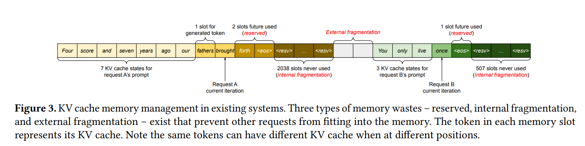
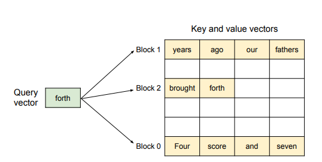
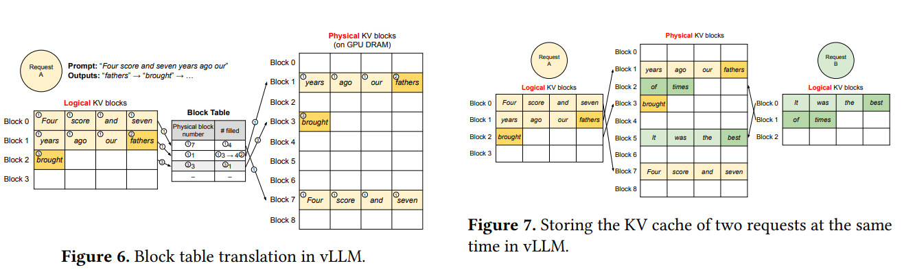
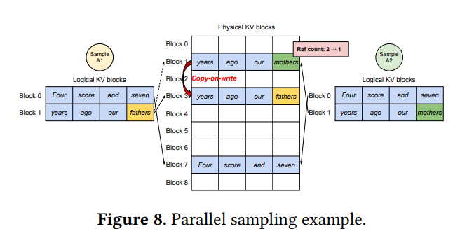

# Efficient Memory Management for Large Language Model Serving withe PagedAttention

## Background

在这一节简单介绍 LLM 的背景。

### Transformer-Based LLMs

**autoregressive decomposition**(条件概率的乘积)
$$
P(x) = P(x_1)\cdot P(x_2|x_1)\cdots P(x_n|x_1,\cdots,x_{n-1})
$$
其余见 Transformer 的笔记。

### LLM Service & Autoregressive Generation

A request to an LLM provides a list of *input prompt tokens* $(x_1,\cdots,x_n)$ and the LLM service generates a list of output tokens $(x_{n+1},\cdots,x_{n+T})$.

需要注意的是，LLM 只能一个个生成新的 token, 并且生成的新 token 只取决于序列中之前的 token , 特别是之前 Token 的 key vector 和 value vector。因此在生成的过程中，所有 token 的这两个向量都被存储起来，称作 KV cache。每个 token 的 KV cache 只取决于它前面的 token，这意味着输入序列中不同位置的 Token 具有不同的 KV cache。

因此，我们可以总结出 LLM 的生成过程，大致分为两个步骤:

1. **The prompt phase**: LLM 接受整个 prompt 输入 $(x_1,\cdots, x_n)$ 并计算第一个新 token 的概率 $P(x_{n+1}|x_1,\cdots,x_n)$，同时生成 key vectors $k_1,\cdots,k_n$ 和 value vectors $v_1,\cdots,v_n$。这个过程可以并行计算(因为输入序列已知)。
2. **The autoregressive generation phase**: 这个阶段不断生成剩下的 token。在第 $t$ 轮循环中，模型只接受 $x_{n+t}$ 作为新输入，并计算 $P(x_{n+t+1}|x_1,\cdots,x_{n+t})$ 以及 key/value vectors。需要注意的是第 $1$ 到第 $n+t-1$ 个 token 的 key/value vector 已经被 cache 了，因此只要计算 $n+t$ position 的向量即可。整个过程不能并行，因为数据是相互依赖的。**所以这个阶段是最主要的瓶颈**。(underutilizes GPU computation and memory-bound)

### Batching Techniques for LLMs

为了提升 serving 的效率，我们可以把多个请求 Batch 起来，即不用对每次输入都加载一遍模型参数，而是用于多次输入(其实就类似于模型训练的 batch)。

但是 LLM 的 batching 有两个问题:

1. 不同请求的到达时间不同。naive batching 策略要么让最早到达的请求等待，要么让之后到达的请求等前面的请求处理完毕。两种方法都会造成延时。
2. 请求的输入输出长度可能相差很大。我们的 batching 会填充短的请求，使得所有长度相等，这样就浪费了 GPU 的计算和内存。

为了解决这个问题，可以使用一些高细粒度(fine-grained)的 batching 技术。(cellular batching 或者 iteration-level scheduling)。在每轮迭代结束之后，完成的请求被移除 batch 并添加新的请求。这样子就不需要进行 input/ouutput 的填充了。

## Memory Challenges in LLM Serving

尽管我们有细粒度的 batching 技术，LLM serving 仍然受到 GPU 内存的限制 (memory-bound)，具体来说有以下几个问题:

- **Large KV cache**
    - 随着请求数量增多，KV Cache 的大小也快速增大。
    - 13B 的 OPT 模型中，每个 Token 需要 $2\times 5120\times 40\times 2$ 的空间，其中 2(key and value vectors), 5120(隐藏层维度), 40(层数),2(fp16 字节数)，而 OPT 模型最长可以生成 2048 个 Token 的序列，KV cache 需要 1.6GB 的内存。所以即使 GPU 所有的内存空间都分配给 KV cache, 一次也只能处理十几个请求。
    - 低效的内存管理会减小批次大小
    - GPU 计算增长速度快于内存容量的增长速度，导致内存是最主要的瓶颈。
- **Complex decoding algorithms**
    - 不同的应用场景和解码算法会有不同的 KV cache 共享效率。
- **Scheduling for unknown input & output lengths**
    - 输入和输出长度不是确定的，需要内存管理算法来处理这些情况。
    - 输出长度会不断变长，这时候 KV cache 所需要的 memory 大小也会增大，这时如果出现内存不足的情况，就需要系统进行调度。

### Memory Management in Exsiting Systems

现在的 LLM 将单个请求的 KV cache 存储为一个连续的张量，但由于 LLM 的输出长度是不可预测的，系统在内存管理的时候只能静态预分配一块足够大的内存(该请求的最大可能序列长度)。

假设有两个请求 $A,B$, A 最大长度为 2047，B 为 512.那么系统的分配结果如上图所示。

- reserved slots：用来放接下来要输出的 token
- Interanal fragmentation: 预分配的空间大于实际需要的空间造成的内存未利用
- external fragmentation: 两个请求的分配导致中间一段内存不可用。

internal/external fragmentation 不会再被使用，是纯粹的内存浪费(pure memory waste), reserved slots 最终会被使用，但是可能这段空间会被保留很长一段时间，但其实可以被其它的请求使用。这是非常低效的。

## Method

### PagedAttention

**PagedAttention** 受操作系统中 paging 思想的启发，允许我们在非连续的内存空间中存储连续的 key/value。

PagedAttention 将每个序列的 KV cache 切分成一系列 KV Blocks, 每个 block 包含固定长度 token 的 key/value 向量。我们用 $K_j=(k_{(j-1)B+1},\cdots,k_{jB})$ 来表示 key block, 用 $V_j=(v_{(j-1)B+1},\cdots,v_{jB})$ 来表示 value block。于是，原有的 attention 计算被替换成 block-wise 的计算：

$$
A_{ij}=\dfrac{exp(q_i^TK_j/\sqrt{d})}{\sum_{t=1}^iexp(q_i^Tk_t/\sqrt{d})},\ o_i=\sum_{j=1}^{\lceil i/b\rceil}V_jA_{ij}^T
$$

其中 $A_{ij}=(a_{i,(j-1)B+1},\cdots,a_{i,jB})$, $B$ 是 block size. $A_{ij}$ 代表了第 $j$ 个 KV Block 与第 $i$ 个查询向量的注意力得分。

!!! Example

    

    如图所示，key/value 向量被存在三个不同的 block 里，并且这几个 Block 在物理内存中不是连续的。每次我们都计算 $q_i$ 和 $K_j$ 的乘积来计算 attention score (e.g. forth 和第 0 块中的 "Four score and seven")，然后将 $A_{ij}$ 与 $V_j$ 相乘得到最终的 attention 输出。

### KV Cache Manager

**High Level Idea**: 类似 os 中的 virtual memory。

操作系统将内存分为定长的 pages, 并且能够将进程的逻辑页映射到物理页。连续的逻辑页对应着不连续的物理页，但是让用户感觉它们访问的是连续的内存。除此之外，我们不需要提前保留这些物理地址空间，操作系统可以根据需要对物理页进行动态的分配。

- 一个请求的 KV cache 表示为一系列逻辑(logical) KV blocks, 这些 blocks 从左向右填充。最后一个 KV block 可能不会被填满，那么剩余的位置可以用来放后面生成 token 的 KV cache。
- 在 GPU 工作器上，一个 block engine 分配一个块连续的 GPU DRAM，并将其划分为物理 KV 块。
- 除此之外，KV block manager 还维护一个 block table(类似操作系统的页表)来管理逻辑块和物理块之间的映射。
- 好处：vLLM 可以动态增加 KV cache memory, 这样就不用提前预留内存空间，避免内存浪费。

### Decoding with PagedAttention and vLLM

我们使用一个例子来看看 vLLM 是怎么利用 PagedAttention 和 KV Cache Maneger 来进行输入序列的 decode。

- 首先，我们的 prompt 有 7 个 tokens, 所以 vLLM 先分配前两个logical KV blocks(0 和 1)，并将这两个 logical block 映射到两个 physical blocks(7 和 1)
- 在 prefill 这一步，vLLM 使用传统的 attention 算法生成 prompt 的 KV cache，并把前 4 个 token 的 cache 放到 logical block 0 ,把后 3 个 token 的 cache 放到 logical block 1。block 1 还剩下一个 slot, 可以用来放接下来生成的 token。
- 在第一次 autoregressive 后，logical block 1 被填满。
- 在第二次 decode 步骤，vLLM 将新生成的 KV cache 存在新的 logical block 中，并为其分配一个新的 physical block，并将映射关系存储在 block table 中。

### Application to Other Decodig Scenarios

#### Parallel sampling

对于一个 Input prompt, LLM 生成多个 output 供 user 选择。并且 vLLM 可以支持这些输出能够共享 KV cache。

上图是一个例子:

- 由于两个输出共享一个 prompt, 我们只需要存一份 prompt，并且 logical block 被映射到同一块 physical block。
- 由于一个物理块可能对应多个逻辑块，对每个物理块我们需要一个 reference count (引用计数)。在这个例子中，物理块 7 和 1 的引用计数都是 2.
- 在生成阶段，两个输出序列可能生成不同的 Token, 因此需要为它们的 KV cache 分配单独的存储空间。因此 bLLM 实现了块细粒度的 **copy-on-write** 的机制，当多个序列需要修改同一个物理块时被触发。
    - 当一个序列需要写入其最后一个逻辑块时，vLLM 会检查相应物理块的引用计数。
    - 如果引用计数大于 1， 意味着有其它序列在使用这个物理块，那么 vLLM 会分配一个新的物理块，并将物理块 1 的信息复制到物理块 3，并减小物理块 1 的引用计数。
    - 当另一个序列需要写入物理块 1 时，由于引用计数已经是 1，那么可以直接将新生成的 cache 写入该块。

#### Beam Search

- Background: 在机器翻译任务中，user 想要前 $k$ 个最好的翻译结果。Beam Search 就在每次迭代中保留 top-k 个候选序列。其中 $k$ 是 beam width。
- 不仅可以共享 prompt 块，还可以在不同候选之间共享其它块。
- 操作系统进程树？

### Scheduling and Preemption

- 当请求量超过系统的容量时，vLLM 需要决定优先处理的请求集合。vLLM 使用 **first-come-first-serve(FCFS)** 的调度策略来保证公平性并且避免饿死(starvation)，即当 vLLM 需要抢占请求时，能够保证先来的请求最先被处理，最后来的请求最先被抢占。
- LLM service 一个独特的挑战：输入和输出的长度未知。所以当请求数量和输出长度变大时，GPU 可能会耗尽内存。因此我们需要解决两个问题：
    - 我们应该逐出哪些块？
    - 如果再次需要，我们如何恢复被逐出的块？
- 逐出策略
    - 使用启发式方法来预测哪个块最不可能被访问。
    - 一个序列的所有块是一起被访问的，因此实现 all-or-nothing 的策略，要么全部逐出，要么不逐出。
    - 一个请求中的多个序列可能存在内存共享，因此它们总是一起被抢占或重新调度。
- 恢复逐出块
    - Swapping: 被逐出的块被复制到 CPU 内存中。当 vLLM 用光所有自由的物理块时，它会选择合适的序列逐出，并将它们的 KV cache 转移到 CPU 中。vLLM 一旦抢占了一个序列，那么它就停止接受新请求，直到所有抢占的序列完成。这时候内存中就有空心啊的块，我们就可以从 CPU 中把它搬回来。
    - Recomputation: 当被抢占的序列重新调度时，系统重新计算 KV cache。

### Distributed Execution

很多 LLM 的参数量都会超过单个 GPU 的容量，因此需要将模型分割在多个 GPU 上并行执行。

- 作者观察到即使并行执行，每个模型分片(shard)仍然会处理相同的输入 token，这样的话对相同的位置需要多个 KV Cache。因此我们使用一个全局的 KV Cache manager，即不同的 GPU 共享一个 manager 以及从逻辑页到物理页的映射关系。每个 GPU worker 只保存 KV Cache 的一部分(8 个 attention head, 4 个 GPU， 那么每个 GPU 保存两个 attention heads 的 KV Cache)。
- 具体步骤不是很懂，到时候去看一下分布式系统。