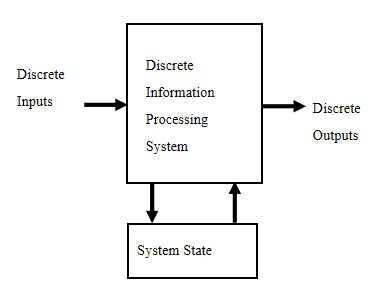
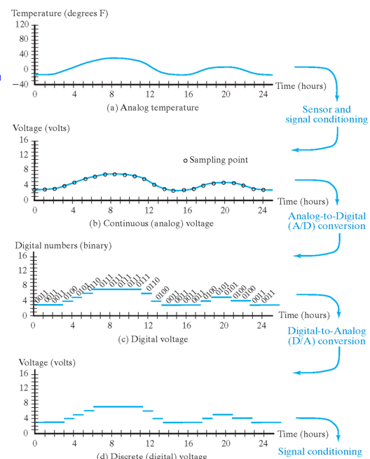
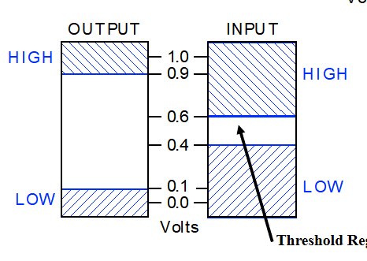
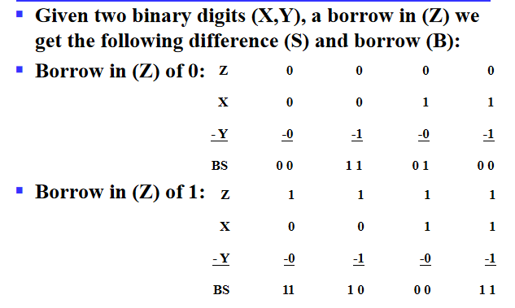
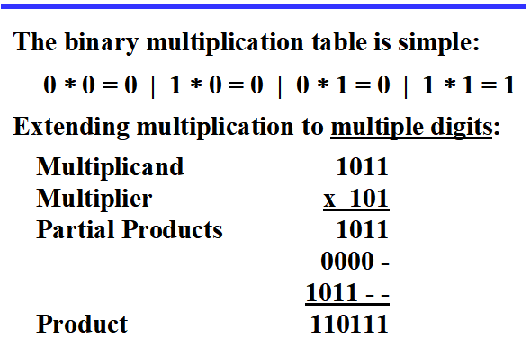
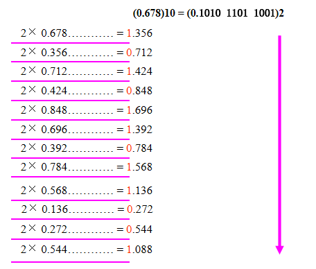
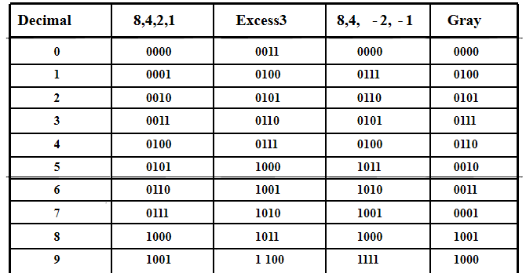
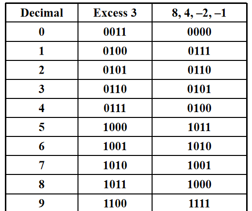
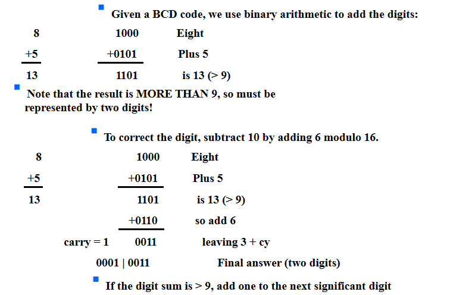
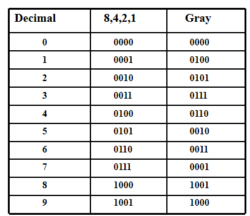

# Digital Systems and Information

## Digital System
- Takes a set of discrete information **inputs** and discrete internal information (**system state**) and generates a set of discrete information **outputs**.

### Tyoes of Digital Systems
- No state present:
    - Combinational Logic System
    - Output = Fuction(Input)
- State present:
    - State updated at discrete times: Sychronous Sequential System（系统里有统一的时钟, 每一秒钟决定要不要更新, 这个更新只会在每秒钟的边界产生）
    - State updated at any time: Asynchronous Sequential System
    - State = Function(State,Input)
    - Output = Function(State) or Function(State,Input)

!!! example

    汽车上的里程表，输入count up和reset信号，如果count up就把里程加一，输出是可视化的里程。状态就是里程表里的值
    该数字系统是asynchronous的，因为更新信号的时间不依赖统一时钟，在任何时候都可以发生

### Embedded Systems

- Computers as integral parts of other products
- Examples of embedded computers：
    - Microcomputers
    - Microcontrollers
    - Digital signal processors
- Block Diagram of Embedded Systems

!!! note

    这里需要将物理的信息（模拟信号）转化为处理器可以处理的数字信号。A-to-D:把模拟信号转化为数字信号，D-to-A：处理后把数字信号转化为模拟信号，这两个block是嵌入式系统与普通计算机的主要区别

Example: Temperature Measurement and Display

对于空调来说，input 是一个电压值（由温度传感器将信号转化为电压），以下是空调理解电压变化的过程：

> 其中周期性采样运用到了香农采样定理：为了不失真地恢复模拟信号，采样频率应大于等于模拟信号频谱中最高频率的2倍。

### Signal Examples Over Time

## Information Representation

- Information variables represented by physical quantities.
- For digital systems, the variables take on discreye values.
- Binary values are represented abstractly by:
    - digits 0 and 1
    - words F and T
    - words Low(L) and High(H)
    - words On and Off
- Binary values are represented by values or ranges of values of physical quantities.

**Why binary is most prevalent in digital systems?**

## Number Systems - Representation
- A number with radix $r$ is represented by a string of digits: $A_{n-1}A_{n-2}……A_1A_0.A_{-1}……A_{-m+1}A_{-m}$ in which $0\leq A_i<r$ and . is the *radix point*

$$
(Number)_r = (\sum_{i=0}^{i=n-1}A_ir^i)+(\sum_{j=-m}^{j=-1}A_jr^j)
$$

- The string of digits represents the power series:

### Special Powers of 2
- $2^{10}$ is Kilo, denoted "K"
- $2^{20}$ is Mega, denoted "M"
- $2^{30}$ is Giga, denoted "G"
- $2^{40}$ is Tera, denoted "T"

### Binary Arithmetic
- Single Bit Binary Subtraction with Borrow

- Binart Multiplication

### Conversion Between Bases
- Convert the Integer Part
- Convert the Fraction Part
Repeatedly multiply the fraction by the new radix and save the integer digits that result.  The digits for the new radix are the integer digits in order of their computation. If the new radix is > 10, then convert all integers > 10 to digits A, B, … 

这里注意补零时零的位置，整数部分从小数点开始往左，小数部分从小数点开始往右：$(11 \:111\:101.010\:011\:11)_2$ = $(011\:111\:101.010\:011\:110)_2$

- Join the two results with a radix point

### Binary Coding
- Numeric
    - Must represent range of data needed
    - Very desirable to represent data such that simple,straightforward computation for common arithmetic operations permitted
    - Tight relation to binary numbers

- Non-numeric
    - Greater flexibility since arithmetic operations not applied(灵活性是指保证编码映射关系唯一的情况下的编码都可以称作合法编码)
    - Not tied to binary numbers

- Number of bits requierd: Given M elements to be represented by a binary code, the minimum number of bits $n$ needed satisfies the following relationships: $2^n\ge M\ge 2^{n-1}$  $n=\lceil log_2M\rceil$

!!! example

    You can represent 4 elements in radix r=2 with n=2 digits:(00,01,10,11)

    Also, you can use n=4 digits: (0001,0010,0100,1000) ("one hot" code，要求比特向量中只有一位是1，使用该编码的好处是决定或改变状态机目前的状态成本相对较低，容易设计也容易检测非法行为，缺点是信息表示率较低)

Decimal Codes-binary codes for decimal digits
以下是常见的对十进制十个数字进行的编码：

#### Excess 3 Code and 8,4,-2,-1 Code

其中Excess 3即二进制表示上加3
Excess 3 和 8,4,-2,-1编码共同的特点就是编码成对出现，$i$和$9-i$互为反码，这么做的好处就是在通信中，数字1-9出现的概率是随机的，所以可以认为等可能的出现，这样对应的二进制编码中0和1的频率也是接近的

#### Binary Coded Decimal(BCD)
- The BCD code is the 8,4,2,1 code
- BCD is the weighted code, 8,4,2,1 are weights
- only encodes 0-9
- $1001(9)=1000(8)+0001(1)$
  
!!! warning

    这里需要注意conversion 和 coding的区别：
    13=1101(This is conversion)
    13: 0001|0011(This is coding)

!!! note "Why do we need BCD"

    电子表中有时针秒, 如果用十六进制保存时针秒, 那么 加到9以上得到 ABCD..., 当我们想要显示这些值时, 我们要先做进制转换, 再显示(如 A 转为 10) 这其中要做除法，效率低。但是用两位BCD码表示, 就可以直接显示结果。

- BCD Arithmetic
如果大于9，则加上6（0110）

### ASCII Character Codes
- American Standord Code for Information Interchange
- It uses 7-bits to represent:
     - 94 Graphic printing characters
     - 34 Non-printing characers
- `0`: $30_{16}$
- `A`: $41_{16}$
- `a`: $61_{16}$
- `Delete`: all bits set

### Parity bit error-detection codes
- **Rebundancy** (extra information), in the form of extra bits, can be incorporated into binary code words to detect and correct errors.
- **Parity**: an extra bit appended onto the code word to make the number of 1's odd or even. It can detect all single-bit errors
    - A code word has even parity if the number of 1's in the code word is even
    - A code word has odd parity if the number of 1's in the code word is odd

!!! question

    不太理解具体机制

### Gray Code-Decimal

可以看到gray code的性质就是相邻的两位只相差一个bit，其作用可以在optical shaft encoder中展现出来

光学编码器包含透明区域和不透明区域，两个相邻区域颜色转变代表其对应的binary code变化，当三个区域的传感器不在同一条直线上时（即存在安装误差），普通的二进制编码会出现中间情况，而gray码由于相邻只差一个bit，则不会产生这种情况。
例如对于二进制编码 011 和 100 来说，还有可能出现 000, 001, 010, 110, 101, 111; 但对于格雷编码，任何时候他都能产生正确的编号。

### Unicode
- Unicode extends ASCII to 65536 universal characters codes
- is able to encode characters in world languages(Ascii only can deal with English)
- 2 byte(16-bit) code words