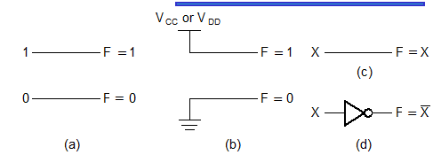
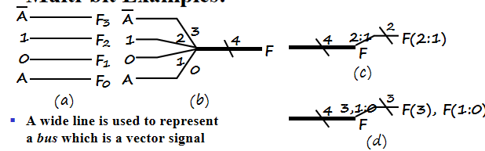
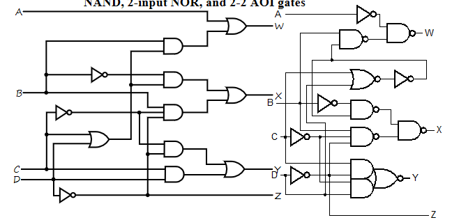

# Lec 3 : Combinational Logic Design

## Implementation Technology and Logic Design

### Combinational Circuits

A combinational logic circuit has:

- A set of $m$ Boolean inputs
- A set of $n$ Boolean outputs
- $n$ switching functions, each mapping the $2^m$ input combinations to an output such that the current output depends only on the current input values

### Hierarchical Design

To control the complexity of the function mapping inputs to outputs:

- Decompose the function into smaller pieces called blocks
- Decompose each block`s function into smaller blocks, repeating as necessary until all blocks are small enough
- Any block not decomposed is called a *primitive block*
- The collection of all blocks including the decomposed ones is a *hierarchy*

**Reusable Functions**

就类似C or python语言中的库，提前设计好，需要的时候直接拿来用

Whenever possible, we try to decompose a complex design into common, *reusable* function blocks, which are verified and well-documented, and placed in libraries for future use.

**Top-Down versus Bottom-Up**

- A top-down design proceed from an abstract, high-level specification to a more and more detailed design by decomposition and successive refinement
- A bottom-up design starts with detailed primitive blocks and combines them into larger and more complex functional blocks
- Design usually proceeds top-down to known building blocks ranging from complete CPUs to primitive logic gates or electronic components.

### Design Procedure

1. Specification: write a specification for the circuit if one is not already available
2. Formulation: Derive a truth table or initial Boolean equations that define the required relationships between the inputs and outputs, if not in the specification and apply hierarchical design if appropriate
3. Optimization: Apply 2-level and multiple-level optimization, and draw a logic diagram or provide a netlist for the resulting circuit using ANDs, ORs, and inverters
4. Technology Mapping: Map the logic diagram or netlist to the implementation technology selected（即将与或门映射为实际电路中的与非，或非门）
5. Verification：Verify the correctness of the final design manually or using simulation 。

## Combinational Logic

### Functions and Functional Blocks

Corresponding to each of the functions is a combinational circuit implementation called a functional block.

### Rudimentary Logic Functions

- Functions of a single variable $X$

#### Multiple-bit Rudimentary Functions

- A wide line is used to represent a **bus** which is a vector signal, as $F=(F_3,F_2,F_1,F_0)$ shown in (b)
- The bus can be split into *individual bits* as shown in (b)
- Sets of bits can be split from the bus as shown in (c) for bits 2 and 1 of $F$
- The sets of bits need not be continuous as shown in (d)

#### Enabling Function

- Enabling permits an input signal to pass through to an output
- Disabling blocks an input signal from passing through to an output, replacing it with a fixed value
- The value on the output when it is disable can be Hi-Z (as for three-state buffers and transmission gates), 0 , or 1

### Decoding

- Decoding: the conversion of an $n$-bit input code to an $m$-bit output code with $n\le m\le 2^n$ such that each valid code word produces a **unique** output code
- Circuits that perform decoding are called decoders
- So the functional blocks for decoding are called $n-to-m$ line decoders, where $m\le 2^n$, and generate $2^n$(or fewer) minterms for the $n$ input variables

??? Example "BCD to Excess-3 code converter"

    1. Specification:
    - Transforms BCD code  for the decimal digits to Excess-3 code for the decimal digits.
  
    - BCD code words for digits 0 through 9: 4-bit patterns 0000 to 1001, respectively

    - Don't Cares BCD 1010 to 1111
  
    - Excess-3 code words for digits 0 through 9: 4-bit patterns consisting of 3 (binary 0011) added to each BCD code word
  
    - Implementation: 
  
        - multiple-level circuit

        - NAND gates(including inverters)

    2. Formulation

    - Conversion of 4-bit codes can be most easily formulated by a truth table

    

    3.Optimization

    W,X,Y,Z四个输出需要四个逻辑函数进行化简，所以有四个卡诺图，对应的输入为ABCD
    
    
    
    为什么要算上$\overline{T_1}$的成本呢？我们说$G$不计算非门成本是因为ABCD是外部输入的，它们的非有可能是前级电路提供的，但是$T_1$是我们内部产生的非门，必须要计算在$G$中

    4.Technology Mapping
    - Mapping with a library containing inverters and 2-input NAND, 2-input NOR, and 2-2 AOI gates

    
    
    即全部用与非，或非门来实现

    5.Verification

