# Lec 3 : Combinational Logic Design

## Implementation Technology and Logic Design

### Combinational Circuits

A combinational logic circuit has:

- A set of $m$ Boolean inputs
- A set of $n$ Boolean outputs
- $n$ switching functions, each mapping the $2^m$ input combinations to an output such that the current output depends only on the current input values

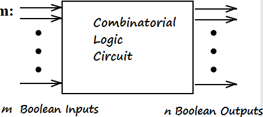

### Hierarchical Design

To control the complexity of the function mapping inputs to outputs:

- Decompose the function into smaller pieces called blocks
- Decompose each block`s function into smaller blocks, repeating as necessary until all blocks are small enough
- Any block not decomposed is called a *primitive block*
- The collection of all blocks including the decomposed ones is a *hierarchy*

**Reusable Functions**

就类似C or python语言中的库，提前设计好，需要的时候直接拿来用

Whenever possible, we try to decompose a complex design into common, *reusable* function blocks, which are verified and well-documented, and placed in libraries for future use.

**Top-Down versus Bottom-Up**

- A top-down design proceed from an abstract, high-level specification to a more and more detailed design by decomposition and successive refinement
- A bottom-up design starts with detailed primitive blocks and combines them into larger and more complex functional blocks
- Design usually proceeds top-down to known building blocks ranging from complete CPUs to primitive logic gates or electronic components.

### Design Procedure

1. Specification: write a specification for the circuit if one is not already available
2. Formulation: Derive a truth table or initial Boolean equations that define the required relationships between the inputs and outputs, if not in the specification and apply hierarchical design if appropriate
3. Optimization: Apply 2-level and multiple-level optimization, and draw a logic diagram or provide a netlist for the resulting circuit using ANDs, ORs, and inverters
4. Technology Mapping: Map the logic diagram or netlist to the implementation technology selected（即将与或门映射为实际电路中的与非，或非门）
5. Verification：Verify the correctness of the final design manually or using simulation 。

??? Example "BCD to Excess-3 code converter"

    1. Specification:
    - Transforms BCD code  for the decimal digits to Excess-3 code for the decimal digits.
      
    - BCD code words for digits 0 through 9: 4-bit patterns 0000 to 1001, respectively
    
    - Don't Cares BCD 1010 to 1111
      
    - Excess-3 code words for digits 0 through 9: 4-bit patterns consisting of 3 (binary 0011) added to each BCD code word
      
    - Implementation: 
      
        - multiple-level circuit
    
        - NAND gates(including inverters)
    
    2. Formulation
    
    - Conversion of 4-bit codes can be most easily formulated by a truth table
    
    
    
    3.Optimization
    
    W,X,Y,Z四个输出需要四个逻辑函数进行化简，所以有四个卡诺图，对应的输入为ABCD
    
    
    
    为什么要算上$\overline{T_1}$的成本呢？我们说$G$不计算非门成本是因为ABCD是外部输入的，它们的非有可能是前级电路提供的，但是$T_1$是我们内部产生的非门，必须要计算在$G$中
    
    4.Technology Mapping
    - Mapping with a library containing inverters and 2-input NAND, 2-input NOR, and 2-2 AOI gates
    
    
    
    即全部用与非，或非门来实现
    
    5.Verification

### Chip Design Styles
- Full custom: the entire design of the chip down to the smallest detail of the layout is performed
- Standord cell: blocks have been design ahead of time or as part of previous designs(标准库)，有时会产生冗余代码
- Gate array: 预先设计好可编程单元，即买了现成芯片，在里面写代码即可执行，成本最低。

**Cell Libraries**
- a pre-designed primitive block
- cell library: a collection of cells available for design using a particular implementation technology
- cell characterization: a detailed specification of a cell for use by a designer-often based on actual cell design and fabrication and measured values (schematic, area of cell, input loding,delays,technology mapping,hardware description language models……)

!!! Example

    

### Mapping to NAND/NOR gates
只用NAND和NOR做technology mapping

1.Replace ANDs and ORs:
$AB=\overline{\overline{AB}}$

即与门等于与非+非,或门同理

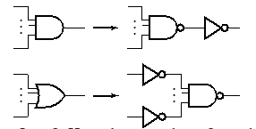

2.Pushing inverters through circuit fan-out points:

### Verification
**Basic Verfication Methods**:
- Manual Logic Analysis
- Simulation

  

## Combinational Logic

### Functions and Functional Blocks

Corresponding to each of the functions is a combinational circuit implementation called a functional block.

### Rudimentary Logic Functions

- Functions of a single variable $X$

#### Multiple-bit Rudimentary Functions

- A wide line is used to represent a **bus** which is a vector signal, as $F=(F_3,F_2,F_1,F_0)$ shown in (b)
- The bus can be split into *individual bits* as shown in (b)
- Sets of bits can be split from the bus as shown in (c) for bits 2 and 1 of $F$
- The sets of bits need not be continuous as shown in (d)

#### Enabling Function

- Enabling permits an input signal to pass through to an output
- Disabling blocks an input signal from passing through to an output, replacing it with a fixed value
- The value on the output when it is disable can be Hi-Z (as for three-state buffers and transmission gates), 0 , or 1

### Decoding

(两种不同编码之间的转化，输入少，输出多)

- Decoding: the conversion of an $n$-bit input code to an $m$-bit output code with $n\le m\le 2^n$ such that each valid code word produces a **unique** output code
- Circuits that perform decoding are called decoders
- So the functional blocks for decoding are called $n-to-m$ line decoders, where $m\le 2^n$, and generate $2^n$(or fewer) minterms for the $n$ input variables

!!! Example

    
    
    每一位输出引脚对应一个最小项输出
    
    假设我们使用最直接的方法，$n-2^n$译码器，每个输出都连一个$n$输入与门,总共成本为$n2^n$。成本太高了，因此我们要考虑如何降低成本

#### Decoder Expansion
行列译码器: 将n输入拆成两半，一组$\frac{n}{2}$作为行，另一组作为列，行与列的交点再用一个1-2译码器

??? Example "3-to-8 line decoder"
    
    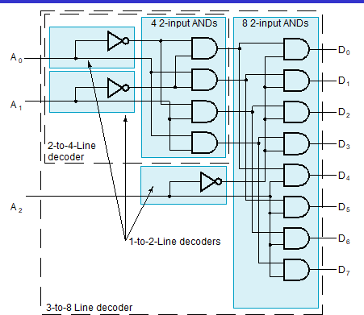
    
    分为一个2-4译码器与一个1-2译码器，最后用8个2输入与门，两两一与即得到结果。
    
    成本: $2^n$个两输入与门,而中间的成本相比与门要小得多.
    
    但是性能有所降低.

#### Decoder with Enable

增加一个与门

换个角度理解,可以将译码器作为使能信号(不同输入组合只有一根线为1，最终结果则取决于EN信号，而其它门被禁止)，看作是一个分配的电路(demultiplexer)

#### Combinational Logic Implementation-Decoder and OR Gates
之前提到任何一个逻辑函数可以表示为最小项的和，那么我们就可以使用译码器来实现任何一个逻辑函数

Implement $m$ functions of $n$ variables with:
- Sum-of-minterms expressions
- One $n-to-2^n-line$ decoder
- $m$ OR gates, one for each output

!!! Example

    

??? Example "BCD-to-Segment Decoder"
    

    注意七段数码管字母的排列顺序
    
    标准的七段数码管如下图所示，其中h控制小数点，另外两个Com.决定该数码管是共阴控制还是共阳控制，共阳控制时输入为0才能亮
    
    

### Encoding
- the conversion of an m-bit input code to a n-bit output code with $n\le m\le 2^n$ such that each valid code produces a unique output code
- An encoder has $2^n$(or fewer) input lines and $n$ output lines which generate the binary code corresponding to the input values

??? Example "decimal-to-BCD encoder"

    - Inputs:  10 bits corresponding to decimal digits 0 through 9, $(D_0,\cdots,D_9)$
    
    - Outputs: 4 bits with BCD codes
    
    - Function: If input bit $D_i$ is a 1, the the ouput $(A_3,A_2,A_1,A_0)$ is the BCD code for $i$
    
    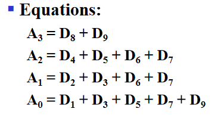
    
    但是当输入信号有多个1时，可能会产生无效编码

#### Priority Encoder
Among the 1s that appear, it selects the most significant input position (or the least significant input position) containing a 1 and responds with  the corresponding binary code for that position.

!!! Example

    

### Selecting
- A set of information inputs from which the selection is made
- A single output
- A set of control lines for making the selection

Logic circuits that perform selcting are called **multiplexers**

- A multiplexer selects information from an input line and directs the information to an output line
- A typical multiplexer has $n$ control inputs $(S_{n-1},\cdots,S_0)$ called *selection inputs*, $2^n$ information inputs $(I_{2^n-1},\cdots,I_0)$ and one output Y
- could be designed to have $m\le 2^n$ information inputs as well

!!! Example "2-to-1-Line Multiplexer"

    
    
    整体结构即为一个1-2译码器加上一个与或结构

In general, for an $2^n$-to-1-line multiplexer:
- $n-to-2^n$-line decoder
- $2^n\times 2$ AND-OR

!!! Example "4-to-1-line Multiplexer"

    

In practice, we select "vectors of bits" instead of "bits"

!!! Example

    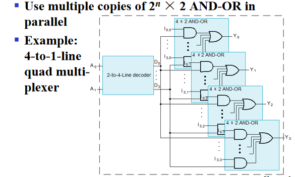
    
    每一位要选择的信号都是vector,包含四个信号,译码器可以共用

#### Other Selection Implementation

使用三态门

!!! Example

    
    
    由于译码器只有一个输出是1，所以任何时候都只有一个三态门能被使能
    
    成本降低(省掉了或门)

!!! Example "分层选择"

    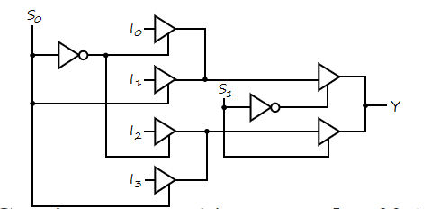
    
    $S_0$进行第一层选择，$S_1$进行第二层

#### Combinational Logic Implementation

1.Implement $m$ functions of $n$ variables

对于一个$n$变量的逻辑函数，我们可以得到它的真值表,利用选择器对每个$n$输入选择对应的真值表的某一行,输出结果.

!!! Example "Gray to Binary Code"

    - connecting A, B, and C to the multiplexer select inputs
    
    - placing y and z on the two multiplexer outputs
    
    - connecting their respective truth table values to the inputs
    
    

2.Implement any $m$ functions of $n+1$ variables

For each pair and output, define a rudimentary function of the final variable $(0,1,X,\overline{X})$

比如说$F(A,B,C)$,当$A,B$确定时，最后输出只可能为 $1,0,C,\overline{C}$

!!! Example 

    
    
    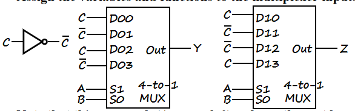
    
    即我们使用小一半的选择器来实现.

## Arithmetic Functions

### Iterative combinational circuits
直接使用真值表以及卡诺图化简的方式进行实际电路设计是不可行的
所以我们需要iterative combinational circuits(迭代阵列)
将计算机里的多位逻辑操作分解成一个个单位操作的组合。

### Binary adders

!!! Example "Half adder"

    
    
    Logic Simplification:
    
    $S=X\oplus Y,C=XY$
    
    
    
    异或可以分解成四个与非，要敏感

### Full Adder
与半加器不同的是，全加器包含了一个进位(carry-in bit from lower stages)

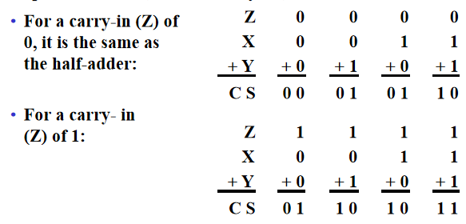

$S=X\oplus Y\oplus Z$(这是我们在上一章介绍的奇函数)

The Carry bit C is 1 if both X and Y are 1 (the sum is 2), or if the sum is 1 and a carry-in (Z) occurs.   Thus C can be re-written as:

$C=XY+(X\oplus Y)Z$

- The term $X\cdot Y$ is *carry generate*(进位产生信号)
- The term $X\oplus Y$ is *carry propagate*(进位传播信号)

#### Implementation

### Binary Adders

根据算术的基本原则，最基本的想法就是将全加器串起来

但是这个电路的缺点就是随着加法器位数的增加，进位传递过程太长，传输延迟越来越高，这不是我们想要的。

#### Carry Lookahead

电路慢的原因就在于进位传递的过程, 因此思考能不能使当前的进位$C_n$不依赖于$C_{n-1}$,而是直接依赖于$A_i,B_i,C_0$. ($A_i,B_i$总是存在的)。

In the ripple carry adder:
- $G_i,P_i,S_i$ are local to each cell of the adder
- $C_i$ is also local each cell

Defining the equations for the FULL Adder in term of the $P_i,G_i$: 

$P_i=A\oplus B_i,\,G_i=A_iB_i,\,S_i=P_i\oplus C_i,\,C_{i+1}=G_i+P_iC_i$

于是可以得到Carry Lookahead Adder的原理图
可分为两部分,上面那部分称作部分全加器,作用是产生$G_i,P_i,S_i$，下面的一块是进位计算部分，简称CLA块。每个$C_i$只依赖一个与或块。

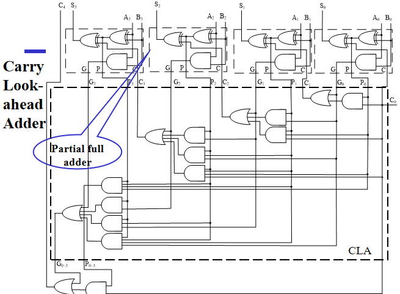

但另外一个问题就是电路的复杂度高了很多,大幅度增加电路成本$N^2$。
但是很好的解决了进位传递过多而造成延迟过大的问题。

如果要按这个思路简单复制来扩展成更高位的加法器,一方面大幅度增加成本，另一方面$G_0,P_0$要驱动$N$级门,门的扇出数量增加，并不能很好的降低传输延迟。

但是可以以4位加法器为基础，将它们拼起来(例如16位加法器就可以由4个4位加法器拼接组成)

**Group Carry Lookahead Logic**

对比四位加法器和16位加法器，二者的计算逻辑相同的

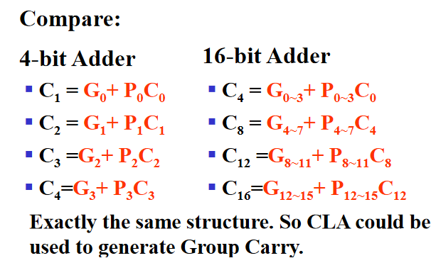

!!! Group Carry Lookahead

    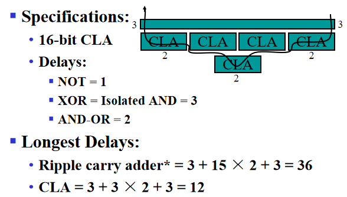
    
    最上面那个长条是部分全加器,第二行的四个CLA从右到左分别构成0-3,4-7,8-11,12-15的全加器,最下面一个CLA块产生$C_4,C_8,C_{12},C_{16}$，即每四位之间，每四位一组之间。

!!! Question
    longest delay?

### Unsigned Subtraction

但是这样子设计出来的电路很复杂，我们在想能不能利用加法器来搞定减法器。

#### Complements

- Diminished Radix Complement of $N$: Defined as $(r^n-1)-N$. 在二进制里,$r^n-1$是全为1的二进制数,用它减N即可得到N按位取反的结果
- Radix Complement: $r^n-N$. 
- 补码等于反码加1,或者从右往左第一个1之前不变，之后其它位全部求反

有了补码的概念后，我们就可以用加法器来实现减法器:
要计算$M-N$,我们可以计算$M$加上$N$的二进制补码:
$$
M+2^n-N=M-N-2^n
$$

- 如果$M\ge N$, 那么M-N是一个正数,加上$2^n$后会产生一个进位,在有效位中保留的是正确的结果
- 如果$M<N$,,那么原式等于$2^n-(N-M)$
- 判断结果是否为负，只需判断高位的进位:若进位为1，则为正，进位为0，结果为负。

!!! Example

    
    
    

### Signed Integers

$$
sa_{n-2}\cdots a_1a_0
$$
where s=0 for positive numbers,s=1 for negative numbers

#### Representations

- Signed-Magnitude(有符号真值)
- Signed-Complement
    - Signed 1's Complement(有符号反码)
    - Signed 2's Complement(有符号补码)

!!! Example

    
    
    可以看到三种表示方法中+0和-0的区别

#### Signed-Magnitude Arithmetic
我们用0代表加法，1代表减法，检验三个符号位的奇偶性，并且要注意判断是否溢出

- If the parity of the three signs is 0:
    - Add the magnitudes
    - Check for overflow
    - The sign of the result is the same as the sign of the first operand

- If the parity of the three signs is 1:
    - Subtract the second magnitude from the first
    - If a borrow occurs:
        - take the two's compement of result
        - make the result sign the complement of the sign of the first operand
    - Overflow never occurs

#### Signed-Complement Arithmetic

**Addition**:
- Add the numbers including the sign bits, **discarding** a carry out of the sign bits
- If the sign bits were the same for both numbers and the sign of the result is different, an overflow has occurred.
- The sign of the result is computed in step 1

**Substraction**
Form the complement of the number you are subtracting and follow the rules for addition.

!!! Example

    1101+0011=0000
    1101-0011=1010

### 2's Compement Adder/Subtractor

S=0代表减法，S=0代表加法，这个电路的输入为A,B,S。我们要计算A+B和A-B，于是希望利用S来控制B，决定是否要取反

可以利用异或门,**当S=0时异或门保持另一个信号,当S=1时异或门对另一个信号取反r**,而对于取反后加1，我们可以把这个加到$C_0$里, 即$A-B=A+\overline{B}+1$

**Overflow Detection**

Overflow can occur for:

- Addition of two operands with the same sign
- Subtraction of operands with different signs

Simplest way to implement overflow: $V=C_n\oplus C_{n+1}$