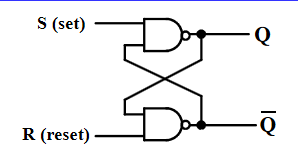
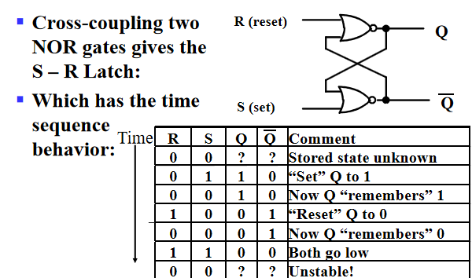
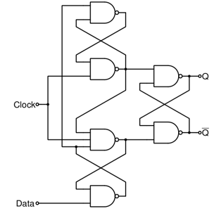

# Sequential Circuits

## Storage Elements and Sequential Circuit Analysis

### Introduction

- 一个时序电路包含存储元件和组合逻辑电路。

- 存储元件的状态由次态方程决定: $Next\,State=f(Inputs,State)$
- Output function(Mealy): Outputs=g(Inputs,State)(由输入和当前状态共同决定)
- Output function(Moore): Outputs=h(State)(仅由当前状态决定)

### Types of sequential circuits

Depends on the times at which:

- storage elements observe their inputs,and
- storage elements change their state

**Synchronous**: 要求比较严格：电路中所有元件必须同时更新，且更新的时间周期一致。

**Asynchronous**: 状态的更新任意时刻都可发生。如果时钟被看作一个输入，那么所有电路都是异步的。但是异步的时序电路使设计变得复杂。

### Storage elements

??? Example "Storing State"
    回顾我们之前学的门传输延迟电路，现在我们把输出端Y与A连接，就将组合逻辑电路变成了时序电路。

    

    

#### Latches(锁存器)

**$\overline{S}-\overline{R}$ Latch**

可得到如下的时序状态：

注意当$R=0,S=0$时，$Q,\overline{Q}$都为1，如果我们将$R,S$改为1，$Q$和$overline{Q}$谁为1取决于门的传输延迟。因此$R=0,S=0$ is forbidden as input pattern.

**S-R Latch**

**Clocked S-R Latch**

在之前的基础上我们增加一个时钟信号(clock or control)

- Has a time sequence behavior similar to the basic S-R latch except that the S and R inputs are only observed when the line C is high.

与之前SR锁存器相同，C=1,S=1,R=1是非法的。

**D-Latch**

我们想避免非法输入，避免未定义情况，因此引入D锁存器。

!!! note
    在chapter3计算门输入成本时，我们一般计算G而不计算GN，是因为电路中的锁存器同时提供了$Q$ 和$\overline{Q}$。

#### Flip-flops

!!! Example

    

在锁存器中，有可能出现空翻现象，即不能做到在时钟信号一个周期内，状态只更新一次。

A solution to the latch timing problem is to break the closed path from Y to Y within the storage element. 即切断锁存器输入和输出的直接联系，采用触发器的设计。

主要有两种触发器：
  
- 在时钟信号高电平时修改第一个锁存器的值，保存第二个锁存器的值；在低电平时保存第一个，修改第二个，此时更新触发器的状态，称为主从触发器。
- 仅在时钟电平变换的边沿触发，即在特定时刻仅接受一个输入，分为上升沿触发和下降沿触发，统称为边沿触发器。

**S-R Master-Slave Flip-Flop**

!!! note "一次性采样问题"

    假如在$C=1，S=0，R=0$时，S或者R发生微小的扰动(突然变成1后又回到0)，主锁存器由原先的保持状态变为修改状态,但是当S变回0时，主锁存器又回到保持状态，保持的值仍然为S=1而不会变回原来的0，该值就会被传到从锁存器中。

    为解决一次性采样问题，我们采用边沿触发器。

**Edge-Triggered D Flip-Flop**

我们用上图来理解边沿触发器的行为。在上升沿前一刻，主锁存器可写，从锁存器只读；而在上升沿后一刻，主锁存器只读，从锁存器写入主锁存器存储的值，即上升沿前一刻写入主锁存器的内容。

在实际电路中，我们通常采用如下的电路图，它减少了门输入成本。

#### Standard Symbols for Storage Elements

注意符号图上的小圆圈，代表非。用来判断是何种锁存器/触发器

#### Direct Input

我们通常会对时序电路进行初始化，即在它开始运行之前赋予电路一个确定的状态，称为直接输入。这些输入通常是异步的。

以上图为例，S和R就作为直接输入，当$\overline{S}$端为0时我们将锁存器置为1，当$\overline{R}$端为0时我们复位为0

### Sequential Circuit Analysis

相比组合电路，时序电路具有**状态**，因此除了输出与输入的关系之外，我们还要关注**次态方程**，即当前的状态和输入如何影响下一个状态。

!!! Example

    

    对于如上的电路,输入是$x(t)$,输出是$y(t)$,状态是$(A(t),B(t))$,我们需要关注的是输出方程与次态方程。

    由于我们采用D锁存器，因此状态就是锁存器D的输入。可以得到如下布尔方程：

    

#### State Table

我们可以使用状态表来描述时序电路的逻辑。分为四列：当前状态，输入，次态，输出。为了得到状态表，需要先写出输出方程和次态方程。

!!! Example

    

    如上图所示的状态表的行数由状态数+输入个数决定，我们可以进行降维，将输入和次态写在一起。

    

#### State Diagrams

时序逻辑电路也可以用状态图表示，它比状态表更好地描述了状态之间的转移关系。

!!! note "Mealy type circuit and Moore type circuit"

    Mealy型电路输出既依赖于当前状态，也依赖于输入。Moore型只取决于当前状态。

    对于状态图中标识输出的位置，由于Moore型电路只取决于当前状态，因此我们习惯标在状态的圆圈里，而Mealy型电路标在状态转移的弧上。

!!! Example

    

    由于输出标在弧上，因此该电路是Mealy型电路。

    

    Moore型电路

    在实际电路设计中，可能会存在一些输出是Moore型，一些输出是Mealy型的情况。

#### Equivalent State Definitions

当两个状态的输入相同时，如果它们的输出和次态都相同，则称这两个状态为等价状态。如果电路中有等价状态，那么我们可以将它们合并，以减少触发器的个数。

!!! Example

    

    可以发现S2和S3是等价状态，将它们合并。

    

    咦合并之后又发现等价状态S2和S1。通过两次等价状态的合并，我们在输入成本上减少了两个触发器。

!!! Example

    

    其中Clock连的是系统时钟，Reset是作为直接输入，将电路赋初值。但是不用将Clock和Reset在方程中描述。

    对于如上的时序电路，我们可以通过一系列操作得到如下的状态图。

    

    可以发现在有效的循环中，该电路的功能是一个模五计数器，而对于无效的状态111，101，110，可以发现它们的次态都回到了有效循环中。这可以有效防止微小扰动对电路的影响，处理无效状态。

    
#### Flip-Flop Timing Parameters

我们想要计算时序电路的最大工作频率，也就是要计算两个上升沿之间的最小间隔。为此需要考虑时序电路的传输延迟。

**触发器延时**

触发器的延时不仅仅是传输延迟，还有为了保证产生稳定输出信号所必要的时间。

- Setup Time: 采样边缘前输入信号需要保持稳定的时间，即输入信号需要在setup time之前改变好，否则这次改变不会被接收。
- Hold Time: 采样边缘后输入信号需要保持稳定的时间。
- $t_{pd,ff}$：触发器采样边缘到产生稳定输出的时间。

**组合电路延时**
即为传输延迟。

观察上图可发现S-R主从触发器的setup time占据一半的时钟周期，原因就是之前介绍的一次性采样，输入信号在C=1时不允许发生改变。

**电路松弛时间**
extra time in the clock period in addition to the sum of the delays and setup time on a path.
松弛时间必定非负。

因此我们可以得到两个上升沿的最小时间：

可以看到，由于主从触发器的$t_s$占了半个时钟信号，大约50%占空比，因此留给触发器和组合电路的传输时间就很少，在触发器和组合电路相同的情况下具有更长的周期，工作频率更小。这也是我们更常用边沿触发器的原因。

## Sequential Circuit Design

现在我们需要知道怎么样来设计时序的电路。

在分析时序电路的行为时，我们依次得到状态方程，状态表，状态图。而设计时我们则反过来，先用状态图表达应用需求，再得到状态表等。大致遵循如下流程：

### Specification

说明电路要做什么。包括文字描述，数学公式，硬件描述等

### Formulation

#### 状态的抽象
 把电路的行为抽象为几个状态，以及状态之间的转移。

!!! Example "Sequence Recognizer Procedure"

    序列识别器：识别出给定的二进制序列。

    初态：什么都没识别到。每识别到一个位更新一个状态，全部识别完毕后得到最终状态。

    假设我们现在的电路需要识别1101二进制序列。如果识别到1101，则电路输出1。特别的，对于1101101，头和尾都是有效序列(**1101**101,110**1101**),两种情况都要考虑到。

    对于Mealy型电路，我们得到的状态图和状态表如下：

    

    - A表明没有任何有效序列
    - B表示收到1
    - C：两个1
    - D：110，当D再收到一个1时，输出1，同时由于最后一位1可以当作下一个1101序列的第一个1，因此回到B状态。
    
    对于Moore型电路，我们需要再增加一个状态E代表成功识别，即输出1.

    

#### 状态表的简化

一般情况下，原始状态图和原始状态表中存在着多余的状态，状态个数越多，电路中所需的触发器数目越多，成本也越高。因此我们需要除去多余状态，这就涉及到状态表的简化：不仅能正确反映设计的全部要求，而且状态的数目最少。

**状态等效**：上文已涉及。

**状态等效的判别**：

- 在所有输入情况下输出相同
- 同时，要么次态相同，要么次态交错，要么次态循环

!!! Example "次态交错，次态循环的解释"

    

    对于上图的状态$S_i,S_j$,当输入为0时，输出和次态相同；当输入为1时，输出相同，$S_i,S_j$互为对方的次态，这种情况称作次态交错，$S_i,S_j$为等效状态。

    

    对于上图的状态$S_i,S_j$,当输入为1时，次态交错，当输入为1时，次态分别为$S_k,S_l$.假如$S_k,S_l$为等效状态，则$S_i,S_j$也等效。即$S_i,S_j$等效与否依赖于$S_k,S_l$是否等效。

    

    对于上图的状态，$S_i,S_j$与$S_k,S_l$相互依赖，则称为次态循环，这种情况我们认为这四个状态都等效。

**化简状态表**
现在我们知道了等效状态的定义，下一步就需要化简状态表。分为两种方法：观察法和隐含表法。观察法就是直接看状态表找等效状态，这里不展开。

!!! Example "隐含表法化简状态表"

    

    对于上面的状态图，具有较多状态，使用观察法不现实，我们可以通过隐含表法化简。隐含表就是个下三角阵，行数为状态数减一，列数为状态个数。行列交叉的格子里填的是两个状态等效与否，以及等效需要的条件。如下图所示：

    

    如果状态对等效，则在格子里打勾，不等效则打叉（根据输出是否相同可以直接判断）。如果等效与否需要进一步检查，则标记次态对。对于标记的次态对，进行关联比较，确定最终等效状态对。

    最后确定最大等效类，画出最小化状态表。

    如上的状态表中有四个等效对AB,AE,BE,CF,因此最大等效类为ABE，总共电路中有四个状态ABE,CF,D,G,令上述四个状态为abcd，可得到最小化状态表：

    

#### State Assignment

在得到最小化状态表后，由于我们的目的是设计电路，而状态表中的状态只是抽象的字母，因此我们现在需要做的是为每个状态分配二进制位，以进行电路的设计。

但是$n$种状态，总共有$n!$种分配二进制位的方法，我们应该如何选择呢？对于不同的分配，设计出来的电路成本及复杂程度也会很不一样，如下是一个例子。

!!! Example

    

    对于上面的状态表，我们考虑两种分配方案：按计数顺序以及按格雷码，结果依次为如下两图：

    

    

    相应的，我们可以画出卡诺图来得到次态方程，输出方程的逻辑表达式,并计算门输入成本。

    

    

    可以看到，使用第二种方案的门输入成本显著小于第一种。

所以我们状态分配的任务不仅是决定编码的长度，还需要寻找一种最佳的或接近最佳的状态分配方案。

因此我们需要了解一些状态分配的技巧。

**基本原则**

- 在相同输入条件下具有相同次态的现态，应尽可能分配相邻的二进制代码
- 在相邻输入条件，同一现态的次态应尽可能分配相邻的二进制代码
- 输出完全相同的现态应尽可能分配相邻的二进制代码
- 最小化状态表中出现次数最多的状态或初始状态应分配逻辑0

一般情况下，我们优先考虑第一条原则。

??? Example

    

    

    

### Map Technology

画出电路图，并采用与非门的方式实现，与组合逻辑电路设计的工艺映射相同。

!!! Example "A little Practice"

    到这里我们应该具备设计出时序电路的能力。

    明白需求->画状态图->得到状态表->寻找等效状态，化简状态表->状态分配->工艺映射

    

### Other Flip-Flop Types

#### J-K Flip-Flop

除了在$J=1,K=1$时次态取反，其它与SR主从触发器相同，也同样存在一次性采样问题。

可以使用D触发器来实现J-K触发器的功能。复习时手动模拟一下。

这里使用了边沿触发器，可以解决一次性采样问题。

逻辑符号图：

#### T Flip-Flop

T触发器只有一个输入T，当T为0时为保持状态，当T为1时求反。

#### Basic Flip-Flop Descriptors

对于触发器，我们有不同的描述方法。

在分析时序电路中，由于我们想知道电路的作用，因此我们使用特征表和特征方程来描述，即通过当前状态和输入得到次态。

在设计时序电路中，由于我们已知的是当前状态已经每个当前状态对应的次态，我们想通过他们来得到触发器的输入方程，因此使用激励表来描述。

!!! Example "Flip-Flop Descriptors"

    D触发器

    

    SR触发器

    

    T触发器

    

    JK触发器

    

