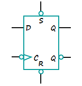

# Sequential Circuits

## Storage Elements and Sequential Circuit Analysis

### Introduction

- 一个时序电路包含存储元件和组合逻辑电路。

- 存储元件的状态由次态方程决定: $Next\,State=f(Inputs,State)$
- Output function(Mealy): Outputs=g(Inputs,State)(由输入和当前状态共同决定)
- Output function(Moore): Outputs=h(State)(仅由当前状态决定)

### Types of sequential circuits

Depends on the times at which:

- storage elements observe their inputs,and
- storage elements change their state

**Synchronous**: 要求比较严格：电路中所有元件必须同时更新，且更新的时间周期一致。

**Asynchronous**: 状态的更新任意时刻都可发生。如果时钟被看作一个输入，那么所有电路都是异步的。但是异步的时序电路使设计变得复杂。

### Storage elements

??? Example "Storing State"
    回顾我们之前学的门传输延迟电路，现在我们把输出端Y与A连接，就将组合逻辑电路变成了时序电路。

    

    

#### Latches(锁存器)

**$\overline{S}-\overline{R}$ Latch**

可得到如下的时序状态：

注意当$R=0,S=0$时，$Q,\overline{Q}$都为1，如果我们将$R,S$改为1，$Q$和$overline{Q}$谁为1取决于门的传输延迟。因此$R=0,S=0$ is forbidden as input pattern.

**S-R Latch**

**Clocked S-R Latch**

在之前的基础上我们增加一个时钟信号(clock or control)

- Has a time sequence behavior similar to the basic S-R latch except that the S and R inputs are only observed when the line C is high.

与之前SR锁存器相同，C=1,S=1,R=1是非法的。

**D-Latch**

我们想避免非法输入，避免未定义情况，因此引入D锁存器。

!!! note
    在chapter3计算门输入成本时，我们一般计算G而不计算GN，是因为电路中的锁存器同时提供了$Q$ 和$\overline{Q}$。

#### Flip-flops

!!! Example

    

在锁存器中，有可能出现空翻现象，即不能做到在时钟信号一个周期内，状态只更新一次。

A solution to the latch timing problem is to break the closed path from Y to Y within the storage element. 即切断锁存器输入和输出的直接联系，采用触发器的设计。

主要有两种触发器：
  
- 在时钟信号高电平时修改第一个锁存器的值，保存第二个锁存器的值；在低电平时保存第一个，修改第二个，此时更新触发器的状态，称为主从触发器。
- 仅在时钟电平变换的边沿触发，即在特定时刻仅接受一个输入，分为上升沿触发和下降沿触发，统称为边沿触发器。

**S-R Master-Slave Flip-Flop**

!!! note "一次性采样问题"

    假如在$C=1，S=0，R=0$时，S或者R发生微小的扰动(突然变成1后又回到0)，主锁存器由原先的保持状态变为修改状态,但是当S变回0时，主锁存器又回到保持状态，保持的值仍然为S=1而不会变回原来的0，该值就会被传到从锁存器中。

    为解决一次性采样问题，我们采用边沿触发器。

**Edge-Triggered D Flip-Flop**

我们用上图来理解边沿触发器的行为。在上升沿前一刻，主锁存器可写，从锁存器只读；而在上升沿后一刻，主锁存器只读，从锁存器写入主锁存器存储的值，即上升沿前一刻写入主锁存器的内容。

在实际电路中，我们通常采用如下的电路图，它减少了门输入成本。

#### Standard Symbols for Storage Elements

注意符号图上的小圆圈，代表非。用来判断是何种锁存器/触发器

#### Direct Input

我们通常会对时序电路进行初始化，即在它开始运行之前赋予电路一个确定的状态，称为直接输入。这些输入通常是异步的。

以上图为例，S和R就作为直接输入，当$\overline{S}$端为0时我们将锁存器置为1，当$\overline{R}$端为0时我们复位为0

### Sequential Circuit Analysis

相比组合电路，时序电路具有**状态**，因此除了输出与输入的关系之外，我们还要关注**次态方程**，即当前的状态和输入如何影响下一个状态。

!!! Example

    

    对于如上的电路,输入是$x(t)$,输出是$y(t)$,状态是$(A(t),B(t))$,我们需要关注的是输出方程与次态方程。

    由于我们采用D锁存器，因此状态就是锁存器D的输入。可以得到如下布尔方程：

    

#### State Table

我们可以使用状态表来描述时序电路的逻辑。分为四列：当前状态，输入，次态，输出。为了得到状态表，需要先写出输出方程和次态方程。

!!! Example

    

    如上图所示的状态表的行数由状态数+输入个数决定，我们可以进行降维，将输入和次态写在一起。

    

#### State Diagrams

时序逻辑电路也可以用状态图表示，它比状态表更好地描述了状态之间的转移关系。

!!! note "Mealy type circuit and Moore type circuit"

    Mealy型电路输出既依赖于当前状态，也依赖于输入。Moore型只取决于当前状态。

    对于状态图中标识输出的位置，由于Moore型电路只取决于当前状态，因此我们习惯标在状态的圆圈里，而Mealy型电路标在状态转移的弧上。

!!! Example

    

    由于输出标在弧上，因此该电路是Mealy型电路。

    

    Moore型电路

    在实际电路设计中，可能会存在一些输出是Moore型，一些输出是Mealy型的情况。

#### Equivalent State Definitions

当两个状态的输入相同时，如果它们的输出和次态都相同，则称这两个状态为等价状态。如果电路中有等价状态，那么我们可以将它们合并，以减少触发器的个数。

!!! Example

    

    可以发现S2和S3是等价状态，将它们合并。

    

    咦合并之后又发现等价状态S2和S1。通过两次等价状态的合并，我们在输入成本上减少了两个触发器。

!!! Example

    

    其中Clock连的是系统时钟，Reset是作为直接输入，将电路赋初值。但是不用将Clock和Reset在方程中描述。

    对于如上的时序电路，我们可以通过一系列操作得到如下的状态图。

    

    可以发现在有效的循环中，该电路的功能是一个模五计数器，而对于无效的状态111，101，110，可以发现它们的次态都回到了有效循环中。这可以有效防止微小扰动对电路的影响，处理无效状态。

    
#### Flip-Flop Timing Parameters

我们想要计算时序电路的最大工作频率，也就是要计算两个上升沿之间的最小间隔。为此需要考虑时序电路的传输延迟。

**触发器延时**

触发器的延时不仅仅是传输延迟，还有为了保证产生稳定输出信号所必要的时间。

- Setup Time: 采样边缘前输入信号需要保持稳定的时间，即输入信号需要在setup time之前改变好，否则这次改变不会被接收。
- Hold Time: 采样边缘后输入信号需要保持稳定的时间。
- $t_{pd,ff}$：触发器采样边缘到产生稳定输出的时间。

**组合电路延时**
即为传输延迟。

观察上图可发现S-R主从触发器的setup time占据一半的时钟周期，原因就是之前介绍的一次性采样，输入信号在C=1时不允许发生改变。

**电路松弛时间**
extra time in the clock period in addition to the sum of the delays and setup time on a path.
松弛时间必定非负。

因此我们可以得到两个上升沿的最小时间：

可以看到，由于主从触发器的$t_s$占了半个时钟信号，大约50%占空比，因此留给触发器和组合电路的传输时间就很少，在触发器和组合电路相同的情况下具有更长的周期，工作频率更小。这也是我们更常用边沿触发器的原因。