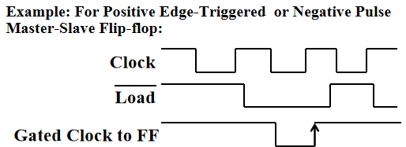
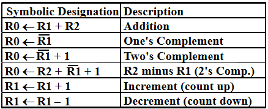
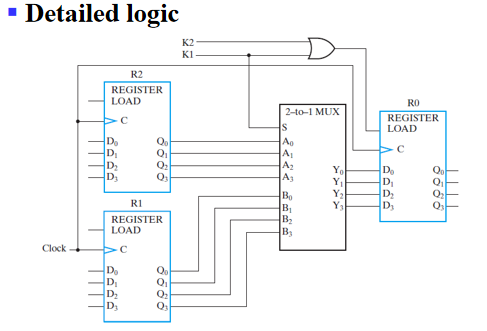
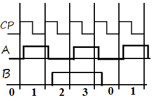
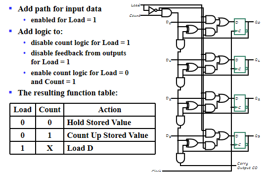
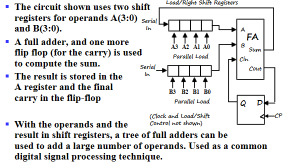

# Registers and Register Transfers

## Registers, Microoperations and Implementations

### Registers and load enable

寄存器是一系列二进制存储单元的集合。我们可以把时序电路中的存储元件抽象成寄存器。

但是在计算机设计中，由于位数很多，因此我们使用之前时序电路的思想，画状态表状态图，是不现实的。因此有以下两种设计思路：

- 将整个计算机电路分成两个部分，一个是存储元件，一个是组合电路部分。组合电路去完成存储元件输出与次态和当前输入的关系。
- 设计出单位电路，组合成多位电路。

寄存器最基本的功能就是保存计算结果。因此寄存器起码需要有两种状态：**存储，使能加载新数据**。

对于存储，寄存器需要做到保存多个时钟周期的数据。

由于我们时序电路中最常用的是D触发器，因此我们考虑一下能否用D触发器来实现寄存器的功能？

D触发器在每个时钟周期都会根据输入更新数据，因此不符合存储多个时钟周期数据的需求。因此我们需要修改D触发器的电路。

有几种思路：

- 把时钟block掉。
- 使用SR或者JK触发器这些具有保持功能的触发器。(本质上是将触发器的输出返回到输入上)

**Load**信号：当Load为1时代表寄存器需要接收新数据，为0代表保存。有时候会用$\overline{Load}$表示。

对于电路的搭建，很显然可以设置新的clock=$clock+\overline{Load}$。

但是对于这个比较简单的电路(在时钟上加一个或门)，或门产生了时钟延迟，这样就出现了时钟信号不同步的情况，对于同步时序电路，这是我们不希望出现的。

所以更实用的方法是使用选择器，将当前寄存器输出返回到输入端，通过Load信号选择本位输入(更新)或是当前寄存器的值(保持)。

### Register Transfer Operations

寄存器接收新数据本质山就是寄存器传输，把某个寄存器的值经过计算后传输给另一个寄存器。

几个基本的部分：
- 多个寄存器(元寄存器，目的寄存器)
- 传输方向+计算(operations：load,count,shift,add,or,etc.称作microoperations), 通常用组合逻辑电路实现
- 控制条件：什么时候要做啥运算，传给谁。

#### Register Notation

其中$M[AR]$中[]代表寻址。就像C语言中的`*`。其中PC(Program Counter)，是当前执行指令的内存位置。

#### Conditional Transfer

需要注意的点：
- 对于$R_2$寄存器，输入端是一直有信号的(数据是一直准备好的)，但是没有$Load$信号是不会接受的。Load信号控制的是是否接受，而不是是否传递。

- 并不是Load一变为1，R2就开始接收新数据的。R2内部本质是个触发器，接受新数据也要等到时钟的上升沿。

#### Control Expressions

### Microoperations - arithmetic,logic,and shift

有一个注意的点，在冒号左边的加号代表逻辑或;在冒号右边的加号代表算术加。

#### Arithmetic Microoperations

#### Logical Microoperations

#### Shift Microoperations

### Register Transfer Structures

#### Multiplexer-Based Transfers

当$K_1$满足时，用$R_1$更新$R_0$
当$K_2\overline{K_1}$满足时，用$R_2$更新。

对于更一般的使用多路复用器进行寄存器传输的架构如下图所示：

其中选择控制端做了个编码器，$n$位控制信号实现$m$位选择控制端。

#### Register Cell Design

做单位的设计，最后进行拼接(注意考虑边界条件)。

**Specifications**

#### Multiplexer and Bus-Based Transfers for Multiple Registers

现在我们具体看一下使用多路复用器的寄存器传输架构。

如上图所示，我们在每个寄存器前都加一个选择器，$n$个寄存器，对应的就是$n-1$选1多路选择器。该电路可以实现任意两个寄存器的相互传输。

注意到该电路可以实现两个寄存器值的相互交换。例如，我们要交换$R_0,R_1$寄存器的数据。我们将$S_0$置为0，则第一个复用器选择$R_1$的输出信号，同理将$S_1$置为0，选择$R_0$的输出信号。这时候我们同时将$L_0,L_1$置为1，则可以实现两个寄存器的相互传输。

这时候就产生一个问题：在编程语言中，我们交换两个变量的值，一定是通过第三个变量(tmp)进行交换的，但是在这个电路中允许同时交换，即在硬件层面是可行的，但是为什么实际上不支持这样的指令呢？

原因就在于成本。该电路每一个寄存器前都有一个多路复用器，门输入成本太大了。而计算机中存在非常多的寄存器，如果使用该种电路那么开销不可想象。

因此我们简化电路，代价就是寄存器传输的限制。

**Multiplexer Bus**

我们使用了公用的多路复用器，选择源寄存器，将它的结果通过选择器得到(即总线的数据)，什么时候我们想要传输，就把相应的寄存器的load信号置为1。由于我们只有一根总线，所以一次只能传输一个数据，无法做到两个变量同时交换。

**Three-State Bus**

另一种方式是使用三态门。回忆一下三态门，输出有三种状态：0，1，高阻态。当输出为高阻态时相当于电路断开。通过使能信号来控制三态门是否接入电路。

如上图所示，将三个寄存器输出接到同一个总线上，例如我们要把$R_0$传给$R_1$，我们只需将$E_0$使能，并将$L_1$信号拉高即可实现。

该电路除了减少成本外，还有一个优点：假设我们将该电路封装，每个寄存器对应一个数据引脚，因此总共只有$n$个数据引脚(每个引脚对应着双向的数据in,out)。在我们做板极设计时(即设计成芯片)，可以显著减少芯片面积。

#### Shift Registers

下图所示的是一个简单的右移移位寄存器。

!!! Question

    移位寄存器只能使用触发器，不能使用锁存器。

移位寄存器常用的功能是并行加载数据(即设置初值)，最基本的思路是在每个触发器之前放一个多路复用器，通过控制信号选择移位或是加载外部数据。在上图的例子中，`Shift`为0，则选择外部输入，否则进行右移。

除此之外，我们使用三选一选择器，增加一个Hold选项，实现数据保持不变的功能。若`Shift`为1，此时Load信号对应的门被禁止，进行移位；若`Shift`为0，移位相关的与门被禁止，`Load`信号控制的门被使能。此时根据`Load`为0或1来决定电路是Hold还是外部加载。

我们还可以实现具有选择Load,Hold功能的双向移位寄存器，原理类似，不再赘述。

## Counters, register cells, buses, serial operations

### Counters

对于一个$n$位的序列，计数器可以实现循环的计数。最简单的计数器是二进制计数器，除此之外还有格雷码计数器等。

#### Ripple Counter

(纹波计数器)

纹波计数器的电路如上图所示，将本位的反向输出提供到本位的输入上，即每个周期取一次反。这样子可以使本位的输出是时钟频率的一半，实现二分频的功能。

在理解了二分频之后，我们将A的输出作为B的时钟信号输入，并将B的反向输出作为B的输入，这样就又实现了二分频。

仔细观察波形图，可以发现在B的一个周期内，AB实现了一个从00，01，10，11的计数器。

因此我们可以采取这种方法设计$n$位计数器，并同时也实现了时钟二分频的功能。

但是纹波计数器不是同步的，时钟信号的改变并不统一。我们可以通过以下的例子来看到该问题的影响。

我们考虑0-7的计数器，当计数器为111时，由上图可以看出，并不会直接从7变为0，而是经历了7-6-4-0的错误数据。

这个电路的可取之处在于，我们注意到高位的触发器是不太容易被触发的，因此降低了电路的功耗。

#### Synchronous Counters

同步计数器由一个D触发器和一个自增器构成。

即将本位输出经过自增器加一后给到本位输入。

对于自增器的设计，观察真值表我们可以发现一个规律(高位变换的条件)：

即当低位全部为1时，高位求反。因此可以得到电路实现：

异或门一端接到本位，若符合条件则求反。可控条件我们使用了与门链，依次将低位数据求与，若全为1则异或门求反，否则异或门的结果就是本位保持不变。

该电路的缺点就是与门链的延迟，解决方案的思路与第三章的加法器类似，look ahead,把所有的低位信号全部拉到本位，使用多输入与门。

其中`CO`carry out是进位信号,当低位全为1时`CO`为1。
这个进位信号的作用就在于计数器的级联，我们将该4位计数器的进位信号连到另一个计数器(高位)的使能信号，在下一个时钟周期，高位开始计数，低位全部变回0。

并行加载的计数器。思路与之前寄存器传输一致，这里不展开。

#### Counting Modulo N

除了采用时序电路的方法外(第四章)，我们可以使用二进制计数器来实现模n计数器。方法就是在二进制计数器到达$N-1$时对计数器进行清零。

而Clear有两种方法，一种是ch4介绍的direct input Reset，这种清零是异步的。另一种方法是同步的，当clear信号有效时，不会立马清零，而是等到下一个时钟上升沿同时清零。

!!! Example "Counting Modulo 7"

    - 异步清零方法：

    

    如图所示，当计数器输出为7时，立即clear，电路的输出会有很短时间的7出现。

    - 同步清零方法：

    

    这时候我们在检测到6时，与门输出结果变为1(很显然当输出为0-5时与门输出都为0)，该信号传递到Load端，但是并不会马上加载，而是在下一个上升沿到达后，加载外部信号0000，实现了并行加载的同步清零。

    

    我们也可以设计中间结果的模N计数器，如上图所示，复习的时候可以分析一下该电路功能。

### Serial transfers and microoperations

串行每次运算一个位，因此速度比较快。降低了电路复杂度。

**Serial Adder**

