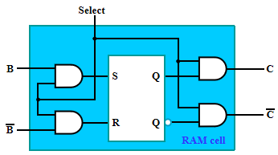
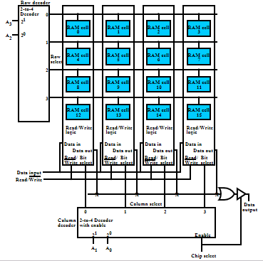
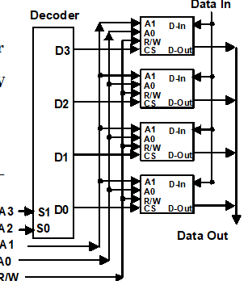
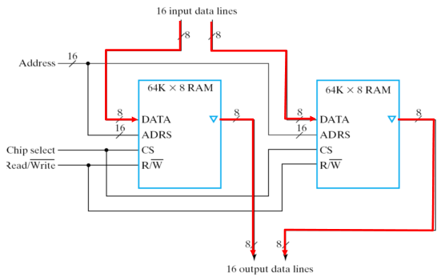
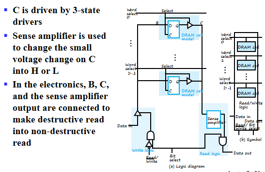
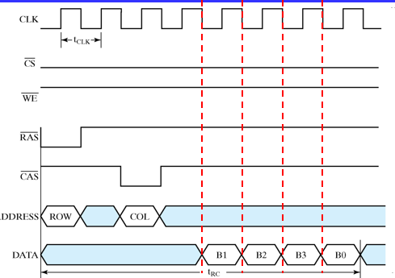

# Memory Basics

## Memory definitions

Memory(内存)就是存储数据的一个部件，是计算机中必不可少的部分。

- **Memory Organization**: 内存的基本架构，例如内存能放多少数据，包含多少字，一个字多少位等。

- **Random Access Memory(RAM)**: 随机访问存储器，CPU可以指定内存中任何一个地址访问，访问任何一个地址的时间是相同的。与其相对应的是顺序存储的存储器，访问某一个单元数据的时间与该单位的位置有关。

- **Memory Address**: 内存地址

- **Typical data elements**: bit, byte, word
计算机是以二进制存储，发送接受数据的。bit的含义就是二进制数中的一个数位，0或1。

byte(字节)，1byte=8bit.

word: 在计算机中我们通过总线来传输固定大小的数据，这块数据被称作字，一个字包含的字节数是各种计算机系统里面的基本参数，在不同的操作系统里通常不同。一般是二的整数次幂个字节大小(1byte,2bytes,8bytes,etc.)

- **Memory Data**: 内存里存的数据
- Memory Operation: 最基本的就是读和写。

上图所示是典型的内存访问接口。其中$k$根地址线经过译码器得到$2^k$个字的地址。每一个字都是$n$bit的。

!!! Example "Memory Organization Example"

    

    上表所示的是一个$8\times 8$的内存结构，第一个8代表有8个字，第二个8代表每个字里面有8个位。

### Memory Operation Timing

Memory Enbale为1时，代表CPU将操作该内存。
当我们做Read操作时，如上图所示，CPU首先将地址放到地址总线上，再将Memory Enable拉高，内存经过若干时间后经过寻址，就会将内存的值放到output总线上。

内存使能到内存送出数据的时间称作读取延迟。

类似地，上图是写操作的时序图。在把wirte非信号拉高之后，数据输入还保持了一小段时间，这是为了保持稳定(可以类比时序电路中触发器的hold time)。

## Random Access Memory(RAM)

RAM的种类：

- SRAM： 静态存储器，信息是保存在锁存器中。由于使用门来实现，因此速度比较快，但是成本较高。
- DRAM： 存储元件是电容，通过电容充放电来标志逻辑1或0。
    - 会存在漏电情况，导致丢失数据。因此要定时刷新。
    - 需要的电路元件较少，在芯片上密度更高，成本更低。

另一种分类方法是根据断电后信息是否会丢失：

- Volatile: 掉电易失
- Non-volatile.

### SRAM

上图所示是典型的SRAM存储单元的电路图。
若`Select=0`，锁存器前的与门都被disable,锁存器处于保持功能。对于输出端的与门也被disable,输出也为0。若`Select=1`,则将B和B非作为锁存器的输入，倘若二者值不同，则有条件修改锁存器的内容。与此同时输出端的与门也被使能，得到有效输出。

我们将每个SRAM单元拼成位片(Bit Slice)，总共有$2^n$个RAMcell。可以看到所有cell的输入端$B,\overline{B}$都并在一起，由一个读写控制逻辑操作，所有的输出由或门连接。

其中`Bit Select`控制读写操作的使能。若`Bit Select=0`，分析电路可知，$B,\overline{B}$都为0，无论`Select`等于多少，锁存器始终是保持状态。与此同时，`Data out`也始终为0。

当`Bit Select=1`，要写入数据时，`Read/Write`信号线为0，与门得到使能，锁存器的输入端为相反的值，若`Select=1`，SR锁存器的结果可以更新，实现了对数据的写入操作。对于读取操作，`Data-in`的数据不能被送到锁存器的输入。但是当有一个内存的`Select=1`时，锁存器输出端的与门被使能，产生有效的输出$C,\oveline{C}$。由于内存操作要求任何时刻只能对一个字进行操作，输出端仅有被选择的那位内存产生有效的输出，从而得到`Data out`，实现read操作。

由于内存操作要求任何时刻只能对一个字进行操作，因此在$2^n$个word select信号中，只有一个为1，因此我们在这之前加上一个地址译码器。译码器的输入就是地址线。

值得注意的是，上图中的输出加上了一个三态门，被称作Chip Select,确保只有一个芯片被使能，我们便可以将多个输出接在一起。

在实际计算机中，内存非常大，使用一个译码器是不现实的。(设想一下8M的内存，有$2^{23}$个字)。一个简化方法就是将word select变成row select，将bit select变为column select。一般将高位作为行地址。行地址使能某一个行线，列地址使能某一个位片。具体结构如下图所示。

但计算机中地址的字可能不止一位，考虑将上述16$\times$ 1 的结构改成8乘2的RAM结构。将16改为8意味着更少的地址线，只需要一个38译码器即可。我们列的使能信号同时控制两个位片，而将两个位片的输出作为电路的输出。

#### Making Larger Memories

我们有两种扩展内存的方法：字扩展和位扩展。

如上图所示，我们可以将一个4-word by 1-bit的内存字扩展成16-word by 1-bit的内存。我们将高两位的地址线经过译码器，译码器的输出端接每个位片的chip select上。而低两位就像上文所述那样工作。

上图所示是位扩展的一个例子，思路很简单，将两个RAM的输出并在一起即可。

### Dynamic RAM(DRAM)

使用电容充放电进行数据的存储。

由于电容很小，我们使用敏感放大器的结构对电容的充放电进行操作(上图右边的结构)。

类比为一个大池子，每个大池子连着很多开关，开关的另一端连接的是小电容(小池子)。小池子里的水位高时，存储逻辑1，反之存储逻辑0。

写1时，我们将大池子的电压升高，打开开关，小池子的电压也会升高。写0时则把大池子的电压放空。

在进行读操作时，我们在大池子里放上中等大小的电压，打开开关，若小池子里是逻辑1，则大池子的电压会稍稍上升，反之则会稍稍下降，这时我们只需要检测大池子的电压变化即可。

需要注意的是，进行读操作时会消耗小池子里的电荷，所以我们还需要再写回去。

在设计DRAM芯片时需要考虑的另一个问题是如何减少引脚的数量。

DRAM芯片中，地址是分两次送达的，先送行地址，再送列地址。这时候就需要控制引脚，$\overline{RAS},\overline{CAS}$。具体结构如下图所示。(列地址实际上是用计数器来写入的)

DRAM读写操作的时序过程如下图所示：

#### DRAM Types

- DRAM是同步电路，称作SDRAM。SRAM是异步电路，SRAM很快，DRAM很慢，但是存储量大。

由于我们在读数据时期望读出一行数据。
触发仿真操作：列地址加1。触发读可以提高效率。

当columen address溢出时，返回第一列。

- DDR SDRAM： 在时钟上升沿和下降沿都可以进行读写操作。

- RDRAM

寻址过程：将4次操作的数据组合在一起访问。

The bus consists of:
- A 3-bit row address bus
- A 5-bit column address bus
- A 16 or 18-bit (for error correction) data bus

Packets are 4-clock cycles long giving 8 transfers per packet representing:
- A 12-bit row address packet
- A 20-bit column address packet
- A 128 or 144-bit data packet

