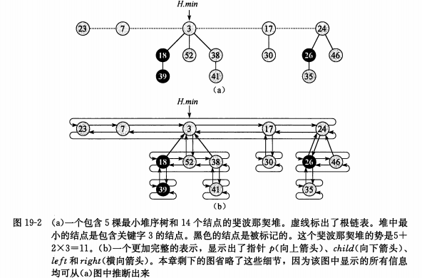

# 斐波那契堆

!!! Abstract

    斐波那契堆的用途：

    - 支持"可合并堆"的操作
    - 一些操作可以在常数摊还时间内完成

## 可合并堆

可合并堆是支持以下 5 种操作的数据结构：

1. `MAKE-HEAP()`
2. `INSERT(H, x)`
3. `MINIMUM(H)`
4. `EXTRACI-MIN(H)`
5. `UNION(H1,H2)`

除此之外，斐波那契堆支持以下两种操作：

1. `DECREASE-KEY(H, x, k)`： 将堆中元素 x 的关键字赋予新值 k 。
2. `DELETE(H, x)`


## 斐波那契堆结构

一个斐波那契堆是一系列具有最小堆序的有根树集合。



- 每个结点包含一个指向它父节点的指针 `x.p` 和一个指向它**某一个**孩子的指针 `x.child`。
- `x` 的所有孩子被链接成一个环形的双向链表，称为 `x` 的孩子链表。
- 孩子链表中每一个孩子 `y` 都有指针 `y.left`、`y.right`，分别指向 `y` 的左兄弟和右兄弟。

!!! note "双向环形链表的优点"

    - 在 $O(1)$ 时间内在链表中的任何位置插入或删除结点。
    - $O(1)$ 时间合并两个链表

- `x.degree`：结点 `x` 的孩子链表中孩子数目。
- `x.mark`：结点 `x` 自从上一次成为另一个结点的孩子之后，是否失去过孩子。
- `H.n`: $H$ 中当前的结点数目。

### 势函数

对于一个给定的斐波那契堆$H$,用 $t(H)$ 来表示 $H$ 中根链表中树的数目，$m(H)$ 表示 $H$ 中已标记的结点数目。


## 可合并堆操作

### 插入一个结点

```
FIB-HEAP-INSERT(H,x)
    x.degree = 0
    x.p = NIL
    x.child = NIL
    x.mark = FALSE
    if H.min == NIL
        create a root list for H containing just x
        H.min = x
    else insert x into H's root list
        if x.key < H.min.key
                H.min = x
    H.n = H.n + 1
```

### 合并两个堆

```
FIB-HEAP-UNION(H1, H2)
    H = MAKE-FIB-HEAP()
    H.min = H1.min
    concatenate the root list of H2 with the root list of H
    if(H1.min == NIL) or (H2.min != NIL and H2.min.key < H1.min.key)
        H.min = H2.min
    H.n = H1.n + H2.n
    return H 
```

### 抽取最小结点

