# NP and Computational Intractability

## Polynomial-Time Reductions

对于能在多项式时间内被解决的问题，我们认为是在实际应用中能够被解决的。而在这里我们主要讨论不能在多项式时间内被解决的问题。

首先我们希望能够比较两个不同问题的相对复杂性，即对问题 $X$ 和 $Y$ 建立 "Problem $X$ is at least as hard as Problem $Y$"的关系。因此引入多项式时间归约的概念。

Problem $X$ **polynomial reduces to** Problem $Y$($X\leq_p Y$), if arbitrary instances of problem $X$ can be solved using:

- Polynomial number of standard computational steps, plus
- Polynomial number of calls to oracle that solves problem $Y$.

有了多项式时间归约的概念之后，我们可以做下面几件事情：

- 设计算法：如果 $X\leq_p Y$, 并且 $Y$ 多项式时间可解，那么 $X$ 也可以在多项式时间内被解决。
- 建立不可解性：如果 $X\leq_p Y$ 并且 $X$ 不能在多项式时间被解决，那么 $Y$ 也不是多项式时间可解的。

这两个性质是从多项式时间归约的定义自然得出的。

### Basic reduction stategies

1. Reduction by simple equivalence

这里介绍两个问题：

!!! Example "Independent Set"

    给定一个图 $G=(V,E)$ 和一个整数 $k$, 是否存在点集$S\subset V$ 使得 $\left| S\right\| \ge k$ 并且每一条边最多只有一个端点在 $S$ 中。

    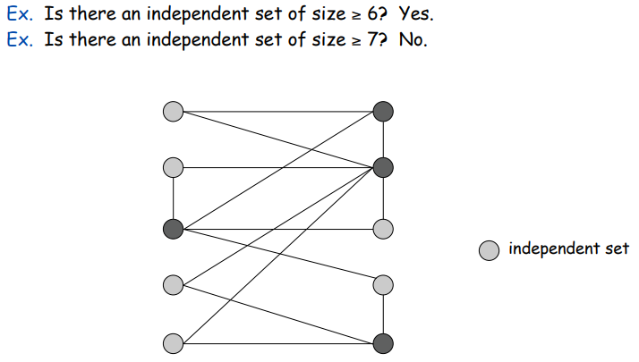

!!! Example "Vertex Cover"

    给定一个图 $G=(V,E)$ 和一个整数 $k$, 是否存在点集$S\subset V$ 使得 $\left| S\right\| \leq k$ 并且每一条边至少只有一个端点在 $S$ 中。

    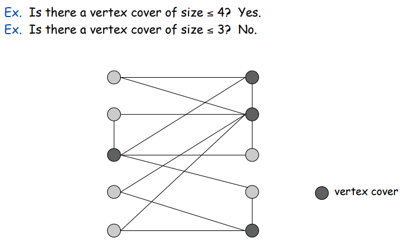

可以证明 VERTEX-COVER $\equiv _p$ INDEPENDENT-SET

??? note "Hint"

     show $S$ is an independent set iff $V − S$ is a vertex cove

2. Reduction from special case to general case

!!! Example "Set Cover"

    Given a set of $U$ of elements, a collection $S_1, \cdots, S_m$ of subset of $U$ and a integer $k$, does there exist a collection of $\leq k$ of these sets whose union is equal to $U$?

可以证明 VERTEX-COVER $\leq_p$ SET-COVER

Proof: 给定一个点集覆盖的实例 $G=(V,E)$, 我们可以构建一个集合覆盖的实例。

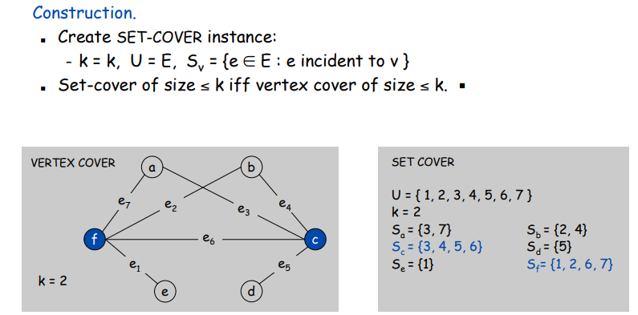

3. **Reduction by encoding with gadgets**

首先我们介绍可满足性问题。

SAT: Given a CNF(conjuctive normal form) formula $\Phi$, does it have a satisfying truth assignment?

3-SAT: SAT where each clause contains exactly 3 literals(each corresponds to a different vairable).

我们可以证明，3-SAT $\leq_p$ INDEPENDET-SET

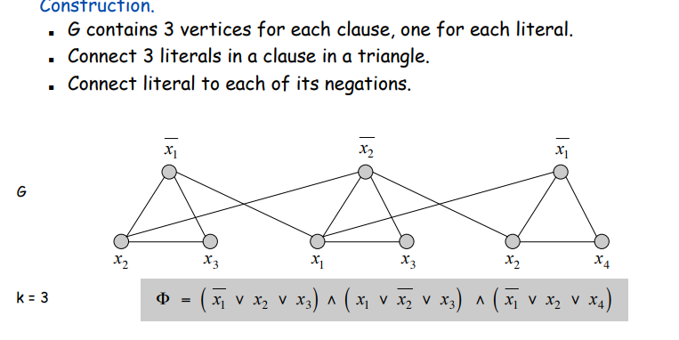

### Review of Polynomial-Time Reduction

- 引入多项式时间归约的概念来建立两个问题的相对复杂度。
- 一些例子：3-SAT $\leq_p$ INDEPENDENT-SET $\leq_p$ VERTEX-COVER $\leq_p$ SET-COVER

## Definition of NP

我们现在想要形式化在这些多项式时间内不可解决的问题: NP 类。

首先给出问题和多项式时间的形式化定义：

### Problems and Algorithms

Decision Problem:

- $X$ is a set of binray strings.
- Instance: string $s$.
- Algorithm $A$ solves problem $X$: $A(s)=yes$ iff $s\in X$.

Polyomial time: Alogirthm $A$ runs in poly-time if for every string $s$, $A(s)$ terminates in at most $p(\left| s\right|)$ steps, where $p(\cdot)$ is some polynomial.

**Definition of $P$**

我们定义问题类 $P$: Decision problems for which there is a poly-time algorithm.

### Efficient Certification

对于多项式时间内不可解的问题，我们思考能否在多项时间内验证某个解是否就是该问题的解，因此我们引入验证器(certification 的概念)。

Algorithm $C(s,t)$ is a certifier for problem $X$ if for every string $s$, $s\in X$ iff there exists a string $t$ such that $C(s,t)=yes$.

### NP: a class of Problems

NP: decision problems for which there exists a poly-time certifier.

Poly-time certifer: $C(s,t)$ is a poly-time algorithm and $\left| t\right| \leq p(\left| s\right|)$.

!!! Example "Certifers and Certificates for SAT"

    - Certificate: An assignment of truth values to the $n$ boolean variables.
    - Certifier. Check that each clause in Φ has at least one true literal.

## NP-Completeness

有了 $P$ 和 $NP$ 类的定义之后，我们可以很自然地得出结论: $P\subset NP$, 毕竟一个问题既然都在多项式时间内可解了，那么肯定能在多项式时间内被验证。但我们关心的问题是： $P$ 是否等于 $NP$?

我们可以考虑 $NP$ 类中最难的那个问题，如果这个问题都能在多项式时间内被解决，那么有了多项式时间归约的方法，其它问题自然也可以。因此我们引入 NP 完全类的概念：

**NP-complete**: A problme $Y$ in $NP$ with the property that for every problem $X$ in $NP$, $X\leq_p Y$.

**Theroem**: Suppose $Y$ is an NP-complete problem, then $Y$ is solvable in poly-time iff $P=NP$.

接下来，我们的思路就是找到一个自然的 NP 完全问题，有了一个问题之后，我们就可以利用多项式时间归约的方法，将该问题归约到其它问题，找到更多的 NP 完全问题。

### Circuit Satisfiability

!!! Example "CIRCUIT-SAT"

    Given a combinational circuit built out of AND, OR and NOT gates, is there a way to set the circuit inputs so that the output is 1?

    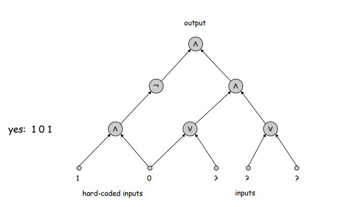

??? note "CIRCUIT-SAT is NPC"

    - 任何 $n$ bit 输入，输出 yes/no 的算法都可以被电路表示，并且如果该算法是多项式可解的，那么电路也是多项式大小的。
    - 对于 NP 类中的一个问题 $X$, 它存在一个多项式时间的验证器 $C(s,t)$。
    - 我们将 $C(s,t)$ 看作是 $\left\|s \right\| + p(\left\|s \right\|)$ 输入的算法，前\left\|s \right\| 比特是 Hard-coded，后p(\left\|s \right\|)个比特代表 certification $t$。
    - 那么电路是可满足的当且仅当 $C(s,t)=yes$。

    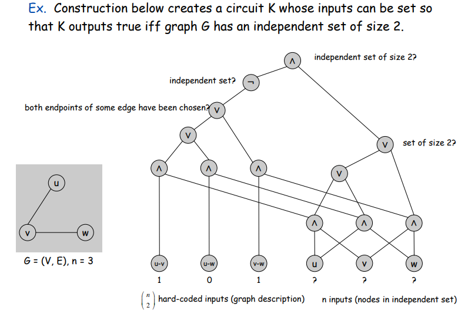

**Recipe to establish NP-completeness of problem $Y$**

1. Show that $Y$ is in NP.
2. Choose an NP-Complete problem $X$.
3. Prove that $X\leq_p Y$.

??? Question "Prove 3-SAT is NPC"

接下来的三个部分，我们介绍几类 NP 完全问题，并且证明他们的 NP 完全性(都可以由 3-SAT 问题归约得到)。

## Sequencing Problems

### Hamiltonian Cycle

我们先引入有向图中的哈密顿路径问题，并证明 DIR-HAM-CYCLE $\leq_p$ HAM-CYCLE。

!!! note "Proof"

    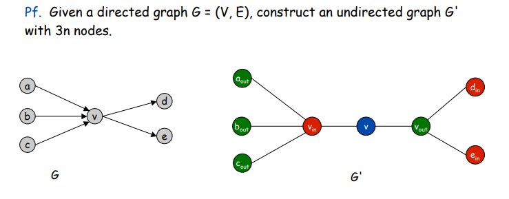

接下来我们可以证明 3-SAT $\leq_p$ DIR-HAM-CYCLE。

**Proof.** 

首先 DIR-HAM-CYCLE 是 NP 类问题。
其次我们需要从 3-SAT 的一个实例构造出 DIR-HAM-CYCLE 的一个实例，使得其存在一个哈密顿回路当且仅当 3-SAT 的实例 $\Phi$ 可满足。

考虑一个 3-SAT 的实例 $\Phi$, $n$ 个变量 $x_i$ 以及 $k$ 个子句 $C_i$。

我们首先构建一个具有 $2^n$ 个哈密顿回路的图 $G$。并且设置两个点 $s$ 和 $t$，两个点之间仅有一条由 $t$ 指向 $s$ 的边。如下图所示。

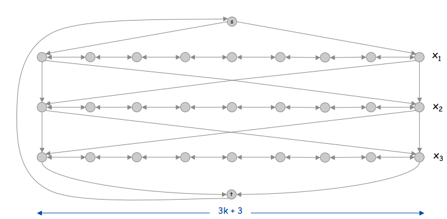

可以看到，图的每一行对应着一个变量 $x_i$, 我们的哈密顿回路从 $s$ 开始，经过每一行到达 $t$ 后回到 $s$。在我们的 tour 中，每当我们前往下一行时，总是有两个选择。因此这 $2^n$ 个哈密顿回路对应着 3-SAT 中 $2^n$ 个赋值情况，并且遍历每一行的方向(从左到右/从右到左)对应着 $\Phi$ 中变量值的真假。

至此我们完成了 literal 和图中 node 的对应，但是我们还需要加上 clause 对图带来的约束。

为了方便我们思考，我们考虑一个具体的 clause: $C_1=x_1\lor \overline{x_2} \lor x_3$。在对应的图中，这条语句的意思是，我们的哈密顿回路要么从左到右遍历 $x_1$,要么从右到左遍历 $x_2$, 要么从左到右遍历 $x_3$。因此我们在图中新增节点来表示遍历的方向性：

我们为每个 clause $C_j$ 定义一个节点 $c_j$。假设 $C_j$ 包含项 $t$，如果 $t=x_i$,我们增加边 $(v_{i,3j},c_j),(c_j,v_{i,3j+1})$;如果 $t=\overline{x_i}$，我们增加边 $(v_{i,3j+1},c_j),(c_j,v_{i,3j})$

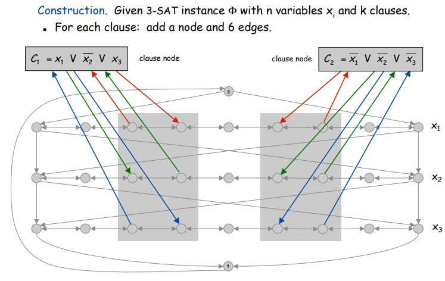

接下来的证明就比较简单了。这里不详细展开。

### Traveling Salesperson Problem

TSP: Given a set of $n$ cities and a pairwise distance function $d(u, v)$, is
there a tour of length $\leq D$ ?

可以证明 HAM-CYCLE $\leq_p$ TSP$。

??? note "Hint"

    从哈密顿回路的实例构造 TSP 的实例。
    证明 TSP 实例有一个小于 $\left\| V\right\|$ 的 tour 当且仅当存在哈密顿回路。

## Partitioning Problems

Seaching over ways of dividing a collection of objects into subsets.

### 3D Matching Problem

首先给出 3D Matching 的定义。

!!! Example "3D Matching"

    Given disjoint sets $X,Y,Z$, each of size $n$, and given a set $T\subset X\times Y\times Z$ of ordered triples, does there exist a set of $n$ triples in $T$ so that each element of $X\cup Y\cup Z$ is contained in exactly one of these triples?

    其实类似二分图，就是找到 $n$ 个三元组，使得图中每个节点仅被一个三元组包含。

我们可以证明 3-SAT $\leq_p$ 3D Matching。
同 HAM-CYCLE 一样，难点还是怎么从 3-SAT 的实例来构造图。但整体思路还是差不多的，首先建立 variable 到 node 的映射，然后添加 clause 的约束。

对于每个 $x_i$ 我们定义：

- $A_i=\left\{a_{i1},a_{i2},\cdots,a_{i,2k}\right\}$-> core of the gadget(我不太知道这个要怎么翻译/(ㄒoㄒ)/~~).
- $B_i=\left\{b_{i1},b_{i2},\cdots,b_{i,2k}\right\}$-> tips of the gadget.
- triple $t_{ij}=(a_{ij},a_{i,j+1},b_{ij})$.

如图所示：

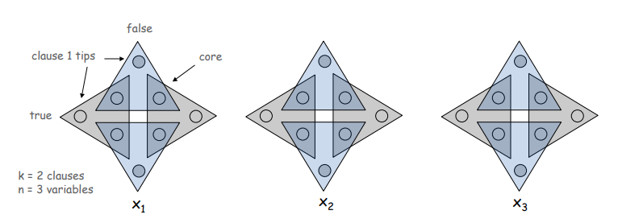

对于 gadget $i$, 如果对应的 $j$ 为偶数，我们则称 $t_{ij},b_{ij}$ 为偶数，反之为奇数。
可以通过观察得到，每个 gadget 中，满足条件的三元组要么全为奇数，要么全为偶数，并且只有集合 $A$ 中的元素能够被完全包含。
根据奇数和偶数的二元关系，我们可以建立图与SAT实例的联系：如果我们选择偶数三元组，意味着对应 $x_i$ 的值为0，否则为 1。

接下来我们需要加上 clause 的约束。对于每个 clause $C_j$,我们定义节点：

- $P_j=\left\{p_j,p_j^{'}\right\}$->core
- 三个三元组。假设 $C_j$ 包含项 $t$, 如果 $t=x_i$,则定义三元组 $(p_j,p_j^{'},b_{i,2j})$;如果 $t=\overline{x_i}$,则定义 $(p_j,p_j^{'},b_{i,2j-1})$

但是我们的 construction 到这里为止，还并没有将所有的 node 完全覆盖，因此我们还需要一个叫做 cleanup gadget 的 core，来覆盖每一个 tip：

$Q_i=\left\{q_i,q_i^{'}\right\}$, 构建三元组 $(q_i,q_i{'},b)$ for every tip $b$。

这时我们就可以证明构建出的实例存在 3D-Matching 当且仅当 $\Phi$ 可被满足。

### Graph Coloring

3-COLOR: Given an undirected graph $G$, does there exists a way to color the nodes red, green, and blue so that no adjacent nodes have the same color?

可以证明 3-SAT $\leq_p$ 3-COLOR.

??? note "Exercise: Construct the instance"

   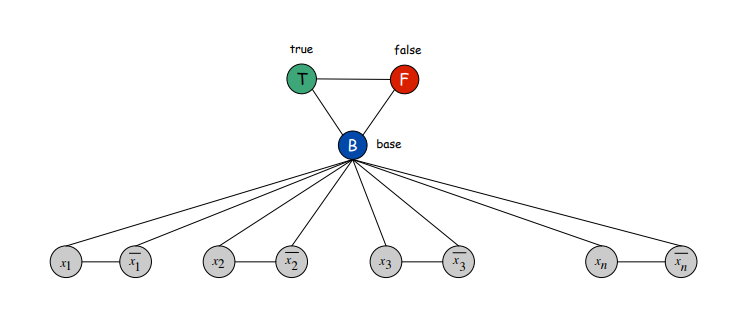

   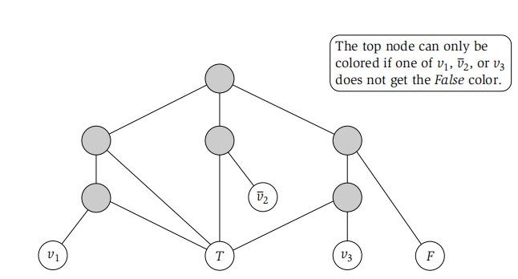 

## Numerical Problems

### The Subset Sum Problem

SUBSET-SUM：Given natuarl numbers $w_1, w_2, \cdots w_n$ and an integer $W$, is there a subset that adds up to exactly $W$?

**伪多项式时间算法**

首先要明确一个概念：一个问题的输入规模是保存输入数据所需要的 bit 数目。

伪多项式时间算法是指算法的时间复杂度是输入数据大小的多项式时间，但却是输入规模的指数时间。

举个例子，输入数字 $n$ 判断 $n$ 是否为素数。输入规模为 $\log n$ ($\log n$ 个bit来表示 $n$),因此当输入规模为 $x$ 时，算法用时为 $O(2^x)$。

同理，对于 SUBSET-SUM 问题，时间复杂度是 $O(nW)$,这也是个伪多项式时间算法，$O(n\log W)$ 的复杂度才是多项式时间的。

回到问题本身，我们可以证明 3D-Matching $\leq_p$ SUBSET-SUM.

!!! note "Hint"

    construct a number $w_t$ with $3n$ digits that has a 1 in positions $i,n+j,2n+k$ and 0 in all other positions.

## co-NP and the Asymmetry of NP

Definition: Given a decision problem $X$, its complement $\overline{X}$ is the same problem with the yes and no answers reverse.

我们知道 $P=\overline{P}$ 的，但是对于 $X\in NP$, 如果 $\overline{X}\in NP$, 则需要满足对于任意的 $s$, $s\in \overline{X}$ 当且仅当对于所有长度小于 $p(\left|s\right|)$ 的 $t$，$C(s,t)=no$。问题的复杂性出在对于之前 NP 类的定义，只要存在一个 $t$ 能够验证这个 problem，而现在是需要对于所有的 $t$。

**co-NP**: Complements of decision problems in NP. iff $\overline{X}\in NP$.

**Theorm**: If $NP \neq co-NP$,then $P\neq NP$.

### Good Characterizations: NP $\cap$ co-NP

对于 NP $\cap$ co-NP 中的 problem,他们有良好的性质：

- When the answer is yes, there is a short certifier.
- When the answer is no, there is a short disqualifier.