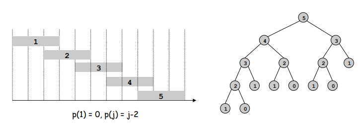
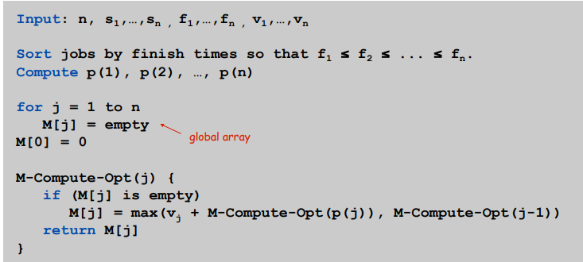
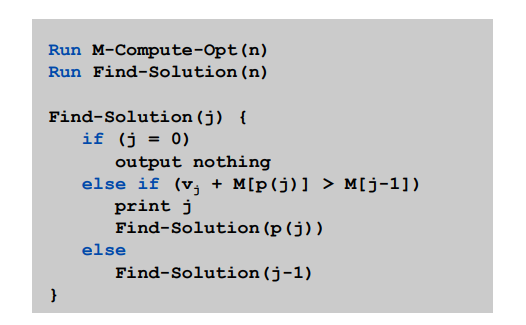
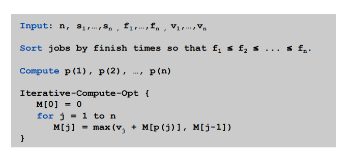
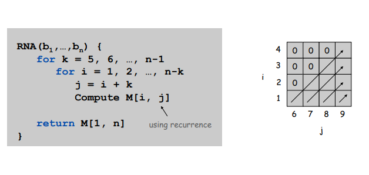
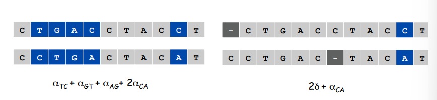
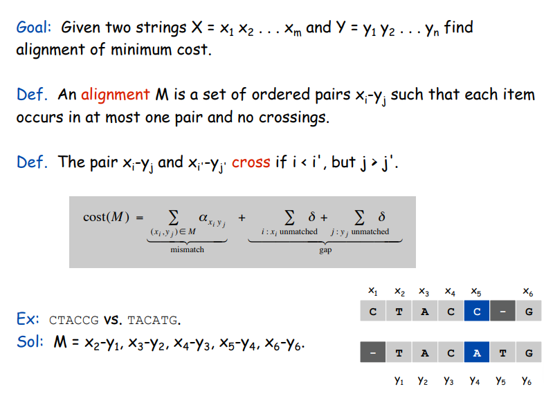

# 动态规划

> **Dynamic programming**: Break up a problem into a series of overlapping sub-problems, and build up solutions to larger and larger sub-problems.

## Weighted Interval Scheduling

### Designing a Recursive Algorithm

!!! Example "Probblem Description"

    - Job $j$ starts at $s_j$, finishes at $f_j$, and has weight or value $v_j$.
    - Two jobs are compatible if they don't overlap.
    - Goal: find maximum weight subset of mutually compatible jobs.

我们首先将所有的工作按完成时间排序并标记： $f_1\le f_2\cdots\le f_n$。
定义 $p(j)$ 是与工作 $j$ 兼容的最大下标工作 $i$。

现在我们考虑最优解 $\mathcal{O}$。对于 $\mathcal{O}$, 我们可以断定最后一个工作要么属于 $\mathcal{O}$, 要么不属于。倘若属于，那么下标位于 $p(n)$ 和 $n$ 之间的工作肯定不属于 $\mathcal{O}$，此时 $\mathcal{O}$ 就等于集合 $\left\{1,\cdots, p(n)\right\}$ 的最优解加上 $v_n$。倘若不属于，$\mathcal{O}$ 就等于集合 $\left\{1, \cdots,n-1\right\}$ 的最优解。至此我们就将原问题分割为了几个子问题，并且我们可以定义 $OPT(j)$ 为集合 $\left\{1,\cdots, j\right\}$ 的最优解:

$$
OPT(j)=\max (v_j+OPT(p(j)), OPT(j-1))
$$

并且第 $j$ 个工作属于最优解中当且仅当 $v_j+OPT(p(j))\ge OPT(j-1)$。

至此我们就得出了递归版本的算法：

```
Compute-Opt(j)
    If j=0 then
        Return 0
    Else
        Return max(v_j+Compute-Opt(p(j)), Compute-Opt(j-1))
```

然而，递归版本的算法花费了指数级别的时间，因为有些值我们需要重复计算，下图的递归树展示了这一点。



### Memoizing the Recursion

可以观察到，我们的算法实际上只解决了 $n+1$ 个不同的子问题，即Compute-Opt(0), $\cdots$, Computer-Opt(n), 为了消除递归的冗余，我们考虑将每次子问题被第一次计算后的结果存起来，即额外声明一个数组 $M[0,\cdots, n]$:



显然上述算法的时间复杂度是 $O(n)$。

上述算法中，我们只计算了最优解，并不知道最优解中有哪些工作。实际上，通过第 $j$ 个工作属于最优解中当且仅当 $v_j+OPT(p(j))\ge OPT(j-1)$的性质，我们可以在 $O(n)$ 时间内找到完整的解。

??? note "Exercise"

    


现在，我们可以将递归的算法转化为迭代的算法：



**A Basic Outline of Dynamic Programming**

- There are only a polynomial number of subproblems.
- The solution to the original problem can be easily computed from the solutions to the subproblems.
- There is a natural ordering on subproblems from smallest to largest, together with an easy-to-compute recureence that allows one to determine the solution to a subproblem from the solutions to some number of smaller subproblems


## RNA Secondary Structure

!!! Example "Problem Description"

    A single-stranded RNA molecule can be viewed as a sequence of $n$ symbols drawn form the alphabet $\left\{A,C,G,U\right\}$.
    Let $B=b_1b_2\cdots b_n$ be a single-stranded RNA molecule. A set of secondary structure on $B$ is a set of pairs $S={(i,j)}$, where $i,j\in {1,2,\cdots, n}$, that satisfies the following conditions:

    - The ends of each pair in $S$ are separated by at least four intervening bases; that is, if $(i,j)\in S$, then $i<j-4$.
    - The elements of any pair in $S$ consist of either $\left\{A,U\right\}$ or $\left\{C,G\right\}$.
    - if $(i,j)$ and $(k,l)$ are two pairs in $S$, then we cannot have $i<k<j<l$ (The noncrossing condition).

    We want to maximize the possible number of base pairs.

现在我们开始为这个问题设计动态规划算法。首先我们从最 trival 的想法开始，我们定义 $OPT(j)$ 是 $b_1b_2\cdots b_j$ 的最优解。根据之前的思路, $b_j$ 要么在最优解中，要么不在。倘若不在的话，$OPT(j)=OPT(j-1)$。但是如果在的话，$j$ 一定和 $t$ 匹配，并且 $t<j-4$。这样的话，由于 noncrossing condition 的存在，我们要求没有其它的组合一端在 $(0,t-1)$, 另一端在 $(t+1, j-1)$ 中，这将我们的子问题分成了两个，其中一个是找到 $(t+1, j-1)$ 的最优解，但这并不符合我们定义的范式。因此我们思考添加一个变量，扩大子问题的范围。

### Dynamic Programming over Intervals

定义 $OPT(i,j)$ 是 $b_ib_{i+1}\cdots b_j$ 的最优解。同样地，我们考虑最后一个基 $b_j$：

- $j$ 在最优解中, 和 $t<j-4$ 进行匹配。此时 $OPT(i,j)=OPT(i,t-1)+OPT(t+1,j-1)+1$
- $j$ 不在最优解中。此时 $OPT(i,j)=OPT(i,j-1)$

因此可以得到我们的状态转移方程：$OPT(i,j)=\max(OPT(i,j-1),\max_{i<t<j}(OPT(i,t-1)+OPT(t+1,j-1)+1))$。

接下来我们考虑：is there a natural ordering on subproblems from smallest to largest?
很显然，我们按间隔($k=j-i$)从小到大依次计算。



总共有 $O(n^2)$ 的子问题，计算 $OPT$ 需要 $O(n)$，因此总时间复杂度为 $O(n^3)$。

## Sequence Alignment

!!! Example "Edit Distance"

    - Gap penalty $\delta$.
    - Mismatch penalty $\alpha_{pq}$
    - Cost: sum of gap and mismatch penalties.
    - Goal: minimize the cost.

    

!!! Example "Sequence Alignment"

    

!!! note "TODO"

