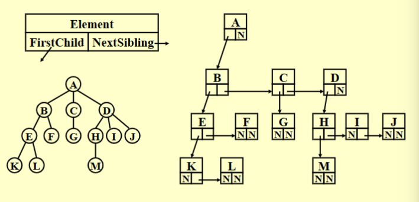
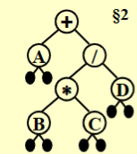
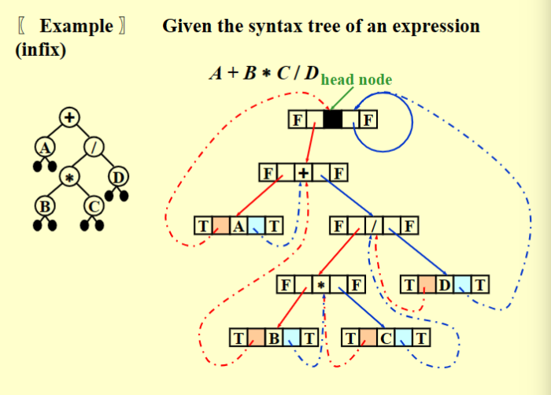
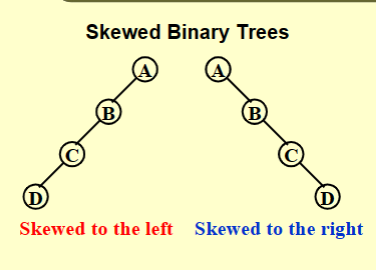
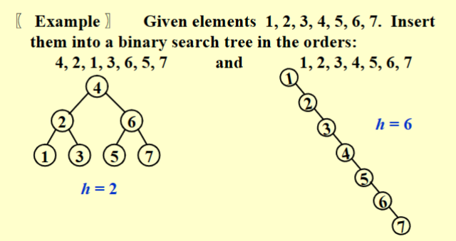

# Binary Tree

## Preliminaries

**Definition**: A tree is a collection of nodes. The collection can be empty; otherwise, a tree consists of:

- a distinguished node $r$, called the root;
- zero or more nonempty **subtrees** $T_1,\cdots,T_k$, each of whose roots are connected by a directed edge from $r$.

!!! note

    - There are $N-1$ edges in a tree with $N$ nodes
    - Normally the root is drawn at the top.


### Terminology

**Degree of a node**: number of subtrees of the node.

**Degree of a tree**: max{degree(node)}

**parent**: a node that has subtrees.

**children**: the roots of the subtrees of a parent.

**siblings**: children of the same parent.

**leaf**: a node with degree 0(no children)

**path from $n_i$ to $n_k$**:  a unique sequence of nodes $n_1,n_2,\cdots,n_k$ such that $n_i$ is the parent of $n_{i+1}$

**length of path**: number of **edges** on the path.

**depth of $n_i$**: length of the unique path from the root to $n_i$. Depth(root)=0

**height of $n_i$**: length of the longest path from $n_i$ to a leaf. Height(leaf)=0.

**height of a tree**: height(root)

**ancestors of a node**: all the nodes along the path form the node up to the root.

**descendants of a node**: all the nodes in its subtrees.

### Implementation

**FirstChild-NextSibling Representation**




## Binary Trees

Let us rotate the FirstChild-NextSibling tree clockwise by 45 degrees.

**Definition**: A binary tree is a tree in which no node can have more than two children.

### Expression Trees




### Tree Traversals

前序遍历:根左右

```c
void preorder(tree_ptr tree){
    if(tree){
        visit(tree);
        for(each child C of tree)
            preorder(C);
    }
}
```

中序遍历：左根右

```c
void  inorder ( tree_ptr  tree ){  
    if  ( tree )   {
        inorder ( tree->Left );
        visit ( tree->Element );
        inorder ( tree->Right );
    }
}
//iterative version
void inorder(tree ptr_tree){
    Stack S=CreateStack(MAX_SIZE);
    for(;;){
        for(;tree;tree=tree->Left)
            Push(tree,S);
        tree=Top(S);
        Pop(S);
        if(!tree) break;
        visit(tree->Element);
        tree=tree->Right;
    }
}
```

后序遍历：左右根

```c
void postorder(tree_ptr tree){
    if(tree){
        for (each child C of tree)
            postorder(C);
       	visit (tree);
    }
}
```

层序遍历

```c
void levelorder(tree_ptr tree){
    enqueue(tree);
    while(queue is not empty){
        visit(T=dequeue());
        for(each child C of T)
            enqueue(C);
    }
}
```


### Threaded Binary Trees

**Rules**:

- If `Tree->Left` is NULL, replace it with a pointer to the inorder predecessor of Tree.
- If `Tree->Right` is NULL, replace it with a pointer to the inorder successor of Tree.
- There must not be any loose threads.  Therefore a threaded binary tree must have a head node of which the left child points to the first node.

```c
typedef  struct  ThreadedTreeNode  *PtrTo  ThreadedNode;
typedef  struct  PtrToThreadedNode  ThreadedTree;
typedef  struct  ThreadedTreeNode {
       int              LeftThread;/* if it is TRUE, then Left */
       ThreadedTree     Left;      /* is a thread, not a child ptr.   */
       ElementType  Element;
       int              RightThread; /* if it is TRUE, then Right */
       ThreadedTree     Right;    /* is a thread, not a child ptr.   */
}
```




!!! note
    In a binary tree, left child and right child are different.

    

### Properties of Binary Trees

- The maximum number of nodes on level $i$ is $2^{i-1}$
- The maximum number of nodes in a binary tree of depth $k$ is $2^k-1$.
- $n_0$=$n_2$+1, where $n_0$ is the number of leaf nodes and $n_2$ the number of nodes of degree 2.

## The Search Tree--Binary Search Trees
**Definition**:
A binary search tree is a binary tree.  It may be empty. If it is not empty, it satisfies the following properties:

- Every node has a key which is an integer, and the keys are distinct
- The keys in a nonempty left subtree must be smaller than the key in the root of the subtree.
- The keys in a nonempty right subtree must be larger than the key in the root of the subtree.
- The left and right subtrees are also binary search trees.

### ADT

**Objects**: A finite ordered list with zero or more elements.
**Operations**: 

- MakeEmpty(初始化)
- Find
- FindMin
- FindMax
- Insert
- Delete
- Retrieve(Position P)

### Implementations

**Find**:

$T(N)=O(d)$, where $d$ is the depth of $X$.

```c
Position  Find( ElementType X,  SearchTree T ) 
{ 
      if ( T == NULL ) 
          return  NULL;  /* not found in an empty tree */
      if ( X < T->Element )  /* if smaller than root */
          return  Find( X, T->Left );  /* search left subtree */
      else 
          if ( X > T->Element )  /* if larger than root */
      return  Find( X, T->Right );  /* search right subtree */
          else   /* if X == root */
      return  T;  /* found */
} 
//iterative version
Position  Iter_Find( ElementType X,  SearchTree T ) 
{ 
      /* iterative version of Find */
      while  ( T )   {
          if  ( X == T->Element )  
    			return T ;  /* found */
          if  ( X < T->Element )
             	T = T->Left ; /*move down along left path */
          else
    			T = T-> Right ; /* move down along right path */
      }  /* end while-loop */
      return  NULL ;   /* not found */
} 
```


**FindMin/Max**

$T(N)=O(d)$

```c
Position  FindMin( SearchTree T ) 
{ 
      if ( T == NULL )   
          return  NULL; /* not found in an empty tree */
      else 
          if ( T->Left == NULL )   return  T;  /* found left most */
          else   return  FindMin( T->Left );   /* keep moving to left */
} 
Position  FindMax( SearchTree T ) 
{ 
      if ( T != NULL ) 
          while ( T->Right != NULL )   
    		T = T->Right;   /* keep moving to find right most */
      return T;  /* return NULL or the right most */
} 
```


**Insert** 

$T(N)=O(d)$

```c
SearchTree  Insert( ElementType X, SearchTree T ) 
{ 
    if ( T == NULL ) { /* Create and return a one-node tree */ 
    T = malloc( sizeof( struct TreeNode ) ); 
    if ( T == NULL ) 
       FatalError( "Out of space!!!" ); 
    else { 
       T->Element = X; 
       T->Left = T->Right = NULL; } 
      }  /* End creating a one-node tree */
     else  /* If there is a tree */
    if ( X < T->Element ) 
       T->Left = Insert( X, T->Left ); 
    else 
       if ( X > T->Element ) 
          T->Right = Insert( X, T->Right ); 
       /* Else X is in the tree already; we'll do nothing */ 
    return  T;   /* Do not forget this line!! */ 
}
```


**Delete**

$T(N)=O(h)$, where $h$ is the height of the tree.

```c
SearchTree Delete(ElementType X, SearchTree T) {
    Position TmpCell;
    if (T == NULL) Error("not found");
    else if (X < T->Element) T->Left = Delete(X, T->Left);
    else if (x > T->Element) T->Right = Delete(X, T->Right);
    else {/*Found element to be deleted*/
        if (T->Left && T->Right) {
            TmpCell = FindMin(T->Right);
            T->Element = TmpCell->Element;
            T->Right = Delete(T->Element, T->Right);
        } else {
            TmpCell = T;
            if (T->Left == NULL) T = T->Right;
            else if (T->Right == NULL) T = T->Left;
            free(TmpCell);
        }
    }
    return T;
}

```


### Average-Case Analysis

Place $n$ elements in a binary search tree.  How high can this tree be?


The height depends on the order of insertion:



