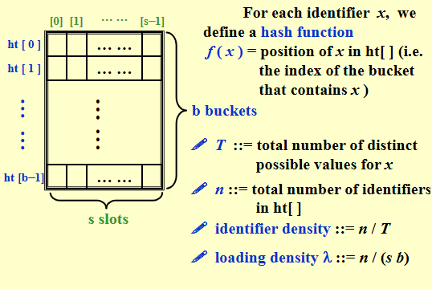

# Hashing

## General Idea

哈希表，又称散列表，通过建立键`key`与值`value`之间的映射，实现高效的元素查询。

我们向哈希表输入一个键`key`,则可以在$O(1)$时间内获取对应的值`value`。

哈希表中进行增删改查的时间复杂度都是$O(1)$。



- 哈希函数的作用是将一个较大的输入空间映射到一个较小的输出空间。在哈希表中，输入空间是所有 `key` ，输出空间是所有桶（数组索引）。即输入`key`我们可以通过哈希函数得到该`key`对应的键值对在数组中的存储位置。
- 负载因子：哈希表元素数量除以桶数量。用于衡量哈希冲突的严重程度，**也常作为哈希表扩容的触发条件**。

**collision**: A collision occurs when we hash two nonidentical identifiers into the same bucket.

**overflow**: An overflow occurs when we hash a new identifier into a full bucket.


## Hash Function

### Properties of $f$:

- must be easy to compute and minimizes the number of collisions.
- should be unbiased. That is, for any $x$ and any $i$, we have the Probability $(f(x)=i)=\frac{1}{b}$. Such kind of a hash function is called a uniform hash function.

### 哈希算法的设计

- 加法哈希：对输入的每个字符的ASCII码进行相加，将得到的总和作为哈希值。
- 乘法哈希：利用乘法的不相关性，每轮乘以一个常数，将各个字符的 ASCII 码累积到哈希值中。
- 异或哈希：将输入数据的每个元素通过异或操作累积到一个哈希值中。

**使用大质数作为模数，可以最大化地保证哈希值的均匀分布**。因为质数不与其他数字存在公约数，可以减少因取模操作而产生的周期性模式，从而避免哈希冲突。


## Separate Chaining

解决哈希冲突的一个方法就是链式地址，将单个元素转为链表，把发生哈希冲突的键值对都存储在同一链表中。

```c
struct ListNode;
typedef struct ListNode *Position;
struct HashTbl;
typedef struct HashTbl *HashTable;
struct ListNode {
    ElementType Element;
    Position Next;
};
typedef Position List;
struct HashTbl {
    int TableSize;
    List *TheLists;
};

HashTable initializeTable(int tableSize) {
    HashTable H;
    if (tableSize < minTableSize) {
        printf("Table size too small");
        return NULL;
    }
    H = malloc(sizeof(struct HashTbl));
    if (H == NULL) Error("Out of space!!!");
    H->TableSize = nextPrime(tableSize);
    H->TheLists = malloc(sizeof(List) * H->TableSize);
    if (H->TheLists == NULL) Error("Out of space!!!");
    for (int i = 0; i < H->tableSize; ++i) {
        H->TheLists[i] = malloc(sizeof(struct ListNode));
        if (H->TheLists[i] == NULL) Error("Out of space!!!");
        else H->TheLists[i]->Next = NULL;
    }
    return H;
}

Position find(ElementType key, HashTable H) {
    Position P; List L;
    L = H->TheLists[hash(key, H->TableSize)];
    P = L->Next;
    while (P != NULL && P->Element != key) P = P->Next;
    return P;
}

void insert(ElementType key, HashTable H) {
    Position pos, newCell; 
    List L;
    pos = find(key, H);
    if (pos == NULL) {
        newCell = malloc(sizeof(struct ListNode));
        if (newCell == NULL) Error("Out of space!!!");
        else {
            L = H->TheLists[hash(key, H->TableSize)];
            newCell->Next = L->Next;
            newCell->Element = key;
            L->Next = newCell;
        }
    }
}

```


## Open Addressing

- find another empty cell to solve collision(avoiding pointers)

```c
void insert(int key) {
    index = hash(key);
    int i = 0;
    while (collision at index) {
        index = (hash(key) + f(i)) % tableSize;
        if (table is full) break;
        else i++;
    }
    if (table is full) Error("No space left");
    else table[index] = key;
}

```


### Linear Probing

$f(i)=i$.

**Analysis of the linear probing show that the expected number of probes**:

- Foe insertions and unsuccessful searches $p=\frac{1}{2}(1+\frac{1}{(1-\lambda)^2})$.
- For successful searches $p=\frac{1}{2}(1+\frac{1}{1-\lambda})$

**Cause primary clustering**: any key that hashes into the cluster will add to the cluster after several attempts to resolve the collision.


### Quadratic Probing

$f(i)=i^2$.

**Theorem**: If quadratic probing is used, and the table size is **prime**, then a neew element can always be inserted if the table is **at least half empty**.

- If the table size is a prime of the form 4k + 3, then the quadratic probing  $f(i) =i^2 or -i^2$ can probe the entire table.

```c
Position find(ElementType key, HashTable H) {
    Position currentPos = hash(key, H->TableSize);
    int collisionNum = 0;
    while (H->TheCells[currentPos].Info != Empty && 
        H->TheCells[currentPos].Element != key) {
        currentPos += 2 * ++collisionNum - 1;
        if (currentPos >= H->TableSize) currentPos -= H->TableSize;
    }
    return currentPos;
}
```

```c
void insert(ElementType key, HashTable H) {
    Position pos = find(key, H);
    if (H->TheCells[pos].Info != Legitimate) {
        H->TheCells[pos].Info = Legitimate;
        H->TheCells[pos].Element = key;
    }
}
```


### Double Hashing

$f(i)=i*hash_2(x)$

$hash_2(x)=R-(x \mod R)$ with $R$ a prime smaller than Tablesize will work well.

-  If double hashing is correctly implemented, simulations imply that the expected number of probes is almost the same as for a random collision resolution strategy.
- Quadratic probing does not require the use of a second hash function and is thus likely to be simpler and faster in practice.

### Rehashing

