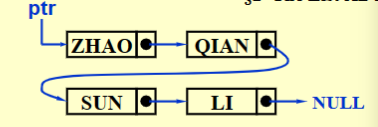
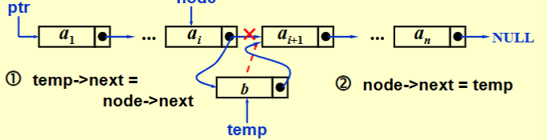

# Lists

**Objects** : ($item_0,item_1,……,item_{N-1}$)

**Operations**:


## Simple Array implementation of Lists

$array[i]=item_i$

Pros : `Find_Kth` takes $O(1)$ time

Cons : 

- MaxSize has to be estimated
- Insertion and Deletion not only take $O(N)$ time, but also involve a lot of data movements which takes time.


## Linked Lists



### Initialization

```c
typedef struct list_node *list_ptr;
typedef struct list_node{
    char data[4];
    list_ptr next;
};
list_ptr ptr;
```

### Insertion



takes $O(1)$ time.


### Deletion

takes $O(1)$ time


## Doubly Linked Circular Lists

```c
typedef struct node *node_ptr;
typedef struct node{
    node_ptr llink;
    element item;
    node_ptr rlink;
};
```

