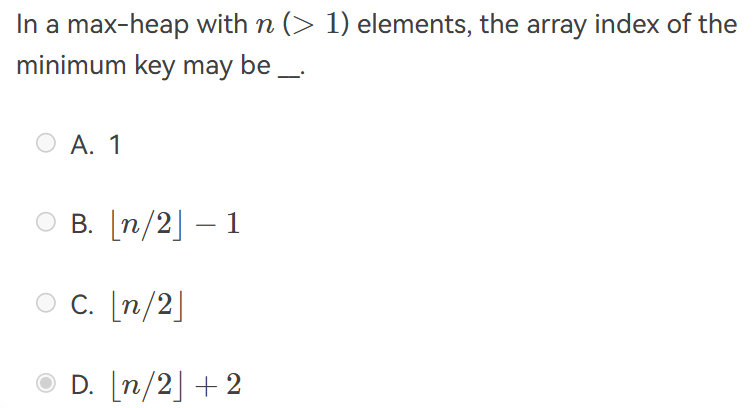
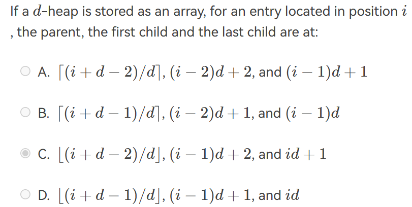
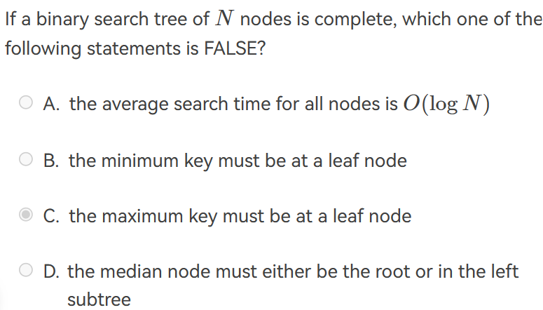

# 数据结构基础理论题

## 算法分析

- 

```c
if ( A > B ){     
  for ( i=0; i<N*2; i++ )         
    for ( j=N*N; j>i; j-- )             
      C += A; 
}
else {     
  for ( i=0; i<N*N/100; i++ )         
    for ( j=N; j>i; j-- ) 
      for ( k=0; k<N*3; k++)
        C += B; 
} 
```

The lowest upper bound of the time complexity is $O(N^3)$

本来看到`for`循环里有个`n*n`，直接以为复杂度是$O(N^4)$,但是要注意当`i`到`n`时下层循环就进不去了！

- 分析复杂度：

$$
T(1)=1,T(N)=T(N/3)+1\\T(1)=1,T(N)=3T(N/3)+1
$$

可以用直接代入法，直到$N/3^K$为$1$：
$$
T(N)=T(N/3)+1=\cdots=T(N/3^k)+k,k=clogN
$$
所以第一个式子的时间复杂度为$O(logN)$,类似地，第二个式子的时间复杂度为$O(N)$


## 线性表

- For a sequentially stored linear list of length $N$, the time complexities for deleting the first element and inserting the last element are $O(1)$ and $O(N)$, respectively.

线性表是一种概念，可以用数组和链表实现。sequentially stored linear list代表数组，删除第一个元素复杂度是$O(N)$, 因为需要将所有元素向前移动。

- To merge two singly linked ascending lists, both with *N* nodes, into one singly linked ascending list, the minimum possible number of comparisons is:$O(N)$

## 树

- It is always possible to represent a tree by a one-dimensional integer array.

对的。我们知道任何二叉树都可以通过一维数组表示，而任何树都可以表示成二叉树。(FirstChild-NextSibiling)

- There exists a binary tree with 2016 nodes in total, and with 16 nodes having only one child.

错误。假设没有孩子的结点个数$n_0$, 只有一个孩子的结点个数为$n_1$, 两个孩子的结点个数$n_2$. 则可得到如下等式：
$$
n_0+n_1+n_2=2016\\1+n_1+2n_2=2016
$$
可以得到当$n_1=16$时$2n_2=1999$，故错误。

- If a general tree $T$ is converted into a binary tree $BT$, then which of the following $BT$ traversals gives the same sequence as that of the post-order traversal of $T$?

In-order traversal.

- In a binary search tree, the keys on the same level from left to right must be in sorted (non-decreasing) order. (T)
- In a binary search tree which contains several integer keys including 4, 5, and 6, if 4 and 6 are on the same level, then 5 must be their parent.(F)


- For a binary search tree, in which order of traversal that we can obtain a non-decreasing sequence?  inorder traversal.
- There are more NULL pointers than the actual pointers in the linked representation of any binary tree.(?)
- 

## 堆



$\lfloor n/2\rfloor$是最后一个结点的父亲，不可能为最小值，因此唯一有可能的就是大于$n/2$的index。






注意到这是完全二叉搜索树，最大值可能在上一层最右边的结点,该节点只有左儿子。

## 图

- In a directed graph, the sum of the in-degrees must be equal to the sum of the out-degrees of all the vertices.

入度和出度对应一条边的起始和结束，如果出入度不相等说明有一条边只和一个顶点相连。

- If graph G is NOT connected and has 35 edges, then it must have at least ____ vertices

9个顶点的连通图最多有$C_n^2=36$条边，35也符合，8个顶点连通图最多有28条边，不符合。因此要使得图不连通，至少要10个vertice.

- A graph with 90 vertices and 20 edges must have at least __ connected component(s).

由欧拉公式，对于连通图$r=e-v+2$, 将一个图的一个连通分量看作一个连通图，若有$k$个连通分量，则$R=E-V+2k$, 但是所有连通分量最外部的区域被算了$k$次，因此最终$R=E-V+k+1$, 代入可得$k=R+69$, 为使连通分量最小，取$R=1$.

- Given an undirected graph $G$ with 16 edges, where 3 vertices are of degree 4, 4 vertices are of degree 3, and all the other vertices are of degrees less than 3. Then $G$ must have at least __ vertices.

根据$\sum (degree)=2e$, 得到$32=12+12+d(v-7)$, 由于$d<3$,故$8\le 2(v-7)$


- A graph with 50 vertices and 17 edges must have at most ____ connected component(s).
- If an undirected graph $G=(V,E)$ contains 10 vertices. Then to guarantee that $G$ is connected in any cases, there has to be at least __ edges.

9个vertices的完全图加上一条边。

