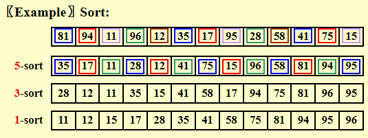

# Sorting

## Insertion Sort

```c
void InsertionSort ( ElementType A[ ], int N ) 
{ 
      int  j, P; 
      ElementType  Tmp; 
      for ( P = 1; P < N; P++ ) { 
		Tmp = A[ P ];  /* the next coming card */
		for ( j = P; j > 0 && A[ j - 1 ] > Tmp; j-- ) 
	      	A[ j ] = A[ j - 1 ]; 
	      /* shift sorted cards to provide a position for the new coming card */
		A[ j ] = Tmp;  /* place the new card at the proper position */
      }  /* end for-P-loop */
}

```

- The worst case: Input `A[]` is in reverse order. $T(N)=O(N^2)$.
- The best case: Input `A[]` is in sorted order. $T(N)=O(N)$.


## A Lower Bound for Simple Sorting Algorithms

**inversion**: An inversion in an array of numbers is any ordered pair $(i,j)$ having the property that $i<j$ but `A[i]>A[j]`.

$T(N,I)=O(I+N)$ where $I$ is the number of inversions in the original array.

**Theorem**:

- The average number of inversions in an array of $N$ distinct numbers is $\frac{N(N-1)}{4}$.

- Any algorithm that sorts by exchanging adjacent elements requires $\Omega(N^2)$ time on average.


## Shellsort

希尔排序的实质就是分组插入排序。

- Define an **increment sequence** $h_1<h_2<\cdots<h_t$ ($h_1=1$)
- Define an $h_k$-sort at each phase for $k-t,t-1,\cdots,1$
- An $h_k$-sort file that is then $h_{k-1}$-sorted remains $h_k$-sort.



```c
void shellSort(int arr[], int n) {
    int i, j, tmp;
    for (int inc = N/2; inc > 0; inc /= 2) {
        for (i = inc; i < N; ++i) {
            tmp = arr[i];
            for (j = i; j >= inc; j -= inc) {
                if (tmp < arr[j - inc])
                    arr[j] = arr[j - inc];
                else
                    break;
            }
            a[j] = tmp;
        }
    }
}
```

- Shell's increment sequence: $h_t=N/2$,$h_k=h_{k+1}/2$

**worst case**: using Shell's increments: $\Theta(N^2)$

- Hibbard's increment sequence: $h_k=2^k-1$

**worst case**： using Hibbard's increments: $\Theta(N^{\frac{3}{2}})$

$T_{avg-Hibbard}(N)=O(N^{\frac{5}{4}})$


## HeapSort

### Algorithm 1

```c
BuildHeap(H);
for(i=0;i<N;i++)
    TmpH[i]=DeleteMin(H); //O(logN)
for(i=0;i<N;i++)
    H[i]=TmpH[i];
```

$T(N)=O(NlogN)$

使用了Tmp数组来存储最小值，空间复杂度翻倍。

### Algorithm 2

使用最大堆，不用额外开辟空间。

```c
void heapSort(int arr[], int n) {
    for (int i = n / 2; i >= 0; --i) //BuildHeap
        percolateDown(arr, i, n);
    for (int i = n - 1; i > 0; --i) {
        swap(&arr[0], &arr[i]);//Deletmax
        percolateDown(arr, 0, i);
    }
}
```

**Theorem**: The average number of comparisons used to heapsort a random permutation of $N$ distinct items is $2NlogN-O(NloglogN)$.

Although Heapsort gives the best average time, in practice it is slower than a version of Shellsort that uses Sedgewick’s increment sequence.


## Mergesort

- Merge two sorted lists: $T(N)=O(N)$

```c
void mergeSort(int arr[], int n) {
    int *tmp = malloc(sizeof(int) * n);
    if (tmp != NULL) {
        mergeSortHelper(arr, tmp, 0, n - 1);
        free(tmp);
    } else {
        printf("No space for tmp array!\n");
    }
}

void mergeSortHelper(int arr[], int tmp[], int left, int right) {
    if (left < right) {
        int center = (left + right) / 2;
        mergeSortHelper(arr, tmp, left, center);
        mergeSortHelper(arr, tmp, center + 1, right);
        merge(arr, tmp, left, center + 1, right);
    }
}

void merge(int arr[], int tmp[], int leftPos, int rightPos, int rightEnd) {
    int leftEnd = rightPos - 1;
    int tmpPos = leftPos
    int numElements = rightEnd - leftPos + 1;
    while (leftPos <= leftEnd && rightPos <= rightEnd)
        if (arr[leftPos] <= arr[rightPos])
            tmp[tmpPos++] = arr[leftPos++];
        else
            tmp[tmpPos++] = arr[rightPos++];
    while (leftPos <= leftEnd)
        tmp[tmpPos++] = arr[leftPos++];
    while (rightPos <= rightEnd)
        tmp[tmpPos++] = arr[rightPos++];
    for (int i = 0; i < numElements; ++i, rightEnd--)
        arr[rightEnd] = tmp[rightEnd];
}

```

Mergesort requires linear extra memory, and copying an array is slow.  It is hardly ever used for internal sorting, but is quite useful for external sorting.

$T(N)=2T(N/2)+O(N)=2^kT(N/2^k)+kO(N)=O(N+NlogN)$
