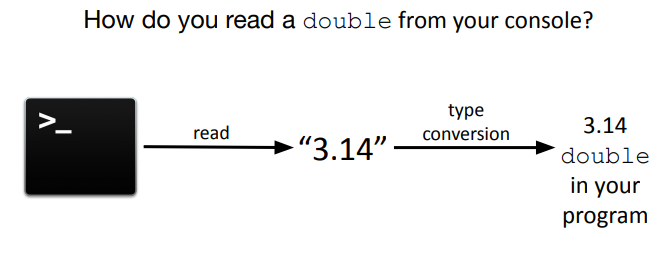
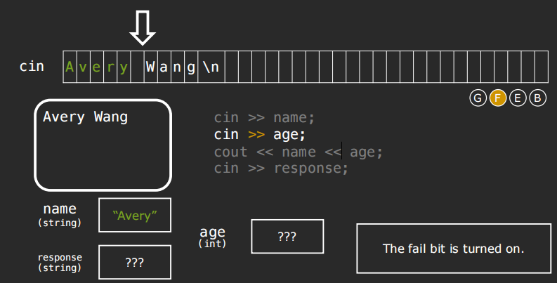
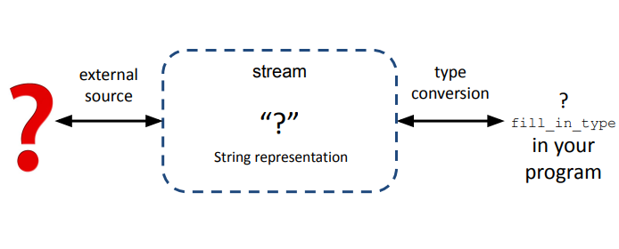

# CS106L

## Streams

> Designing and implementing a general input/output facility for a programming language is notoriously difficult
>
> - Bajarne Stroustrup

**Streams**: a general input/output abstraction for C++.

Abstractions often provide a consistent *interface*, and in the case of streams the interface is for reading and writing data.


### Stringstreams

- a way to treat strings as streams
- stringstreams are useful for use-cases that deal with mixing data types

```c++
int main() {
  	ostringstream oss("Ito En Green Tea ", stringstream::ate);
    cout << oss.str() << endl;
    oss << 16.9 << “ Ounce ”;
    
    //prints ”Ito En Green Tea 16.9 Ounce “
    cout << oss.str() << endl;
    
    istringstream iss("16.9 Ounces");
    double amount, string unit;
    iss >> amount >> unit;
    
    // amount is now 8.45
    amount /= 2;
}
```


- \>> extracts the next variable of a certain type, up to the next  whitespace.
- The >> and << operators return a reference to the stream  itself, so in each instance the stream is the left-hand operand.


**Implementing stringToInteger**

```c++
int stringToInteger(const string& str) {
    istringstream iss(str);
    int result;
    iss >> result; // problem: what if this fails?
    return result;
}
```


### State bits

- Good bit: ready for read/write
- Fail bit: previous operation failed, all future operations frozen. (Type mismatch, file can't be opened, seekg failed.)
- EOF bit: previous operation reached the end of buffer content.(Readched the end of the buffer.)
- Bad bit: external error, likely irrecoverable.(Could not move characters to buffer from external source. (e.g. the file you are reading from suddenly is deleted))


**complete error-checking for stringToInteger**

```c++
int stringToInteger(const string& str) {
    istringstream iss(str);
    
    int result;
    iss >> result;
    if (iss.fail()) throw domain_error(……)；
    
    char remain;
    iss >> remain;
    if (!iss.fail()) throw domain_error(……); //Ensure no characters after the integer
    return result;
    
    //Equivalent: >> returns iss itself, which can ack like a boolean for iss.fail()
    
}
//Compelete version
int stringToInteger(const string& str) {
    istringstream iss(str);
    int result;
    char remain;
    if(!(iss >> result) || iss >> remain) {
        throw domain_erroe("Error!");
    }
    return result;
}
```


### `cout` and `cin`

- Known as the standard `iostreams`

```c++
std::cout << "Hello, World" <<std::endl;
```

`cout` is a stream.

The `std::cout` stream is an instance of `std::ostream` which represents the standard output stream.

#### From external source to program



Buffered stream: characters are stored in an intermediate buffer before being moved to the external source.

To push the characters to the external source, the  stream must be ***“flushed"***.


```c++
int main() {
    cout << "CS";
    cout << 106;
    cout << flush; //"CS106" only shows up at this point.
    cout << 'L';
    cout <<endl;// include a flush
    
    int num;
    cout << "CS";
    cout << 106;
    cout << 'L';
    cin >> num; //cout is flushed when cin is waiting for user input.
}
```


```c++
//Option 1: flush every int
for (int i = 0; i < 100000; ++i) {
    cout << i << endl;
}

//Option 2: flush only at the end
for (int i = 0; i < 100000; ++i) {
    cout << i << '\n';
}
cout << flush;
```


#### An input stream

- `std::cin` is the console input stream

```c++
int main() {
    double pi;
    std::cin >> pi;
    std::cout << pi / 2 << endl;
}
```


**3 reasons why >> with cin is a nightmare**

- `cin` reads the entire line into the buffer but extracts whitespace-separated tokens.
- Trash in the buffer will make `cin` not prompt the user for input at the right time.
- When `cin` fails, all future `cin` operations fail too.


Recap the example in lec2:




**getline()**

```c++
	cout << "What is your name? "; // sidenote: no flush needed! why?
    //cin >> name;
    getline(cin, name);
```

***Bugs for getline()***

```c++
int main() {
    istringstream iss ("16.9\n 24");
    double val;
    string line;
    iss >> val; //val = 16.9
    getline(iss, line); // line = ""
    
    //To fix:
    string line;
    iss >> val;
    iss.ignore();
    getline(iss, line); // line = 24;
} 
```


### Generalizing the Stream



Stream allow for a universal way of dealing with external data.

**Classifying different types of streams**

Input streams(I): a way to read data from a source

- Are inherited from `std::istream`
- ex. reading in something from the console(`std::cin`)
- primary operator: `>>` (called the extraction operator)

Output streams(O): a way to write data to a destination

- Are inherited from `std::ostream`
- ex. writing out something to the console(`std::cout`)
- primary operator: `<<`(called the insertion operator)


## Modern C++ Types

### size_t

```c++
string str = "Hello World!";
for(int i = 0; i < str.size(); ++i) {
    cout << str[i] << endl;
}
//raise Warning!
//int->both positive and negative
//This comparison is dangerous since it compares signed(i) with unsigned(str.size())
//
for(size_t i = 0;){
    blablabla
}
```


**auto**

If the type is not important, then the compiler can figure it out for you.

```c++
auto 
```

Question: C string versus C++ string?(remained)


When to use auto?

- When you don't care what the type is (iterators).
- When its type is clear from context (templates).
- When you don't know what the type is (lambdas).
- Don't use it unnecessarily for return types.


### pair/tuple functions

```c++
auto prices = make_pair(3.4, 5);
auto values = make_tuple(3, 4, "hi");

//access via get/set
prices.first = prices.second;
get<0>(values) = get<1>(values); // values = {4, 4, "hi"}

auto [a,b] = prices;
const auto& [x, y, z] = values;
```


C++ 17 allow structured bindings, allowing you to unpack the variables in a pair.

```c++
pair<int,int> findPriceRange(int dist) {
    blabla;
    return make_pair(min,max);
}
int main() {
    int dist = 6452;
    auto [min,max] = findPriceRange(dist);
}
```


### struct

A struct is a collection of named variables grouped together.

```c++
struct Course {
    string code;
    Time stratTime;
    Time endTime;
    vector<string> instructors;
}

struct PriceRange {
    int min;
    int max;
}

PriceRange findPriceRange(int dist) {
    int min = ;
    int max = ;
    return PriceRange(min,max);
}

int main() {
    int dist = 6452;
    PriceRange p = findPriceRange(dist);
    cout << p.min << p.max; //access the struct
}
```


### Initialization


Uniform initialization: We don't have to specify the types-automatically deduced.

```c++
int main() {
    Course now {"CS106L", {15,30}, {16,30}, {"Wang","Zeng"}};
    vector<int> vec{3,1,4,1,5,9};
    
    vector<int> vec1{3}; //vector = {3}
    vector<int> vec2(3); //vector = {0, 0, 0}
}
```


## The Standard Template Library(STL)

### Sequence Containers

Provides access to ==sequence== of elements.

Includes:

- `std::vector<T>`
- `std::deque<T>`
- `std::list<T>`
- `std::array<T>`

- `std::forward_list<T>`

#### std::vector<T>

A vector represents a sequence of elements of ==any== type.

```c++
std::vector<int> vecInt;
std::vector<string> vecStr;
std::vector<myStruct> vecStrut;
std::vector<std::vector<string>> vecOfVec;
```


**Why doesn't `std::vector` bounds check by default?**

If your program runs correctly, bound checking will just slow your code down.


```c++
vector <int> v; //Create an empty vector
vector<int> v(n); // Create a vector with n copies of zero
vector<int> v(n,k); //Creae a vector with ncopies of a value k
v.push_back(k); // Add k to the end of the vector
v.clear(); // Clear vector
int k = v.at(i); int k = v[i]; // Get the element at index i
if (v.empty()) // Check if the vector is empty
v.at(i) = k; // Replace the element at index i 
```


#### std::deque<T>

- Stands for a double ended queue.
- Unlike a vector, it is possible (and fast) to `push_front` and `pop_front`!


**Downsides of `std::deque<T>`**:

Deques support fast `push_front` operations. However, for other common operations like element access, vector will always outperform a deque.
