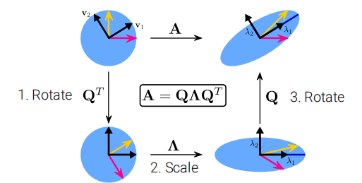

# Mathematics for Deep Learning

!!! abstract

    The goal of this note is to repeat the necessary minimal math background to follow computervision lectures.
    
    By Prof. Dr.-Ing. Andreas Geiger,University of Tubingen

## Linear Algebra

### Tensors

- A tensor is an array with more than 2 axes(e.g.:RGB image)
- Example for tensor of shape $M \times N \times K$: $A \in \mathbb{R}^{M\times N\times K}$

### Linear Dependence and Span

- We call $A x= \sum_ix_i A$ a linear combination
- $A x =  b$ has solution $\iff$ $b$ is in the span of columns of $A$
  - This particualr span is known as **column space** or **range**
- A square matrix with any two linearly dependent columns is called **singular**

### Vectors and Matrix Norms

- $\mathscr{l}_p$-norm is defined as : $\Vert x\Vert_p=(\sum_i\vert x_i\vert^p)^{\frac{1}{p}}$
  - $\Vert x \Vert_\infty=max_i\vert x_i\vert$
- The size of a matrix can be measured with the **Frobenius norm**: $\Vert  A \Vert_F=\sqrt{\sum_{i,j}a_{i,j}^2}$

### Eigenvalue Decomposition

- $Av=\lambda  v$
- We concatenate all eigenvectors to form a matrix $V=( v_1,…, v_N)$
- We form all eignvalues into a diagnal matrix $\Lambda = diag(\lambda_1,…，\lambda_N)^{T}$
- The eigendecomposition of  $A$ is given by: $A =  V \Lambda  V^{-1}$
- Every real symmetric matrix $A$ can be decomposed into $A =  Q \Lambda  Q^{T}$
  - $Q$ is an orthonormal matrix composed of the eigenvectors ${ v_i}_{i=1}^{N}$  of  $A$

*** $A$ distorts the unit circle by scaling space in direction $v_i$ by $\lambda_i$***

> The EVD can be computed easily in NumPy: np.linalg.eig

### Singular Value Decomposition

- Eigenvalue decomposition can only be app;ied to square matrices
- For non-square matrices we can use **singular value decomposition**
- Factorizes a matrx $A \in \mathbb{R}^{M\times N}$ as $A = U  D  V^{T}$, where $U \in \mathbb R^{M\times M},  D\in \mathbb R^{M\times N},  V \in \mathbb R^{N\times N}$
- The elements along the diagonal of $D$ are known as singular values
- The columns of $U$ and $V$ are **left/right-singular vectors**,respectively.

#### Relationship between EVD and SVD

- The right-singular vectors are the eigenvectors of $A^{T} A$
  - $A^{T} A =  V  D U^{T} U  DV^{T}= V  D^2 V^{T}$
- The left-singular vectors are the egienvectors of  $AA^{T}$

- The eigenvalues of $A^{T} A$ and $A A^{T}$ are equal to the squared singular values of $A$

## Probability

### Terminology

- A random variable is a variable that can take on different values randomly
- Random variables may be either **discrete** or **continuous**
- A discrete random variable has a finite or countably infinite number of states
- A continuous random vairiable is associated with a real value
- A **probability distribution** is a descrption of how likely a random variable or set of random variable is to take on each of its possible states

### Discrete Probability Distributions

$p(x)$ for $p(X=x)\in [0,1]$, $p(x)$ is called the probability mass function

$p(X)$ denote the probability distribution over $X$

If $X$ follows distribution $p(X)$, we also write $X\sim p(X)$

- Joint probability: $p(x,y)$ for $p(X=x,Y=y)$
- Conditional probability: $p(x|y)=\frac{p(x,y)}{p(y)}$
- Marginal probability: $p(y)=\sum_{x\in \mathcal{X}}p(x,y)$

