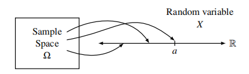
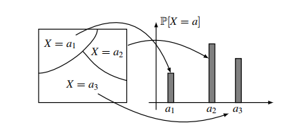

# Random Variables: Distribution and Expectation

## Random Variables

A random variable $X$ on a sample space $\Omega$ is a function $X: \Omega\rightarrow R$ that assigns to each point $\omega\in \Omega$ a real number $X(\omega)$

!!! note

    the term “random variable” is really something of a misnomer: it is a function so there is nothing random about it and it is
    definitely not a variable!

## Probability Distribution

When we introduced the basic probability space we defined two things:

- The sample space $\Omega$ consisting of all the possible outcomes(sample points) of the experiment.
- The probability of each of the sample points

Analogously, there are two important things about any random variable"

- The set of values that it can take
- The probability with which it takes on the values.

Since a random variable is defined on a probability space, we can calculate these probabilities given the probabilities of the sample points.

Let $a$ be any number in the range of a random variable $X$. Then the set 

$\left\{ \omega\in\Omega:X(\omega)=a\right\}$ is an *event* in the sample space, abbreviated by $X=a$.

  

**Distribution**:

The distribution of a discrete random variable $X$ is the collection of values $\left\{ (a,P[X=a]):a\in \mathscr{A}\right\}$, where $\mathscr{A}$ is the set of all possible values taken by $X$.

Note that the collection of events $X=a$ satisfy two important properties:

- Any two events $X=a_1,X=a_2$ with $a_1 \ne a_2$ are disjoint.
- The union of all these events is equal to the entire sample space $\Omega$

Thus the collection of events form a partition of the sample space.

  

### Bernouli Distribution

a random variable which takes value in {0,1}:
$$
P[X=i]=\begin{cases}p&i=1\\ 1-p&i=0\end{cases}
$$

### Binomial Distribution

$$
P[X=i]=\begin{pmatrix}n\\i\end{pmatrix}p^i(1-p)^{n-i}
$$

### Hypergeometric Distribution

$$
P[Y=k]=\frac{\begin{pmatrix}B\\k \end{pmatrix}\begin{pmatrix}N-B\\n-k\end{pmatrix}}{\begin{pmatrix}N\\n\end{pmatrix}}
$$

!!! note

    二项分布有放回，超几何分布无放回

## Multiple Random Variables and Independence

The joint distribution for two discrete random variable $X,Y$ is the collection of values $\left\{((a,b),P[X=a,Y=b]):a\in \mathscr{A},b\in \mathscr{B}\right\}$, where $\mathscr{A}$ is the set of all possible values taken by $X$ and $\mathscr{B}$ is the set of all possible values taken by $Y$.

When given a joint distribution for $X$ and $Y$, the distribution $P[X=a]$ for $X$ is called the **marginal distribution** for $X$, and can be found by summing over the values of $Y$, That is:

$$
P[X=a]=\sum_{b\in \mathscr{B}}P[X=a,Y=b]
$$

**Independence**

$$
P[X=a,Y=b]=P[X=a]P[Y=b]
$$

## Expectation

The expectation of a discrete random varaible $X$ is defined as
$$
E[X]=\sum_{a\in \mathscr{A}}a\times P[X=a]
$$
where the sum is over all possible values taken by the *r.v.*

### Linearity of Expectation

For any two random variables $X$ and $Y$ on the same probability space, we have
$$
E[X+Y]=E[X]+E[Y]
$$
Also, for any constant $c$, we have
$$
E[cX]=cE[X]
$$
!!! note

    It is only sums and differences and constant multiples of random variables that behave so nicely.

